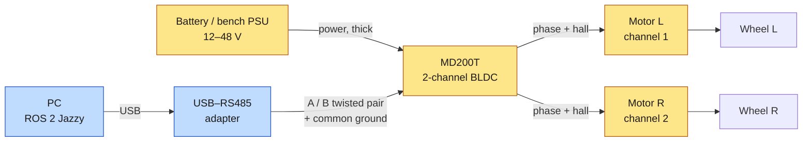
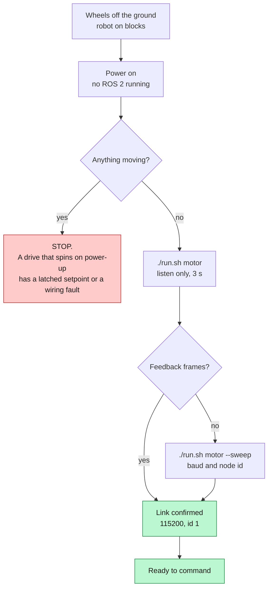
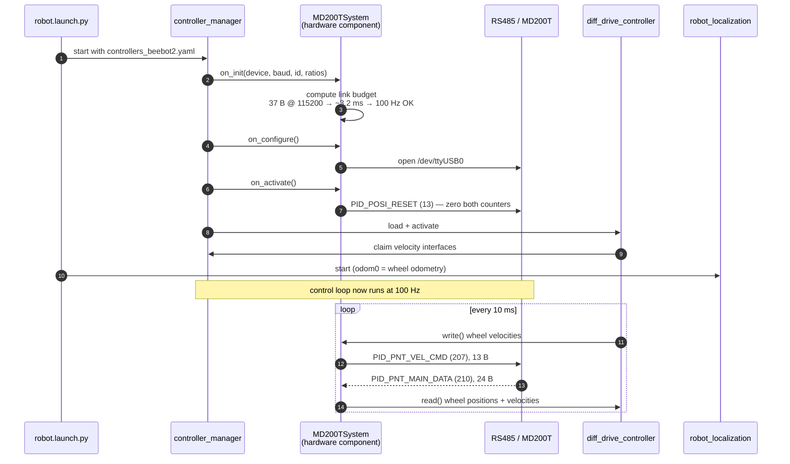
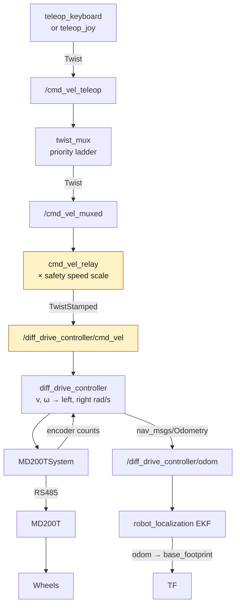

*Companion to video 03. 📺 Watch: **link coming with the video**.*

The drive electronics answered on the bench and both channels turned a wheel.
Nothing is mounted yet, and the robot has never carried its own weight.

This article is the step where the bench becomes a robot: motors into the
platform, wheels onto the motors, the controller bolted down, and then the
first time a `w` keypress moves 40 kg across a floor.

## 1. What "first movement" actually requires

It is tempting to think of this as an assembly job. It is not. Bolting the
motors in is the easy half. The hard half is that mounting the drive creates
three facts that did not exist on the bench:

| New fact | Why the bench could not give it to you |
|---|---|
| There is a **forward** | A motor on a bench has a shaft direction, not a robot direction |
| There is a **left** and a **right** | Nothing on the bench decides which channel is which side |
| There is **load** | A free-spinning wheel tells you nothing about a wheel under 40 kg |

Everything in this article exists to establish one of those three.

## 2. Mounting

Order matters, and the order is: motors, then wheels, then controller, then
wiring, then power, then ROS 2. Each step is checkable before the next one
buries it.

**Motors into the frame.** The drive wheels sit on a common axis with a track
of **0.48 m** — that is `wheel_y = 0.24` in
`beebot2_description/urdf/beebot2.properties.xacro`, doubled. Getting the
physical track to match the declared one is the single most consequential
measurement of the whole build, and §6 explains why.

**Wheels onto the motors.** ⌀0.13 m, so `wheel_radius = 0.065`. Same rule.

**Controller onto the frame.** Mount the MD200T where the motor leads are short
and the RS485 run to the PC is not squeezed alongside them. Motor phase leads
carry switched current at kilohertz rates; the RS485 pair carries millivolt
differences. They are as electrically incompatible as two cables in one machine
can be.

> **The one thing worth being fussy about.**
>
> RS485's noise immunity comes from the *pair* — noise that hits A and B
> equally cancels. That only holds if A and B stay together. Run them as a
> twisted pair, keep them clear of the motor leads, and cross the two bundles
> at right angles where they have to meet.

## 3. Wiring



Three connections, and each has a way of going wrong quietly:

- **Power.** In range (12–48 V) and current-limited if the supply can do it.
  Under-volting a BLDC controller does not always announce itself; it can
  present as one channel behaving and the other stalling under load.
- **RS485.** A to A, B to B, and a **common ground** between the adapter and the
  controller. Swapping A and B is the classic first bug, and the symptom is
  silence — which is indistinguishable from a dead board.
- **Motor phases and halls.** Per the controller's channel pinout. A miswired
  hall set gives cogging or a motor that hums and does not turn.

## 4. Power-up, before anything is commanded



The robot goes on blocks first. Not because something is expected to go wrong,
but because the two questions this article answers — which channel is which
side, and which way is positive — are answered by *watching wheels turn*, and a
wrong answer on the floor is a robot driving into a wall.

The probe from article 02 is still the right tool here. It talks to the drive
with **no `controller_manager` in the way**, which keeps "the cable moved during
assembly" separate from "the control stack is misconfigured".

## 5. Which channel is which side, and which way is forward

This is the part that has no datasheet answer. Spin one channel at a time and
look:

```bash
./run.sh motor --rpm 60 --channel 1 --seconds 2   # MOVES A WHEEL
./run.sh motor --rpm 60 --channel 2 --seconds 2
```

Then write down what you saw, in the three parameters that encode it:

| Parameter | Value here | What it means |
|---|---|---|
| `left_channel` | `1` | output 1 drives the left side; `right_channel` is derived as `3 − left_channel` |
| `left_invert` | `false` | positive command turns the left wheel forward |
| `right_invert` | **`true`** | the two motors are mounted mirrored |

`right_invert` is `true` because the motors face each other across the chassis.
Commanding both channels the same RPM made the machine **pirouette on the spot**
instead of driving forward. That is the entire experiment.

> **`right_invert` cannot be checked from odometry. Not "is hard to" — cannot.**
>
> The driver applies the inversion to the command *and* to the feedback. So
> `/odom`, `/joint_states` and the raw encoder counts all read identically
> whether the robot is translating or spinning on the spot, because the drive
> reports each motor in its own frame.
>
> You watch the robot, or you add an IMU (article 08). There is no third
> option, and no amount of staring at topics will produce one.

All three live in `ros2_control.xacro` as parameters of the
`beebot2_ros2_control` macro, and all three are overridable per run:

```bash
./run.sh robot left_channel:=2 right_invert:=false
```

## 6. The two numbers, now that they are load-bearing

Article 02 established them on a bench. Mounted on a robot, they stop being
motor parameters and become *robot* parameters:

| Parameter | Value | Consequence of getting it wrong |
|---|---|---|
| `gear_ratio` | **1.0** — direct drive | scales every command *and* the odometry, together |
| `encoder_ppr` | **60** — measured, 60.1 and 59.6 | same |
| `wheel_radius` | **0.065 m** | converts wheel rad/s to ground m/s |
| `wheel_separation` | **0.48 m** | converts wheel speed difference to yaw rate |

The first two are in the hardware component. The last two are in
`controllers_beebot2.yaml`, and they must agree with the URDF —
`test_geometry.py` cross-checks them against the generated URDF so they cannot
drift.

That test exists because of a real failure: `wheel_separation` once read
**0.70 m against a 0.48 m track**, inherited from an edited copy of the source
URDF. A 46 % rotational odometry scale error, self-consistent across the model,
the controller config and the Nav2 footprint, and therefore invisible from
inside. The robot would have under-reported every turn by nearly half.

> If you take one habit from this article: **measure the track between the
> wheel centre planes with a tape, on the assembled robot, and compare it to
> the number in the config.** It takes thirty seconds and it is the cheapest
> insurance in the whole build.

## 7. Bringing up the control stack

```bash
./run.sh robot        # terminal 1: drive + odometry, no simulator
./run.sh teleop       # terminal 2: keyboard
```

`robot.launch.py` is the hardware counterpart of `sim.launch.py` and mirrors it
deliberately — same controller config, same `diff_drive_controller`, same EKF,
same `cmd_vel_relay`. Only the hardware component underneath swaps. Article 07
is entirely about why that matters.

What actually happens when you run it:



Two lines in that startup log are worth reading rather than scrolling past:

- **the loop-rate cap.** The component computes the serial link budget and logs
  the maximum rate it can sustain. Expect 100 Hz. If it says **~52 Hz**, the
  drive has been reset to factory defaults and is back at 19200 baud.
- **the controllers activating.** `joint_state_broadcaster` and
  `diff_drive_controller` both have to reach `active`. A controller stuck in
  `inactive` produces no error at the wheels — just silence.

## 8. The command chain, end to end

This is the diagram to keep open the first time nothing moves:



The highlighted hop is the one that catches everybody. **Nav2 and the teleops
speak `geometry_msgs/Twist`; `diff_drive_controller` subscribes
`TwistStamped`.** Same topic name, different type hash — `ros2 topic info`
reports one publisher and one subscriber and not one message crosses.
`cmd_vel_relay` is the only conversion in the stack.

`twist_mux` has to be in the chain too. Without that rung the teleop publishes
into a topic nothing reads, and the symptom is keys pressing, no wheel moving,
and no error anywhere.

## 9. The moment

```
   w / up        straight ahead        space   STOP
   s / down      straight back         p       E-stop, toggle
   a / left      turn left             - / +   cruise speed
   d / right     turn right            h  q    help, quit
```

The command is **latched**: press `w` and it keeps going, press `space` and it
stops. Not hold-to-drive — a terminal takes ~500 ms to start auto-repeating a
held key, and `twist_mux` drops an input that goes quiet for 0.5 s, so
hold-to-drive stutters by construction.

Then, in order, wheels still off the ground:

1. `w` — both wheels turn forward. If one turns backwards, `left_invert` /
   `right_invert` is wrong.
2. `s` — both reverse.
3. `a`, `d` — wheels turn opposite ways.
4. `space` — everything stops.

Only then does the robot come off the blocks. Forward, backward, rotate left,
rotate right. **That is first movement.**

The status line is the useful part of the teleop, and on hardware it reads:

```
v +0.40  w +0.00 | cruise 0.40/0.60 | safety: no /safety/state | mux ok
```

`mux ok` means `twist_mux` is subscribed. `safety: no /safety/state` is
**expected here** — see below.

## 10. Three things `robot.launch.py` deliberately does not start

| Not started | Why |
|---|---|
| `safety_monitor` | it begins with an empty scan dictionary, so with no lidars it evaluates its fields against nothing and publishes "clear" |
| the lift | `controller_manager` treats a hardware component it cannot load as **fatal** — it would refuse to start at all, taking the drive down with it |
| Nav2, AMCL, slam_toolbox | there is nothing to localise against yet |

The first one is worth dwelling on. A safety layer that asserts the world is
empty is **worse than an absent one**, because `/safety/state` and
`/safety/stop_lock` both look healthy while guarding nothing. `beebot2_safety`
runs alongside real scanners or it does not run.

The EKF *does* start, and it runs **wheel-only**. `ekf.yaml` configures
`imu0: /imu` and nothing publishes it on the robot yet.
`robot_localization` handles a missing input without complaint, so this is
silent — the measured heading benefit (0.72° against 6.52° raw) is a
*simulation* result and does not apply here. Article 08 is about closing that.

## 11. Failing safe

**If feedback stops for 500 ms, the component stops the motors and reports an
error**, which deactivates the hardware interface.

The reasoning is worth stating plainly, because the alternative is tempting:
dead-reckoning odometry off a frozen encoder is worse than a halt. A stopped
robot is a problem you can see. A robot confidently reporting positions from an
encoder that stopped updating is a robot that drives into something while
insisting it is somewhere else.

`max_motor_rpm` (250) is the other backstop. It is not a speed setting —
`diff_drive_controller`'s own limits shape normal motion — it is there to catch
a scaling mistake before it becomes a runaway. The failure it exists for is
exactly the `gear_ratio` error from article 02.

## Sign-off

Before this counts as done:

- [ ] the physical track measures what `wheel_separation` says it does
- [ ] `w` turns both wheels forward, on blocks
- [ ] `a` and `d` turn them opposite ways, on blocks
- [ ] the startup log shows the loop rate you expect, not a 52 Hz cap
- [ ] `joint_state_broadcaster` and `diff_drive_controller` both reach `active`
- [ ] `mux ok` in the teleop status line
- [ ] `space` stops the robot from full speed
- [ ] pulling the serial cable stops the motors within 500 ms
- [ ] the robot drives forward, backward, and rotates both ways on the floor

## What is not measured yet

Being straight about this: **no odometry distance test has been run on this
hardware.** `encoder_ppr` is measured and `gear_ratio` is established, but the
"drive a tape-measured 4 m and compare `/odom`" check has not happened. In
simulation that returns 3.926 m against a commanded 4 m and a 349.8° commanded
360°, both shortfalls accounted for by the acceleration ramp rather than by
scale error. On the real machine those are predictions, not results.

Article 13 is where that gets confronted properly.

## Next

The robot moves, but only from a keyboard on a laptop tethered to it. Next it
learns to take orders from a human hand — and picks up three safety rules that
come from the pad being wireless rather than from taste.

**Next: [Driving the AMR with a Logitech F710](../04-gamepad-teleop/).**
