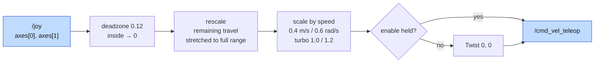
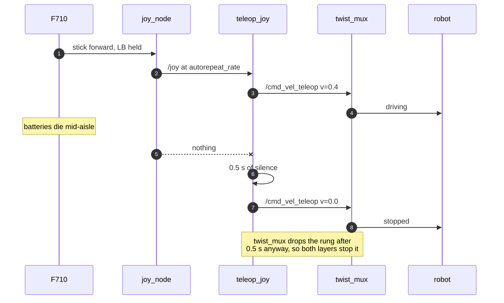
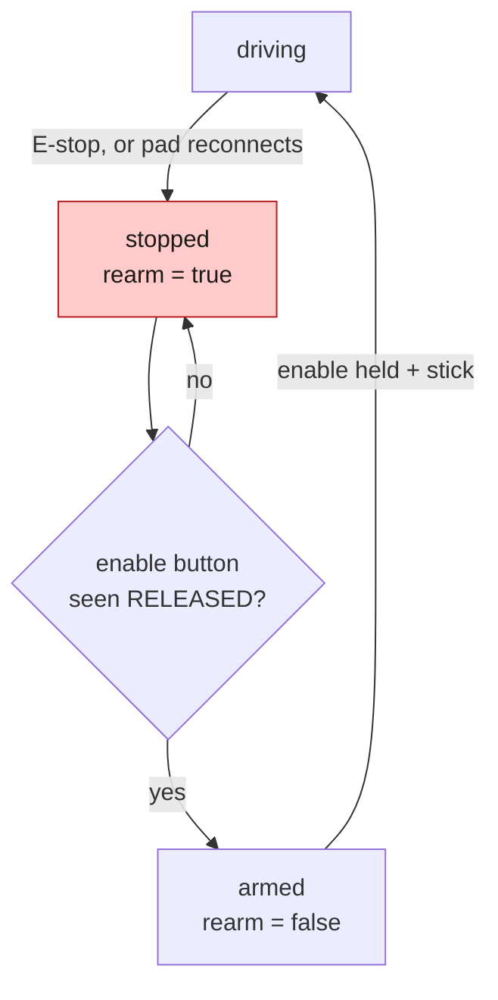
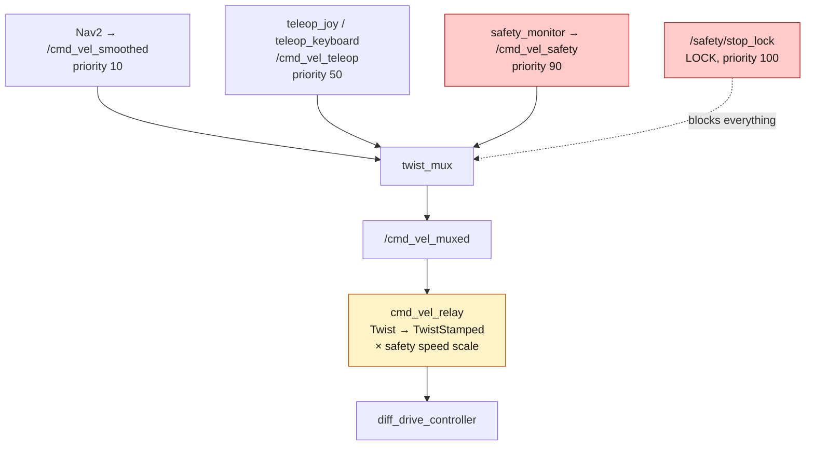

*Companion to video 04. 📺 Watch: **link coming with the video**.*

The robot drives when commanded, but every command has to be typed. That is
fine for a bench and useless for a floor — you cannot walk alongside a robot
while holding a laptop and watching a terminal.

So it gets a gamepad. Which sounds like the easiest article in the series, and
is not, because a **wireless** control device on a machine with mass is a
safety problem wearing a toy's clothing.

## 1. The pad

A **Logitech F710** (the F720 behaves identically). It has a switch on the back
marked **X** and **D**, and that switch is not cosmetic: it changes which Linux
driver binds the pad, and with it the entire axis and button numbering.

| Switch | Mode | Driver | Layout |
|---|---|---|---|
| **X** | XInput | `xpad` | Xbox 360: 8 axes, 11 buttons — the default here |
| **D** | DirectInput | generic HID | different indices; face buttons start at X, not A |

Both layouts ship as config files — `beebot2_control/config/joy_xinput.yaml`
and `joy_dinput.yaml` — rather than being guessed at runtime:

```bash
./run.sh joy                    # switch on the back set to X
./run.sh joy layout:=dinput     # switch set to D
```

> Firmware revisions and kernel versions genuinely do move these indices
> around. `ros2 topic echo /joy` while pressing a button is how to check any of
> it on your own unit. If the configured indices cannot exist on the connected
> pad — you asked for button 10 on a pad with 8 — the teleop says so on
> startup instead of feeling dead.

## 2. What `/joy` actually contains

`joy_node` publishes `sensor_msgs/Joy`, which is two flat arrays and a
timestamp:

```
axes:    [-0.02, 0.71, 1.0, 0.0, 0.0, 1.0, 0.0, 0.0]
buttons: [0, 0, 0, 0, 1, 0, 0, 0, 0, 0, 0]
```

There are no names. Nothing in the message says which entry is the left stick.
That mapping is a property of the pad, the driver and the switch position, and
it lives in the config:

```yaml
linear_axis: 1          # left stick, push forward
angular_axis: 0         # left stick, push left to turn left
enable_button: 4        # LB — held, or the command is zero
turbo_button: 5         # RB
estop_button: 7         # start
```

Driving is one thumb on the left stick — forward/back and turn on the same
stick — so the other hand only has to hold the enable button.

## 3. Stick to velocity



**The deadzone is rescaled, not just clipped.** These sticks do not settle at
exactly zero, so anything inside 0.12 is treated as zero. But if you stop there,
the first usable millimetre of stick becomes a step change from 0 to 12 % of
full speed. So the remaining travel is stretched back over the full range:
0.12 of stick maps to 0.0 of output, and 1.0 maps to 1.0, linearly between.

Full-stick speeds are deliberately modest:

| | linear | angular |
|---|---|---|
| normal | 0.4 m/s | 0.6 rad/s |
| turbo (hold RB) | 1.0 m/s | 1.2 rad/s |

Mapping wants a speed slow enough for `slam_toolbox` to close loops (article
11). Turbo is for crossing the hall, not for the aisles.

## 4. The three rules that come from the pad being wireless

None of these is a design preference. Each is a specific failure the pad can
produce that a wired keyboard cannot.

### Rule 1 — hold to enable

**Nothing moves unless LB is held.** Release it and the command is zero.

Self-centring sticks make hold-to-drive the natural gesture for a pad. Note
that this is the *opposite* of the keyboard teleop, which latches — and the
reason is not consistency, it is that a terminal cannot report a key being
*held*, only that it repeated.

### Rule 2 — stale input is a stop

**No `/joy` for 0.5 s and the command goes to zero.**

A pad that sleeps, flattens its batteries or walks out of range must not leave a
command running on a machine that weighs 40 kg — or, on the larger platform,
300 kg.



This is why the launch file sets `joy_node`'s **`autorepeat_rate`**. At its
default of `0.0`, a perfectly still stick produces no messages at all — and
"held steady" then becomes indistinguishable from "pad gone". With autorepeat
on, silence means exactly one thing.

### Rule 3 — re-arm after any stop

**Clearing an E-stop with the stick still pushed does not resume motion.** The
enable button has to be released and held again first.



The keyboard teleop gets this for free — a latched command was already zeroed
and there is no held stick to resume from. The pad does not, because a stick
held forward through a stop is still held forward after it. It is the same
mistake the safety monitor's latch exists to avoid (article 17): **releasing a
button is not consent to move.**

## 5. Where the command goes: the priority ladder

The pad publishes `/cmd_vel_teleop` — the *teleop rung* of the `twist_mux`
ladder, exactly like the keyboard. That is deliberate: an operator gets no more
authority than the planner does.



`safety > teleop > navigation`. An operator cannot drive through a protective
stop, and neither can Nav2. Articles 17 and 18 are where that gets tested
properly; here it is enough to know that **the pad is not privileged.**

One configuration detail that silently breaks the whole ladder: Jazzy's
`twist_mux` defaults `use_stamped: true`, which makes it speak `TwistStamped` on
every input and output. Nav2 and both teleops publish plain `Twist`. This
project sets it `false` and does the single conversion at `cmd_vel_relay`.

## 6. The controls

```
   HOLD LB        enable — released is stopped
   left stick     forward/back and turn, one thumb
   hold RB        turbo, 1.0 m/s at full stick
   start          E-stop, toggle          A   save + clean the map
   Y / X          full-stick speed ± 25%  B   reset safety after a stop
```

`A` and `B` matter later — `A` saves the map being built in article 11, `B`
clears a latched safety stop in article 17. They are on the pad because walking
back to a keyboard to save a map means stopping the survey.

## 7. The MODE button, which costs everyone an hour

**If the pad looks alive but the robot does not move, check MODE first.**

MODE swaps the left stick with the D-pad. So the stick stops reporting on axes
0 and 1 and starts driving axes 6 and 7 instead.

Nothing about this looks broken:

| Check | Reads |
|---|---|
| `ros2 topic hz /joy` | publishing normally |
| axis and button counts | match the layout |
| the enable button | works |
| the teleop status line | `mux ok` |
| **push the left stick** | **entries 6 and 7 move, not 0 and 1** |

The last row is the only tell. The MODE LED above the Logitech button is lit
when it is on; press MODE to clear it.

Nothing in software can detect this, and it is worth understanding why: a
stationary stick and a reassigned stick produce byte-identical messages on axes
0/1. There is no signal to key off.

## 8. Getting a pad into a container

`./run.sh joy` runs in its **own** container, because the pad needs
`/dev/input` and the simulator does not. Three things are needed, and the first
alone fails silently:

| # | What | What happens without it |
|---|---|---|
| 1 | bind-mount `/dev/input` as a **directory** | `--device` only maps what existed at container start, so a pad switched on later never appears |
| 2 | `--device-cgroup-rule 'c 13:* rmw'` | Docker's default device policy denies anything not passed with `--device`: the node is visible, listable, and `open()` returns `EPERM` |
| 3 | `--group-add` the `input` group | the device nodes are `root:input crw-rw----` |

And once anything runs outside the simulator container, one more:

> **`--ipc=host`.** Fast DDS discovers over the network but moves data between
> same-host participants through **shared memory**, and two containers do not
> share `/dev/shm`. Without it they find each other and nothing crosses:
> `ros2 topic info` reports the publisher, with the right type and a climbing
> subscription count, and `ros2 topic echo` sits empty.
>
> It is already in `run.sh`. `./run.sh joy` is simply the first thing in this
> series that needs it.

## 9. Reading the status line

```
v +0.40  w +0.00 | cruise 0.40/0.60 | NORMAL clear  scale 1.00 | mux ok
```

| Field | What it answers |
|---|---|
| `v` / `w` | what the teleop is asking for |
| `cruise` | current full-stick speeds |
| safety state + `scale` | what the safety layer is doing to the command |
| `mux` | whether `twist_mux` is actually subscribed |

"I push the stick and nothing moves" has at least four causes here — no mux
running, a latched stop, no relay, MODE on — and none of them is visible from a
teleop that only prints velocities. That is the whole reason the status line
carries the other three fields.

On the real robot `safety: no /safety/state` is **expected**, because
`robot.launch.py` deliberately does not start the safety monitor without
scanners (article 03, §10).

## Sign-off

- [ ] `ros2 topic hz /joy` publishes with the stick still — `autorepeat_rate` is set
- [ ] releasing LB stops the robot
- [ ] switching the pad off mid-drive stops the robot within 0.5 s
- [ ] after an E-stop, holding the stick does **not** resume motion until LB is re-held
- [ ] the stick moves axes 0 and 1, not 6 and 7 (MODE off)
- [ ] `mux ok` in the status line
- [ ] turbo reaches the expected speed and nothing clips

## Next

The robot drives, and a human can drive it. But every hardware test costs setup
time and carries risk, and some tests — driving at a wall to see what the safety
system does — are not safe to run on the real machine at all.

So the robot gets a copy of itself. That starts with the robot describing its
own body.

**Next: [Building the AMR in URDF](../05-urdf/).**
