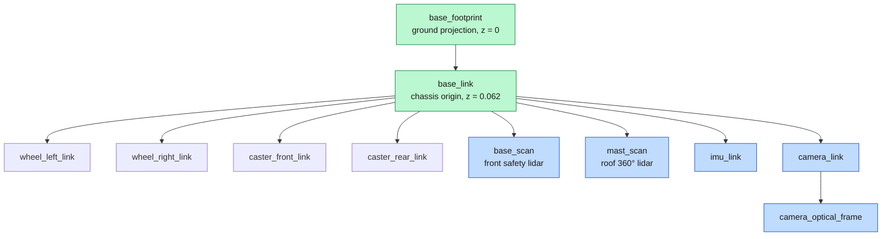
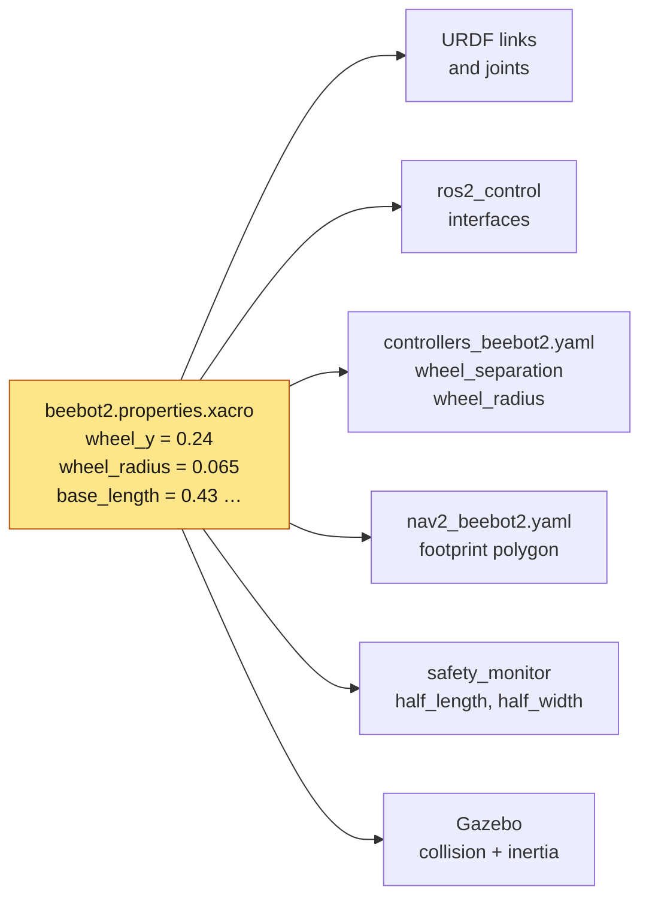
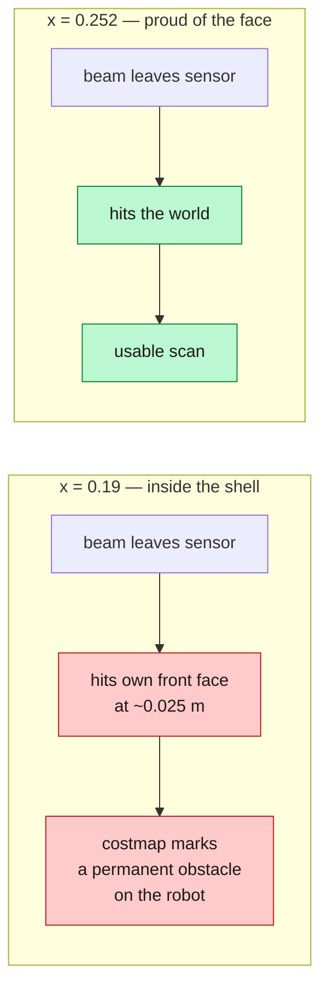
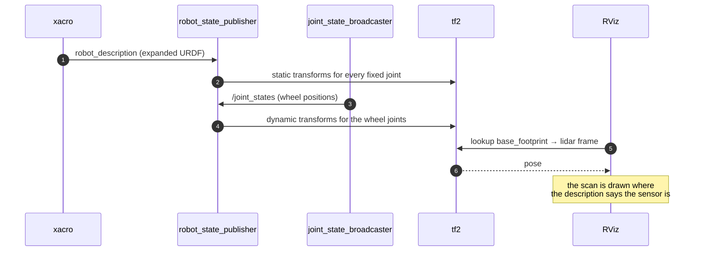

*Companion to video 05. 📺 Watch: **link coming with the video**.*

The robot moves, but ROS 2 has no idea what shape it is. Nothing downstream —
TF, sensors, footprints, navigation — can work without that.

This article is where the robot gets a body in software. It is also, quietly,
the article with the highest ratio of "boring" to "catastrophic if wrong" in the
entire series.

## 1. What the description is actually for

A URDF is not a 3D model. It is a **kinematic and dynamic description**, and
four different consumers read it for four different reasons:

| Consumer | What it takes from the description |
|---|---|
| `robot_state_publisher` | joint definitions → the TF tree |
| `ros2_control` | which joints have command and state interfaces |
| Gazebo | collision shapes, masses, inertias, sensor mounts |
| Nav2 | the footprint polygon, via the numbers it is derived from |

Getting a dimension wrong therefore does not produce one wrong thing. It
produces four wrong things that all agree with each other.

## 2. Links, joints and the two base frames



**`base_link` and `base_footprint` are not the same thing, and the difference
matters more than it looks.**

- `base_link` is the chassis origin — a point on the body, 0.062 m above the
  floor on this robot.
- `base_footprint` is that point **projected onto the ground**, at z = 0.

Everything that reasons in two dimensions — costmaps, the safety fields, AMCL,
`diff_drive_controller`'s odometry — works in `base_footprint`, because they all
assume the robot's reference point is on the floor. A robot whose
`base_footprint` is not at z = 0 puts every costmap 6 cm into the air, and
nothing complains.

## 3. One source of truth for every dimension

This is the rule the whole package is organised around:

> **Every dimension used anywhere resolves back to one properties file.
> Do not write a dimension anywhere else.**



It exists because of a real, expensive bug. A 2018 predecessor of this robot
declared `wheelSeparation 0.64` in its Gazebo plugin while its joints sat
0.663 m apart. A **3.6 % rotational odometry scale error** that survived for
years, presenting as mysterious heading drift.

Then the same class of bug happened again, worse. `wheel_separation` in the
controller config read **0.70 m against a 0.48 m track** — inherited from an
edited copy of the source URDF — which is a **46 % error**. Every file agreed
with every other file. The robot under-reported every turn by nearly half and
nothing in the system could see it.

That is why `test_geometry.py` cross-checks the controller config against the
*generated* URDF, and `test_footprint.py` cross-checks the Nav2 footprint
against the collision geometry. **17 tests, whose entire job is to make sure
two numbers that describe the same thing never differ.**

## 4. xacro: macros instead of copy-paste

Plain URDF has no variables, no arithmetic and no reuse. `xacro` adds all
three, and the description is written as xacro throughout:

```xml
<xacro:property name="wheel_y"          value="0.24"/>
<xacro:property name="wheel_separation" value="${2 * wheel_y}"/>
```

Note what that second line is doing: `wheel_separation` is **derived**, never
typed. There is no way for it to disagree with the joint positions, because it
is computed from the same number the joints use.

The same applies to the scanner position, which is computed rather than
measured off a drawing:

```xml
<xacro:property name="scan_x" value="${base_length/2 + scan_radius + 0.001}"/>
```

"Just proud of the front face" is an expression, not a guess. §6 is about why
that matters.

To see what xacro actually produced:

```bash
ros2 run xacro xacro beebot2.urdf.xacro > /tmp/beebot2.urdf
check_urdf /tmp/beebot2.urdf
```

## 5. The numbers

| | BEEBOT2 | AMR |
|---|---|---|
| Chassis | 0.43 × 0.43 × 0.40 m | 1.00 × 0.80 × 0.38 m |
| **Envelope** | **0.50 × 0.53 m** | **1.14 × 0.94 m** |
| Mass | 40 kg base, 2 kg per wheel | 300 kg base, 21 kg per wheel |
| Wheels | ⌀0.13 m at ±0.24 m | ⌀0.22 m at ±0.3315 m |
| Inscribed / circumscribed | 0.250 / 0.364 m | 0.470 / 0.739 m |
| Swept diameter | 0.729 m | 1.477 m |

> **BEEBOT2's envelope is wider than it is long, and this is easy to get
> backwards.**
>
> The drive wheels sit **outboard** of the 0.43 m shell and reach ±0.265 m in
> y. The caster spheres only reach ±0.25 m in x. So the true envelope is
> 0.50 long × 0.53 wide.
>
> **The Nav2 footprint follows the envelope, not the chassis.** Get it
> backwards and the footprint is wrong in the one direction that matters when
> squeezing through a doorway.

The same description file drives both robots. `robot:=beebot2` or `robot:=amr`
selects the URDF, its controller config, its Nav2 config, its `ros_gz` bridge,
and which raw scans the safety layer watches. That is the cheapest possible
proof that nothing in the stack is secretly hard-coded to one chassis.

## 6. Three defects inherited from the source model

The geometry came from an older `servingbot.urdf`, which was a **kinematic
description only** — no `<gazebo>` blocks, no sensor definitions, inertia on
`base_link` alone. It drew correctly in RViz and could not be simulated. Which
means nothing in it had ever been checked against physics.

All three of the following were invisible until it was.

### 6.1 The wheels floated 5.2 cm above the floor

`base_footprint → base_link` is 0.062, the wheel joint adds 0.055, putting the
wheel centre at 0.117 with a radius of 0.065. In RViz that looks fine. On a
floor it is a robot on invisible stilts.

### 6.2 The collision box was buried 18.8 cm below the floor

The collision box was 0.50 m tall and centred on a `base_link` only 0.062 m up,
so its underside sat 0.188 m **below** the ground plane — while the *visual*
box was 0.40 m tall and raised by 0.20.

In Gazebo the robot ploughed through the ground: wheels turned, chassis stayed
put. The visual box wins, and the two are now identical, so the robot is the
same size to the physics as it is to the eye.

### 6.3 The scanner was inside its own shell

`base_scan` sat at x = 0.19 inside a body reaching x = 0.215. In Gazebo the
scanner was enclosed by its own robot and every beam came back at ~0.025 m.



**A declared field of view is only real if the mounting can deliver it.** The
same file originally declared a 270° field for this scanner, copied from the
larger robot's corner-mounted units — and a corner mount is exactly what makes
270° usable. On a flat front face, 0.037 m proud, any beam past

```
180° − atan(0.215 / 0.037) = 99.8°
```

turns back and strikes the robot's own shell. Measured in Gazebo before it was
cut: **211 of 811 beams under 0.30 m** — 26 % of the field — against a predicted
70.4/270, also 26 %.

That is the same class of error as declaring the wrong track: the number is
only right if the hardware agrees with it. The front scanner is now ±90°.

### 6.4 And one that only appeared later: a forward-only scanner cannot map

This one is worth flagging here even though it belongs to article 11, because
it is a *description* fix.

`slam_toolbox`'s map only covers what has been observed. With a front-mounted
lidar, the map starts at the **scanner's** x and extends ahead of it — nothing
behind the sensor is ever seen. The robot's own origin then falls outside its
own map:

```
/map covers x [0.252, 9.502]      robot at map x = 0.000
                ^ exactly scan_x
```

Every plan dies with `Start Coordinates of(0.0, 0.0) was outside bounds`, the
survey completes **0 of 72 hops**, and the saved map is a stub. In RViz that is
indistinguishable from catastrophic SLAM drift.

So BEEBOT2 carries a **second** scanner on the roof, clear of the shell, with a
full 360° field. The front unit stays forward-only and belongs to safety. Two
scanners, two topics, two jobs:

| Frame | Field | Topic | Consumed by |
|---|---|---|---|
| `mast_scan` (roof) | 360° @ 10 Hz | `/scan` | slam_toolbox, both costmaps |
| `base_scan` (front) | 180° @ 15 Hz | `/scan_front` | `safety_monitor` only |

## 7. From file to TF tree



Two things follow from this diagram that catch people out:

- **`robot_state_publisher` publishes the transforms for fixed joints
  immediately, and moving joints only when `/joint_states` arrives.** A TF tree
  with a missing wheel frame is usually a controller that has not activated,
  not a URDF problem.
- **Nobody publishes `odom → base_footprint` here.** That comes from the EKF
  (article 13), and there is exactly one publisher of it in the whole system.

## 8. Checking it

```bash
ros2 run tf2_tools view_frames        # writes a PDF of the whole tree
ros2 run tf2_ros tf2_echo base_footprint mast_scan
ros2 topic echo /joint_states --once
```

And the regression tests, which are the part that keeps this correct six months
later:

```bash
./run.sh test        # 126 pytest + 20 gtest
```

**Measured after the corrections:** the robot rests at z = 0.0000; wheels and
casters both contact the floor at 0.0000; odometry yaw scale **1.0016** against
ground truth; **zero lidar self-hits**; scan 15 Hz; IMU 99 Hz.

## Sign-off

- [ ] `check_urdf` reports a single-rooted tree
- [ ] `base_footprint` is at z = 0 and the wheels touch the floor
- [ ] the collision box and the visual box are the same box
- [ ] no sensor frame is inside the robot's own collision geometry
- [ ] the footprint follows the **envelope**, not the chassis
- [ ] `wheel_separation` in the controller config equals the one in the URDF
- [ ] every dimension appears in exactly one file
- [ ] the physical robot has been tape-measured against at least the track

## Next

The robot has a body in ROS 2 — links, joints, frames, and one number per
dimension. Next it gets a world to put that body in, and the description stops
being a drawing and starts being a physics object.

**Next: [Turning the AMR into a Digital Robot](../06-gazebo/).**
