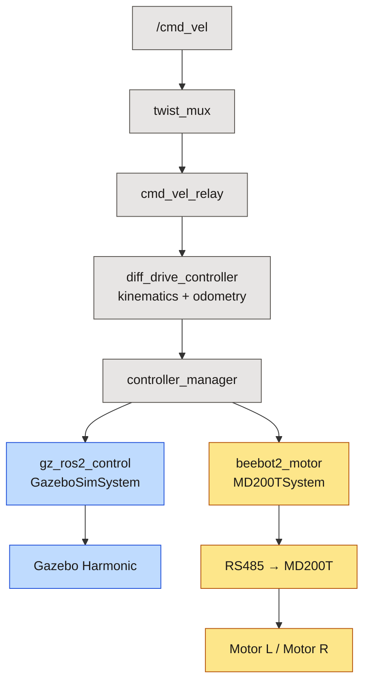
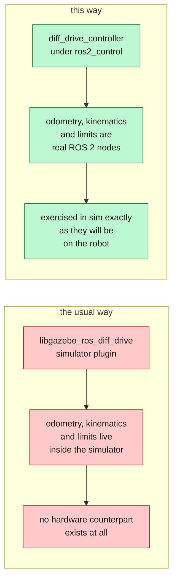
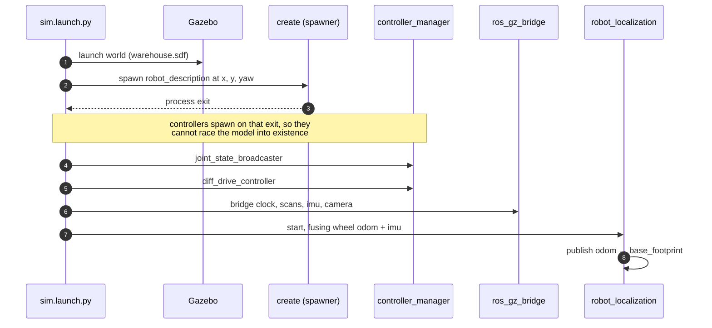

*Companion to video 06. 📺 Watch: **link coming with the video**.*

The real robot drives and has a description. But every hardware test costs setup
time and carries risk, and some tests are not safe to run at all — "drive at a
wall and confirm the safety system stops you" is a reasonable thing to want and
an unreasonable thing to do repeatedly with 300 kg.

So the robot gets a copy of itself.

## 1. The idea that decides everything else

> **The simulation is not a separate project. It is a digital copy of *this*
> robot, running the same ROS 2 graph.**

That sentence is doing real architectural work. The alternative — a simulation
built to demonstrate the algorithms, alongside a robot built to run them — is
the normal outcome, and it fails in a specific way: the two drift, and then
the simulation stops predicting anything. You are running two projects and
learning from neither.

Concretely, the same controller graph runs on both sides and **only the
hardware component underneath swaps**:



Everything grey is shared. Article 07 is entirely about the consequences.

## 2. Getting the URDF into Gazebo

Three things have to be added to a description that was previously drawing-only:

| Addition | Why |
|---|---|
| **Inertias and masses** on every link | a link with no inertia is a link Gazebo cannot integrate |
| **`<gazebo>` blocks** for sensors and plugins | sensors are Gazebo constructs, not URDF ones |
| **A `ros2_control` block** with a simulator plugin | so the controller graph has something to drive |

```bash
./run.sh sim                       # simulator + RViz
./run.sh headless                  # no GUI — CI and scripted runs
./run.sh sim world:=empty.sdf      # bare floor instead of the warehouse
./run.sh sim x:=-16.0 y:=0.0 yaw:=0.0
./run.sh sim use_meshes:=false     # primitives instead of 89k-triangle meshes
```

## 3. Inertias, which decide whether any of it is believable

This is the part people skip, and it is the part that decides whether the
simulation is a prediction or a cartoon.

A differential-drive robot's simulated behaviour under acceleration, its
tendency to slip, and how it settles on its casters are all functions of mass
distribution. Guess the inertias and you get a robot that behaves plausibly and
predicts nothing.

The description computes them from the primitive shapes rather than declaring
them:

```xml
<xacro:box_inertia m="${base_mass}" x="${base_length}"
                   y="${base_width}" z="${base_height}">
  <origin xyz="0 0 ${body_z}" rpy="0 0 0"/>
</xacro:box_inertia>
```

Same rule as article 05: derived, never typed.

> **One thing that was tried and reverted.** A caster *preload* — lifting the
> casters slightly so more load sits on the drive wheels — was added on the
> back of an apparent 2× odometry over-report. That measurement turned out to
> be bogus: the robot had been jammed against a pillar from an earlier test in
> the same session.
>
> The preload was actively harmful. It pitched the chassis 1.31° nose-down,
> which drops the front scan plane 0.23 m at 10 m range — into the floor.
> With the casters flat, clear-path odometry measures 1.06.
>
> **Reset the simulator between tests that can collide.** A robot leaning on a
> pillar keeps turning its wheels, so every number measured afterwards is
> meaningless. Hours went into that one.

## 4. `ros2_control` in simulation

The drive is a `diff_drive_controller` over velocity interfaces — **not** a
simulator plugin. That distinction is the whole point:



The 2018 machine used the plugin approach. Its odometry, its wheel separation
and its velocity limits all lived in a Gazebo plugin that had no hardware
counterpart — which is how a plugin could declare `wheelSeparation 0.64`
against 0.663 m joints and nobody noticed for years.

The controller config is per robot, because the two machines differ in wheel
separation and radius, and pairing one robot with the other's controller
parameters is **a silent odometry scale error, not a crash**.

## 5. Starting order, and why it is enforced



The `OnProcessExit` gate is not decoration. Spawning a controller before the
model exists produces a controller that fails to claim its interfaces, and the
symptom is a robot that sits still with no error worth reading.

## 6. The bridge

Gazebo and ROS 2 do not share a message format. `ros_gz_bridge` translates, and
it is configured **declaratively** so the whole wiring is inspectable in one
file rather than scattered across launch arguments:

```yaml
- ros_topic_name: "/scan"
  gz_topic_name: "/scan"
  ros_type_name: "sensor_msgs/msg/LaserScan"
  gz_type_name: "gz.msgs.LaserScan"
  direction: GZ_TO_ROS
```

What crosses, for BEEBOT2:

| ROS 2 topic | Type | Rate |
|---|---|---|
| `/clock` | `rosgraph_msgs/Clock` | — |
| `/scan` | `LaserScan` — roof 360° | 10 Hz |
| `/scan_front` | `LaserScan` — front safety | 15 Hz |
| `/imu` | `sensor_msgs/Imu` | 99 Hz |
| `/camera/image_raw`, `/depth`, `/points`, `/camera_info` | image / `PointCloud2` | 15 Hz |
| `/ground_truth` | `nav_msgs/Odometry` | **test fixture only** |

> **`/ground_truth` is bridged for tests and nothing else.** No robot node may
> subscribe to it. It is in the same category as the ground-truth *map* in
> article 12: a fixture used to score the robot's beliefs, never an input to
> them. The rule is currently enforced by convention; a CI check is on the list.

## 7. Four traps that cost hours each

**Gazebo lumps fixed joints.** Sensor frames get renamed to scoped paths like
`amr/base_footprint/lidar_front_left`, which no TF publisher knows about. Set
`<gz_frame_id>` on **every** sensor.

**IMU and contact sensors need their own Gazebo systems.** The `Sensors` system
only covers rendering-based sensors — cameras and lidars. Without
`gz-sim-imu-system` the IMU exists in the SDF and never publishes, silently.

**A contact sensor's system must be a *world* plugin, not a model one.** This is
still an open blocker: the bumper sensor does not publish even after that fix,
and article 17 says so plainly rather than pretending otherwise.

**Renames do not follow files.** The rename to `beebot2` changed the names
launch files *ask for* without renaming the files themselves, and every one
failed silently. `sim.launch.py` loaded `rviz/amr.rviz`, which did not exist —
and **RViz does not error on a missing `-d`, it opens an empty config**, so the
robot is simply absent. It asked for `bridge_beebot2.yaml` while the file was
still `bridge_servingbot.yaml`, so the bridge bridged nothing at all.

`test_launch_assets.py` now asserts that every asset a launch file names
actually exists.

## 8. The warehouse

The world is **generated, not hand-authored** — because aisle clearance is
arithmetic against the robot's own radius, not eighty hand-typed `<pose>` tags:

```bash
cd src/beebot2_gazebo
python3 scripts/generate_warehouse.py > worlds/warehouse.sdf
```

A 40 × 24 m hall, 50 models, racking in rows running east–west, a wide central
corridor:

| | width | vs BEEBOT2's 0.729 m swept diameter |
|---|---|---|
| central corridor | 4.8 m | 6.6× |
| standard aisle | 1.8 m | 2.5× |
| cross aisle | 2.0 m | 2.7× |
| **pinched aisle** | **1.4 m** | **1.9×** |

The north-west corner pinches to 1.4 m with a stub wall creating a blind
junction. **It exists to be failed in** — it is where controller tuning and
regression tests earn their keep. For the 1.477 m AMR the same corner is
*below* the swept diameter, i.e. genuinely impassable, which is also useful
information to have in a test world.

**Measured:** 50 models, loads in **6.97 s**, real-time factor **0.907** with
the robot and all sensors running.

## 9. What "it works" means here

```bash
./run.sh sim
./run.sh teleop
```

and then, in a third terminal:

```bash
ros2 topic hz /odom /scan /imu /joint_states
ros2 run tf2_ros tf2_echo odom base_footprint
```

| Check | Measured |
|---|---|
| lidars | 15 Hz |
| IMU | 99 Hz |
| joint states | 97 Hz |
| clear-path odometry ratio | 1.073 |
| 4 m straight line | 3.926 m, zero lateral drift |
| commanded 360° rotation | 349.8° |

Both shortfalls in that last pair are the configured **acceleration limits**
(0.7 m/s², 1.5 rad/s²), not scale error: ramp-up accounts for 0.18 m and 11.7°
respectively. That distinction is only available because there is a ground truth
to compare against — which is the first thing simulation buys you that hardware
does not.

## 10. When the simulator misbehaves

**Gazebo renders black or crawls:**

```bash
LIBGL_ALWAYS_SOFTWARE=1 ./run.sh sim
```

On the development machine here, `/dev/dri` passthrough does not help — the
container's Mesa has no `iris` driver for modern Intel parts and falls back to
llvmpipe regardless. Worth knowing before spending an evening on GPU
passthrough.

## Sign-off

- [ ] the robot rests on the floor: `base_footprint` at z = 0.0000
- [ ] wheels and casters both contact at 0.0000
- [ ] no lidar self-hits (0 beams under `range_min` on a clear floor)
- [ ] every sensor publishes at its declared rate
- [ ] `odom → base_footprint` has exactly one publisher
- [ ] the same `./run.sh teleop` drives the sim and the robot
- [ ] a 4 m commanded line reads back within the acceleration budget
- [ ] the world loads and holds a real-time factor near 1

## Next

There are now two robots: one made of aluminium and one made of arithmetic.
They already share most of a ROS 2 graph. Next they become, as far as the
software is concerned, **one robot** — and the payoff is that any difference
between them becomes evidence rather than noise.

**Next: [One ROS 2 Interface for the Real Robot and Simulation](../07-one-interface/).**
