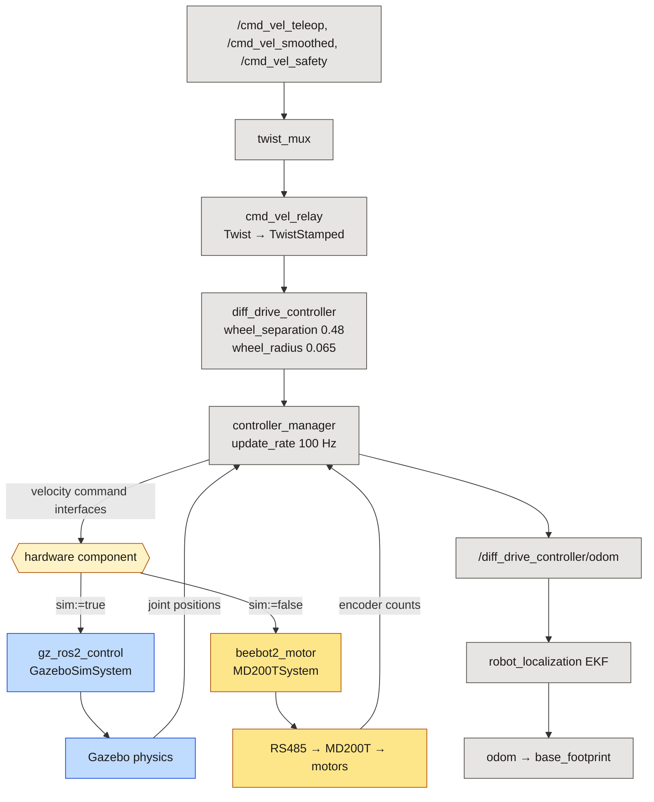
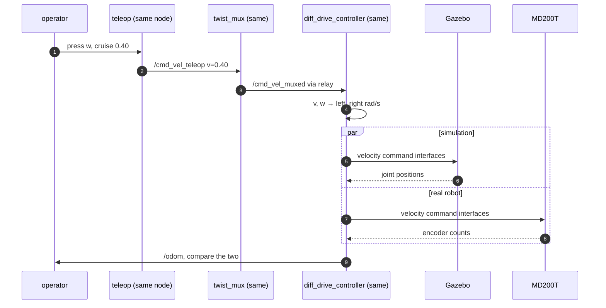
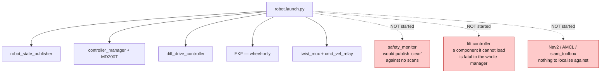

*Companion to video 07. 📺 Watch: **link coming with the video**.*

There is a real robot and a simulated robot. Keeping them in step by hand is a
losing game: two launch files drift apart, and then the simulation stops
predicting anything.

This article is short on new capability and long on consequence. Nothing new
gets built. What changes is that a difference between the two robots stops
being noise and starts being **evidence**.

## 1. The seam

`ros2_control` splits a robot into two halves that meet at a fixed interface:

- **Controllers** own semantics — kinematics, odometry, limits, the
  `cmd_vel` contract.
- **Hardware components** own bytes — how a wheel velocity becomes a command on
  a wire, and how a count becomes a position.

Everything above the seam is identical in simulation and on the machine.
Everything below it swaps.



That is the entire architecture of this article. Everything else is
consequences of it.

## 2. Where the switch happens

One xacro argument:

```xml
<xacro:beebot2_ros2_control sim="true"  .../>   <!-- Gazebo -->
<xacro:beebot2_ros2_control sim="false" .../>   <!-- MD200T over RS485 -->
```

and the joint interfaces themselves are declared **once**, in a macro used by
both branches, so the two cannot drift:

```xml
<xacro:macro name="beebot2_drive_joints" params="vel_limit:=6.0">
  <joint name="wheel_left_joint">
    <command_interface name="velocity">
      <param name="min">${-vel_limit}</param>
      <param name="max">${ vel_limit}</param>
    </command_interface>
    <state_interface name="position"/>
    <state_interface name="velocity"/>
  </joint>
  ...
</xacro:macro>
```

> **`vel_limit` is per robot, not per stack.** It is a rad/s ceiling at the
> wheel, and the two robots have wheels a factor of 1.7 apart in radius: 6.0
> suits the AMR's 0.11 m wheels, BEEBOT2's 0.065 m wheels need 15.0 to reach a
> comparable ground speed.
>
> Getting it wrong **clips the command silently** — mid-turn, where the outer
> wheel carries `v + ω·track/2`. Which is why the controller limits are
> chosen to sit inside it with headroom:
>
> `0.7 + 1.0 × 0.24 = 0.94 m/s` of rim speed, against a ceiling of
> `15.0 × 0.065 = 0.975 m/s`.
>
> The previous 1.0 / 1.2 pair asked for 1.188 m/s — 18.3 rad/s — and would have
> been clipped without a word.

## 3. Two launch files that are deliberate mirrors

| | `sim.launch.py` | `robot.launch.py` |
|---|---|---|
| controller config | `controllers_beebot2.yaml` | **the same file** |
| `diff_drive_controller` | yes | yes |
| EKF (`ekf.yaml`) | yes | yes |
| `twist_mux` | yes | yes |
| `cmd_vel_relay` | yes | yes |
| hardware component | `gz_ros2_control` | `beebot2_motor/MD200TSystem` |
| world, bridge, spawner | yes | — |
| `safety_monitor` | yes | **no** — no scanners exist |

They are mirrors on purpose, and the payoff is one sentence:

> **Anything that behaves differently between the two is a real difference in
> the robot, rather than an artefact of two launch files that drifted apart.**

That turns simulation from a demo into a debugging tool. If the simulated robot
turns further than the real one for the same command, the difference is in the
wheels, the floor or the calibration — it is not in a config file that someone
forgot to copy across.

## 4. Running the same command on both

The test that proves the seam works is deliberately dull:



Both teleops publish `/cmd_vel_teleop`, so either works against either robot
with nothing changed:

```bash
./run.sh sim  ;  ./run.sh teleop      # simulation
./run.sh robot ;  ./run.sh teleop     # the machine
```

The comparison to make is a straight line and a rotation, with the same
commanded speeds, and then a look at what `/odom` says versus a tape measure.
Simulation's numbers are already known:

| Check | Simulation |
|---|---|
| clear-path odometry ratio | 1.073 |
| 4 m straight line | 3.926 m |
| commanded 360° rotation | 349.8° |

**On hardware, none of these has been measured.** `encoder_ppr` is measured and
`gear_ratio` is established, but no distance test has been run. Saying so is
more useful than a highlight reel; article 13 is where it gets closed.

## 5. What this buys, concretely

### Calibration is exercised on both sides

Because `diff_drive_controller` does the kinematics in *both* configurations,
`wheel_separation` and `wheel_radius` are used identically in simulation and on
the robot. A scale error in either is reproducible at a desk.

### The command chain is the same chain

`twist_mux` and `cmd_vel_relay` run on the real robot too. So the
Twist/TwistStamped trap, the mux priority ladder and the safety speed scale are
not simulation conveniences bolted on later — they are the actual command path,
tested every time either robot moves.

### The failure modes transfer

When Nav2 goals fail in simulation (article 16), the diagnosis — localisation
error putting a correctly-followed path into the racking — is a diagnosis about
*this robot*, because the geometry, the limits and the odometry are the same.

## 6. What it does not buy

Being honest about the boundary of the claim:

| Shared | Not shared |
|---|---|
| kinematics, limits, odometry maths | tyre compliance, floor friction, slip |
| the whole command chain | serial timing and link budget |
| controller configuration | encoder quantisation and noise |
| TF tree and frames | motor thermal behaviour, load response |

The seam guarantees that the *software* is the same. It guarantees nothing
about physics. A simulation that agrees with hardware on the command path and
disagrees on slip is doing its job — it has isolated the disagreement to
exactly one place.

## 7. The parts of the real robot that are deliberately absent

`robot.launch.py` brings up the drive and nothing else, and each omission has a
reason:



Two of those are worth restating because they are counter-intuitive:

- **The safety monitor is left out on purpose.** It begins with an empty scan
  dictionary, so with no lidars it evaluates its protective fields against
  nothing and publishes "clear". A safety layer asserting the world is empty is
  worse than an absent one, because `/safety/state` and `/safety/stop_lock`
  both look healthy.
- **The EKF runs, but wheel-only.** `ekf.yaml` configures `imu0: /imu` and
  nothing publishes it on the robot. `robot_localization` handles a missing
  input without complaint, so this is **silent** — and the measured heading
  benefit, 0.72° against 6.52° raw, is a simulation result that does not apply
  here. Article 08 is the fix.

## 8. The honest status of the mirror

The seam is real and the drive works on both sides. Below that, the right-hand
column is mostly empty:

| Subsystem | Sim | Real |
|---|---|---|
| Drive motors | ✅ | 🟡 link confirmed, both wheels driven |
| Wheel odometry | ✅ 1.073 | 🔨 built, never measured |
| EKF fusion | ✅ 0.72° heading | 🟡 runs wheel-only |
| Lidar | ✅ 15 Hz | ⬜ no driver in the workspace |
| IMU | ✅ 99 Hz | ⬜ no driver in the workspace |
| Camera | 🔨 | ⬜ no driver |
| Safety fields | ✅ | ⬜ blocked on the lidars |
| SLAM / AMCL / Nav2 | 🟡 | ⬜ blocked on everything above |

**The drive is the only subsystem that has been made to work on the real
machine.** That is the shape of the project right now, and the seam is what
makes closing the gap a matter of writing drivers rather than rewriting the
stack.

## Sign-off

- [ ] `sim.launch.py` and `robot.launch.py` name the same controller config
- [ ] both start the same `twist_mux`, `cmd_vel_relay` and EKF
- [ ] the same teleop drives both with no arguments changed
- [ ] `ros2 control list_controllers` shows the same controllers, active, on both
- [ ] `ros2 control list_hardware_interfaces` shows the same joint interfaces
- [ ] a commanded straight line and rotation have been compared side by side
- [ ] any difference found has been attributed to physics, not to configuration

## Next

One robot, two worlds, one interface. From here the robot starts growing senses
— and the first one is the sense it needs to know whether it turned at all.

**Next: [Giving the AMR a Sense of Motion](../08-imu/).**
