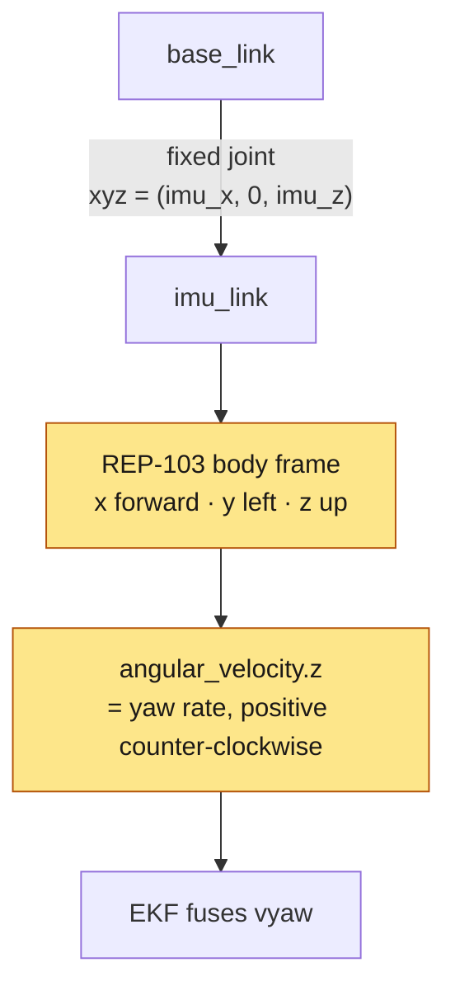
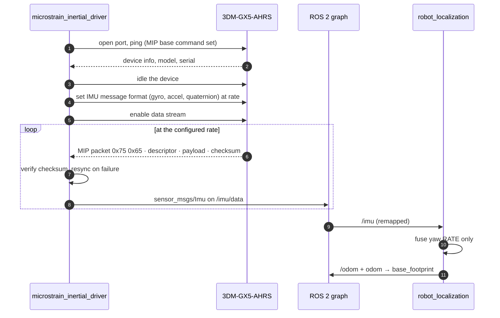
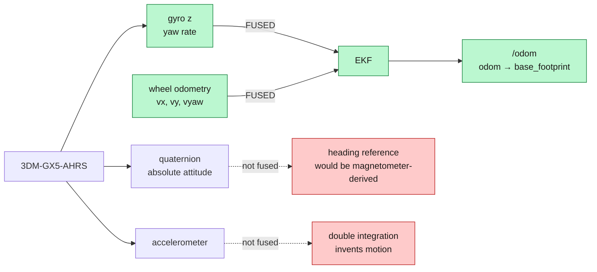
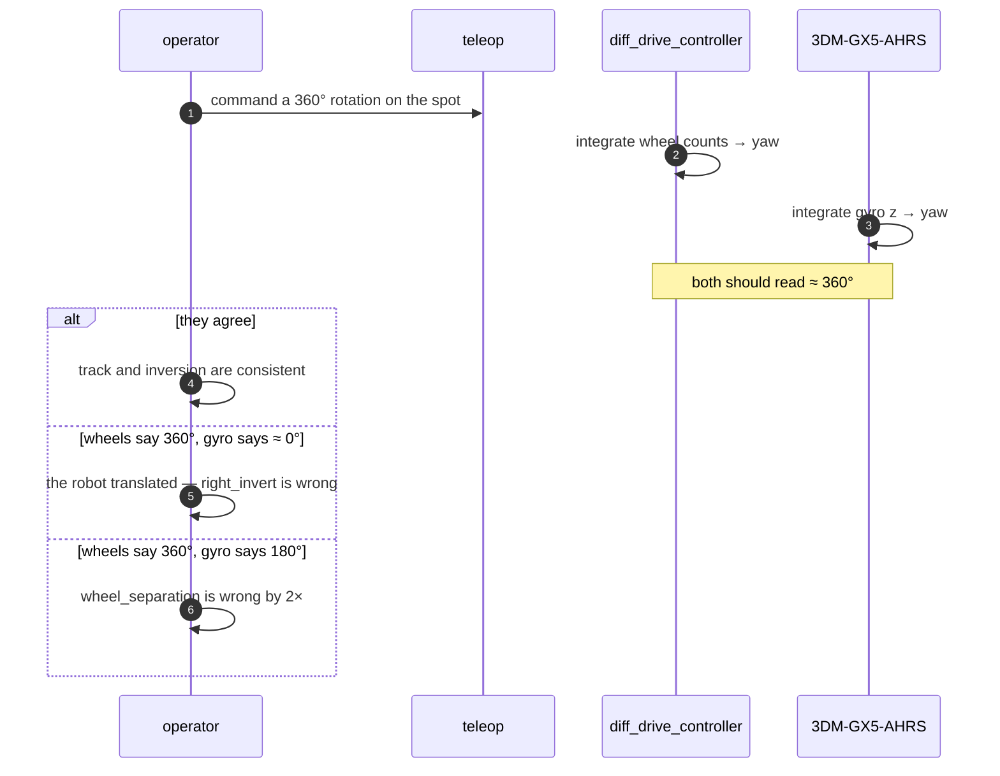

*Companion to video 08. 📺 Watch: **link coming with the video**.*

The robot knows how far its wheels turned. That is not the same as knowing how
far it went — wheels slip, and **a slipping wheel lies confidently**. It reports
rotation that produced no motion, and nothing downstream can tell the difference.

There is a second, sharper reason to want an IMU on this particular robot, and
article 03 already ran into it: `right_invert` has **no electrical
discriminator**. The drive reports each motor in its own frame, so odometry,
`joint_states` and raw encoder counts all read identically whether the robot is
translating or spinning on the spot. You watch the robot, or you add an IMU.

This article adds the IMU.

## 1. What an IMU actually measures

An inertial measurement unit is two or three sensors in one package, and they
are good at completely different things:

| Sensor | Measures | Good at | Bad at |
|---|---|---|---|
| **Gyroscope** | angular rate, °/s | short-term rotation, immune to wheel slip | absolute heading — the bias integrates without bound |
| **Accelerometer** | specific force, m/s² | sensing gravity, so roll and pitch have an absolute reference | translation — integrating it twice invents motion |
| **Magnetometer** | magnetic field | an absolute heading reference, in principle | steel buildings and BLDC motors |

The unit fitted here also runs an **onboard estimation filter** that fuses those
three into an attitude estimate — which is what the "AHRS" in its name means:
Attitude and Heading Reference System, as opposed to a bare IMU that only
streams raw rates.

## 2. The hardware: 3DM-GX5-AHRS

The IMU on this robot is a **MicroStrain 3DM-GX5-AHRS**. Industrial-grade, in a
metal housing, with a documented protocol and a maintained ROS 2 driver — the
three properties that matter more than the specification sheet.

| | Figure |
|---|---|
| Accelerometer range | ±8 g (other ranges available as options) |
| Gyroscope range | ±300 °/s |
| Gyro in-run bias stability | ≈ 8 °/hr |
| Gyro noise density | ≈ 0.005 °/s/√Hz |
| Accel in-run bias stability | ≈ 40 µg |
| Accel noise density | ≈ 25 µg/√Hz |
| Static pitch / roll accuracy | ≈ ±0.25° |
| Dynamic pitch / roll accuracy | ≈ ±0.5° |
| IMU data output | up to 1000 Hz |
| Estimation filter output | up to 500 Hz |
| Interface | USB, or RS232/TTL serial |
| Default baud | 115200, configurable up to 921600 |
| Protocol | MIP (MicroStrain Inertial Protocol) |

> **Take those as datasheet family figures, not as measurements of your unit.**
> Ranges and bias figures vary by option code and revision, and each unit ships
> with its own calibration record. Confirm against the sheet in the box before
> quoting any of them in a report.

For this robot the useful part of that table is one row: **8 °/hr of gyro bias
instability**. That is roughly 0.002 °/s — about 0.13° of heading error per
minute if nothing ever corrects it. Wheel odometry on this class of machine
loses far more than that to a single slipping start.

### Why this class of unit, for an AMR

A hobby-grade MEMS IMU will also give you an angular rate. What an industrial
AHRS adds is the boring stuff: temperature-compensated bias, a documented
coordinate convention, a deterministic packet protocol with a checksum, and an
output rate you can pin rather than one that drifts with CPU load. On a machine
where the heading estimate feeds SLAM, AMCL and Nav2 in turn, "boring" is the
requirement.

## 3. Mounting and frames — get this right first



ROS 2 conventions are fixed by **REP-103**: body frames are **x forward,
y left, z up**, and rotations follow the right-hand rule, so a positive yaw rate
is a *left* turn. The `imu_link` frame in the URDF declares where the unit sits
and how it is rotated relative to `base_link`.

Three failure modes, all silent:

| Mistake | Symptom |
|---|---|
| Unit mounted rotated 90°, URDF not updated | robot turns left, EKF is told it turned... something else |
| Sign convention inverted | the EKF fights the wheels instead of correcting them, and the fused heading is *worse* than raw |
| Frame declared but never published | `robot_localization` ignores the input **without complaint** |

That last one deserves emphasis. `robot_localization` handles a configured input
that never arrives by simply not using it. No warning, no error. The filter runs
and the heading benefit silently does not exist — which is exactly the state the
real robot is in right now (§7).

Physically: mount it rigidly, near the rotation centre, away from the motors and
the drive cabling, and on the chassis rather than on anything compliant. A
gyroscope on a bracket that resonates measures the bracket.

## 4. Getting it into ROS 2

The driver is `microstrain_inertial_driver`, the vendor's maintained ROS 2
package. It speaks MIP over the serial device and publishes standard messages.

```bash
sudo apt install ros-jazzy-microstrain-inertial-driver

ros2 launch microstrain_inertial_driver microstrain_launch.py \
  params_file:=/path/to/gx5.yml
```

The device appears as a USB CDC-ACM port (`/dev/ttyACM0`) or as a plain serial
port if wired over RS232/TTL.

> **Use a `/dev/serial/by-id/...` path for anything permanent.** `ttyUSB` and
> `ttyACM` numbering follows enumeration order, so plugging the lidar in first
> silently moves the IMU. On this robot the battery pack and the drive are
> already on `ttyUSB*` — see article 10.

### What the MIP exchange looks like



A MIP packet is a sync pair (`0x75 0x65`), a descriptor set byte, a length, the
payload, and a 16-bit Fletcher checksum. Same principle as the MD200T frames in
article 02 and the DALY frames in article 10: **a bad checksum drops the frame
rather than acting on it, and the parser resynchronises by advancing one byte
and looking for the next sync pair.** A link that cannot resynchronise needs a
node restart every time a USB adapter hiccups.

### What `sensor_msgs/Imu` carries

```
header.frame_id: imu_link
orientation:                 quaternion — from the onboard filter
orientation_covariance:      [...]
angular_velocity:            rad/s, body frame
angular_velocity_covariance: [...]
linear_acceleration:         m/s², body frame, gravity included
linear_acceleration_covariance: [...]
```

**The covariances are not decoration.** `robot_localization` weights each input
by them. An IMU that publishes zeros — or the `-1` that means "unknown" — either
gets trusted absolutely or ignored, and neither is what you want. Configure the
driver to publish real values, or set them explicitly.

## 5. What this stack actually fuses, and what it refuses to

The EKF configuration is deliberately narrow:

```yaml
imu0: /imu
imu0_config: [false, false, false,     # x     y     z
              false, false, false,     # roll  pitch yaw
              false, false, false,     # vx    vy    vz
              false, false, true,      # vroll vpitch vyaw   ← only this
              false, false, false]     # ax    ay    az
```

**One `true` in fifteen.** Only the yaw *rate*.



### Why absolute yaw is not fused

This is the decision most worth arguing about, because the GX5-AHRS *does* carry
a magnetometer and *does* publish an absolute orientation. It would be easy to
feed that straight in.

The reason not to is the building. An indoor AMR spends its life inside a steel
frame, driving past steel racking, carrying its own BLDC motors and a battery
pack drawing tens of amps. A magnetometer in that environment does not measure
the Earth's field; it measures the warehouse, and it measures a *different*
warehouse in every aisle. Feeding that into `odom → base_footprint` injects a
position-dependent heading error into the one transform that is supposed to be
smooth and continuous.

So the fused heading is an **integration of the gyro, corrected by nothing**. It
drifts — slowly, at roughly the bias-instability rate — and the thing that
corrects it is AMCL matching lidar against a map (article 14), which is a far
better heading reference indoors than any magnetometer.

> **Note the difference between a constraint and a choice.** The configuration
> comment in `ekf.yaml` says absolute yaw is not fused "because there is no
> magnetometer". With a 3DM-GX5-AHRS that is no longer true — there is one, and
> it is a good one. The decision stands, but it now rests on the environment
> rather than on the hardware, and the comment should say so.

### Why linear acceleration is not fused

Integrating acceleration twice to get position is a good way to invent motion
that did not happen. On a machine at AMR speeds — under 1 m/s, with gentle
ramps — the real accelerations are small enough that most of what the sensor
reports is noise and residual gravity leakage from an imperfect attitude
estimate. `imu0_remove_gravitational_acceleration` is set, and the axes stay
off.

## 6. Testing it

### The rate

```bash
ros2 topic hz /imu
ros2 topic echo /imu --once
```

Expect the rate you configured, and expect it to be *steady*. A rate that
wanders with CPU load means the timestamps are being taken on arrival rather
than at sampling, which puts a variable lag into the filter.

### The signs

Push the robot by hand, or drive it slowly, and watch `angular_velocity.z`:

| Motion | Expected |
|---|---|
| rotate **left** (counter-clockwise from above) | `angular_velocity.z` **positive** |
| rotate right | negative |
| drive straight | near zero, with visible noise |
| stationary | mean near zero — this is your bias estimate |

### The cross-check that settles `right_invert`

This is the measurement article 03 could not make:



Three different faults, three different signatures, one experiment. That is the
whole argument for fitting an IMU early rather than late.

### The drift

Leave the robot stationary for five minutes and integrate the gyro. What you get
is your unit's real bias behaviour, and it is the number to quote when someone
asks how long the robot can navigate open-loop.

## 7. Honest status

**There is no IMU driver in this workspace.** The 3DM-GX5-AHRS is the chosen
unit and the EKF is already configured to fuse it, but nothing publishes `/imu`
on the real machine, so:

| | Simulation | Real robot |
|---|---|---|
| IMU publishing | ✅ 99 Hz | ⬜ no driver |
| EKF fusing it | ✅ | ❌ runs wheel-only, silently |
| Heading error | **0.72°** fused vs 6.52° raw | unmeasured |

That measurement — a ~20 m square loop against Gazebo ground truth — is the case
for the whole article:

| | wheel odometry | EKF |
|---|---|---|
| position error | 0.375 m | **0.257 m** |
| heading error | 6.52° | **0.72°** |

**Heading is the point.** Wheel odometry heading degrades with slip, which is
exactly the regime an AMR spends its life in. The gyro does not care.

Fitting the driver is listed as the cheapest large win on the whole hardware
roadmap, for that reason.

### The simulated IMU's noise model needs re-deriving

The Gazebo sensor's noise parameters were taken from a different unit's
datasheet. Now that the real IMU is chosen, they are checkable — and they do not
match:

| | Sim value | Implied by 3DM-GX5-AHRS figures at 100 Hz |
|---|---|---|
| gyro stddev | 2.0e-4 rad/s | ≈ 6e-4 rad/s (0.005 °/s/√Hz over a 50 Hz band) |
| gyro bias | 7.5e-6 rad/s ≈ 1.5 °/hr | ≈ 8 °/hr |
| accel stddev | 1.7e-2 m/s² | ≈ 1.7e-3 m/s² (25 µg/√Hz over a 50 Hz band) |

So the simulated gyro is roughly **three times quieter and five times more
stable than the real unit**, and the simulated accelerometer is ten times
noisier. The accelerometer is not fused, so that row does not matter. The gyro
rows do: **the 0.72° heading result is measured against an optimistic sensor**
and should be expected to degrade on hardware.

Writing that down is more useful than quietly carrying the number forward. The
conversion above — noise density × √(bandwidth) — is the arithmetic to redo once
the real unit's calibration record is in hand.

## Sign-off

- [ ] `/imu` publishes at a steady, configured rate
- [ ] `frame_id` is `imu_link` and that frame exists in TF
- [ ] rotating left gives a **positive** `angular_velocity.z`
- [ ] covariances are real values, not zeros and not `-1`
- [ ] a commanded 360° rotation agrees between wheels and gyro
- [ ] the stationary bias has been measured over several minutes
- [ ] the EKF's `imu0` topic name actually matches what the driver publishes
- [ ] the fused heading has been compared against the raw one on a closed loop

## Next

The robot can feel itself move. It still knows nothing at all about what is
around it — where the walls are, where the racking is, whether there is a person
two metres ahead. Next it learns to see.

**Next: [Giving the AMR Eyes with LiDAR](../09-lidar/).**
