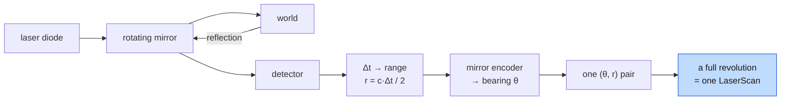
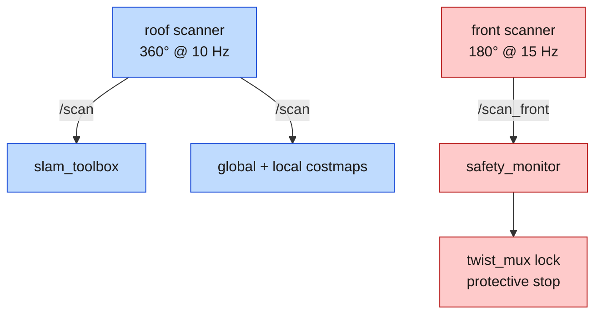
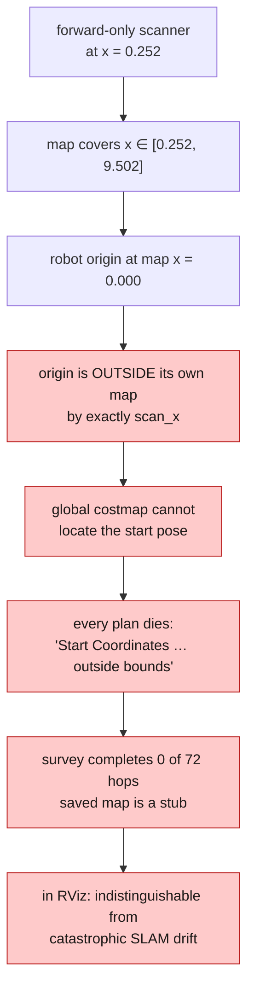
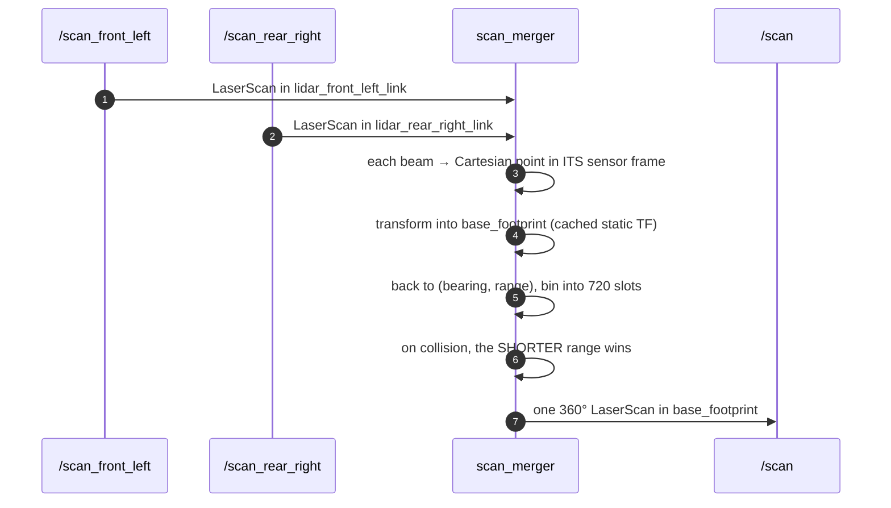

*Companion to video 09. 📺 Watch: **link coming with the video**.*

The robot knows how it is moving. It knows nothing whatsoever about what is
around it.

Every remaining article in the series — mapping, localisation, navigation,
safety, docking — is downstream of this one sensor. It is the single largest
capability step in the build.

## 1. How a 2D scanner works

A time-of-flight laser and a mirror that spins.



Two consequences fall straight out of that picture and shape everything later:

- **A scan is not instantaneous.** The mirror sweeps. At 15 Hz a full revolution
  takes 67 ms, and a robot moving at 0.7 m/s travels 4.7 cm during it. The scan
  carries one timestamp; the beams inside it were taken at different robot
  poses. This is a real error source, and it comes back in article 12.
- **It sees one plane.** Everything above and below the scan plane is invisible.
  A pallet fork at ankle height, an overhanging shelf, a step — none of them
  exist to a 2D scanner mounted at 15 cm.

## 2. `sensor_msgs/LaserScan`

```
header.stamp, header.frame_id
angle_min, angle_max, angle_increment   # radians
time_increment, scan_time
range_min, range_max                    # metres
ranges[]                                # one per beam
intensities[]                           # optional
```

The `ranges` array is bare numbers with no angles attached. Beam *i* is at
`angle_min + i × angle_increment`. Everything about where those beams point
comes from the header frame plus TF — which is why article 05 spent so long on
getting the sensor's pose right.

**What the special values mean:**

| Value | Meaning |
|---|---|
| `inf` | nothing returned within `range_max` — "nothing there", not "unknown" |
| `nan` | the sensor reported an invalid measurement |
| `< range_min` | usually the sensor looking at itself |
| exactly `range_max` | some sensors fill this instead of `inf` — check yours |

That last row is why `max_laser_range` in the SLAM configuration is set to
**9.5** on a 10.0 m sensor. Claiming more range than the hardware delivers makes
the scan matcher trust returns that are really range-max fill, and the map grows
soft edges.

## 3. Two scanners, two jobs

BEEBOT2 carries two, on separate topics **on purpose**:

| | Roof unit | Front unit |
|---|---|---|
| Frame | `mast_scan` | `base_scan` |
| Field | 360° | 180° |
| Rate | 10 Hz | 15 Hz |
| Range | 10 m | 10 m |
| Topic | `/scan` | `/scan_front` |
| Consumed by | slam_toolbox, both costmaps | `safety_monitor` only |



> **The safety layer reads a raw scan, never a derived one.** On a real machine
> the safety scanner is a certified device with its own authority over the drive
> enable. Running the safety fields off a merged or filtered topic teaches the
> software a habit that does not transfer to a certified installation — and adds
> a processing node between an obstacle and a stop.

## 4. Mounting, and the mistake that is easy to make twice

**A declared field of view is only real if the mounting can deliver it.**

The front scanner was originally declared as 270°, copied from the larger
robot's corner-mounted units. It sits 0.037 m proud of a flat 0.43 m front face.
So any beam swept past

```
180° − atan(0.215 / 0.037) = 99.8°
```

turns back and hits the robot's own shell at about 0.05 m.

| | Predicted | Measured in Gazebo |
|---|---|---|
| beams striking the robot | 70.4 of 270 (26 %) | **211 of 811 (26 %)** |

Those returns are not harmless. The costmap marks them, and with
`min_obstacle_height: -0.1` the robot inflates a permanent obstacle **onto
itself** and then refuses to plan. The field is now ±90°, which clears the face
by construction.

The larger AMR solves the same problem the way real machines do: corner-mount
the scanners, proud of the body, so a wide field has somewhere to go.

## 5. The lesson that forced a second scanner

This one is worth its own section because it looks like a SLAM failure and is
not.

**A forward-only scanner cannot map.** `slam_toolbox`'s map covers only what has
been observed, so with a front-mounted lidar the map begins at the *scanner's* x
and extends ahead of it. Nothing behind the sensor is ever seen — including the
ground the robot is standing on.



**A robot cannot map its way out of a hole it cannot see itself in.** Hence the
roof unit, with a full 360° field, mounted clear of the shell — where it
measures **zero** self-hits against the front unit's 211 of 811.

## 6. Merging two scanners into one, on the larger platform

The AMR does it differently: two 270° units on opposite diagonal corners, merged
into a single 360° scan by `beebot2_perception/scan_merger`.

Costmaps want one scan radiating from one origin. The two sensors are **1.06 m
apart**, so the same bearing means different things to each of them, and merging
by angle alone is simply wrong.



Three decisions in that flow, each with a reason:

- **Cartesian, not polar.** Reprojecting through the sensor frames is the only
  correct way to combine displaced sensors.
- **Shorter range wins.** Overestimating free space in a costmap is how robots
  hit things.
- **Transforms cached, not looked up per beam.** They are fixed joints; a TF
  lookup per beam at 15 Hz × 1622 beams would be absurd.
- **Published on the arrival of an input, not on a timer.** A timer republishes
  whatever is cached, so an upstream stall emits duplicate scans taken at
  different robot poses — which is poison to a scan matcher.

> **What the merged scan is not.** It is not a physically valid single scan. Two
> displaced sensors have different occlusion relationships than one sensor at
> the midpoint, and no amount of reprojection fixes that. It is a *costmap
> input*. The safety layer consumes the raw per-sensor scans, which is why they
> are still published.

**Measured:** 720 bins over 359°, no gaps. With a caveat found later while
instrumenting navigation: at typical ranges the merged scan carries about
**600 valid returns of 720 bins**, because the merger bins by bearing and not
every bin receives a beam. That is expected for the method — but "720 beams"
describes the *message*, not the number of measurements in it.

## 7. Seeing it

```bash
./run.sh sim
# RViz: add a LaserScan display, topic /scan, fixed frame base_footprint
```

Then walk in front of the robot and watch the arc deform. It is the most
satisfying five seconds in the series, and it is also a real test: the obstacle
should appear at the right *distance* and the right *bearing*, and those two
being right means the frame and the mounting agree with the URDF.

Checks worth running:

```bash
ros2 topic hz /scan                       # the declared rate
ros2 topic echo /scan --field ranges      # values, and how many are inf
ros2 run tf2_ros tf2_echo base_footprint mast_scan
```

**The self-hit check**, on a clear floor with nothing within a metre:

```bash
ros2 topic echo /scan --once --field ranges | tr ',' '\n' | \
  awk '$1+0 < 0.30 && $1+0 > 0 {n++} END {print n+0, "beams under 0.30 m"}'
```

Anything other than zero means the sensor is looking at the robot.

## 8. What the robot still cannot see

Worth being explicit about, because everything downstream inherits it:

| Blind to | Because |
|---|---|
| anything above or below the scan plane | it is one plane |
| glass, and some polished metal | specular reflection returns nothing |
| the space behind the front scanner | 180° field |
| dynamic obstacles between scans | 67 ms of latency at 15 Hz |
| height — a step, a ramp, a fork | no vertical information at all |

The RGBD camera exists in the description for exactly this gap, and nothing in
the stack currently depends on it. That is a Phase 9 thread, not a Phase 5 one.

## 9. Honest status

**There is no lidar driver in this workspace.** In simulation both scanners run
at their declared rates and the merger is verified. On the real robot:

| | Simulation | Real robot |
|---|---|---|
| Scanners | ✅ 15 Hz | ⬜ **no driver** — needs `sick_scan_xd` or equivalent |
| Scan merger → 360° | ✅ 720 bins / 359° / no gaps | ⬜ blocked on the scanners |
| Safety fields | ✅ | ⬜ blocked on the scanners |
| SLAM, AMCL, Nav2 | 🟡 | ⬜ blocked on all of the above |

This is the **first item** on the hardware roadmap, and the reason is visible in
that table: everything below it is blocked on it. A lidar driver publishing
`/scan` and `/scan_front` in the right frames unblocks four subsystems at once.

## Sign-off

- [ ] `/scan` publishes at the declared rate, in the declared frame
- [ ] `angle_min`/`angle_max` match the field the mounting can actually deliver
- [ ] **zero** beams under `range_min` on a clear floor
- [ ] an obstacle appears in RViz at the right distance *and* bearing
- [ ] `range_max` in every consumer's config is inside the sensor's real range
- [ ] the safety layer reads the raw scan, not a merged or filtered one
- [ ] the mapping scanner can see behind the robot
- [ ] merged output (if used) has no gaps and prefers the shorter range

## Next

The robot drives, feels its own motion and now sees. It has no idea how much
longer it can do any of it — and a mapping run that dies halfway across the hall
because the pack went flat is a mapping run you get to do again.

So before the robot is trusted to go anywhere on its own, it learns to read its
own battery.

**Next: [Reading the AMR's Battery with ROS 2](../10-battery-bms/).**
