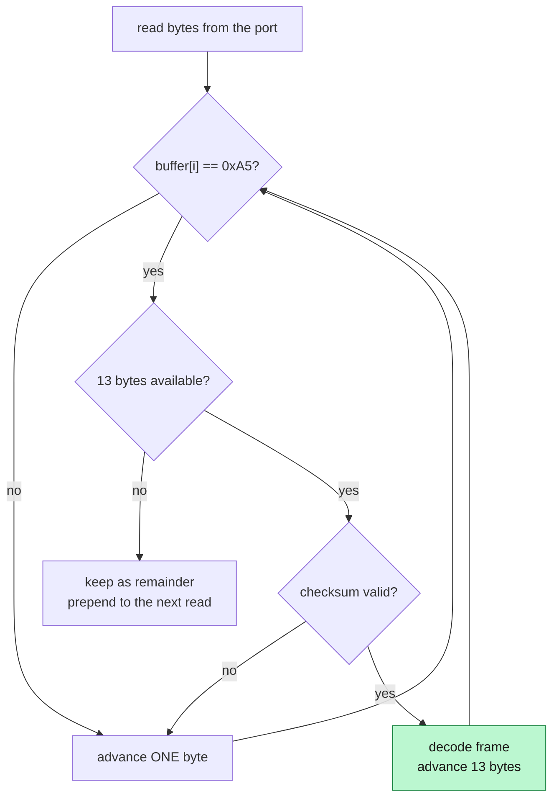
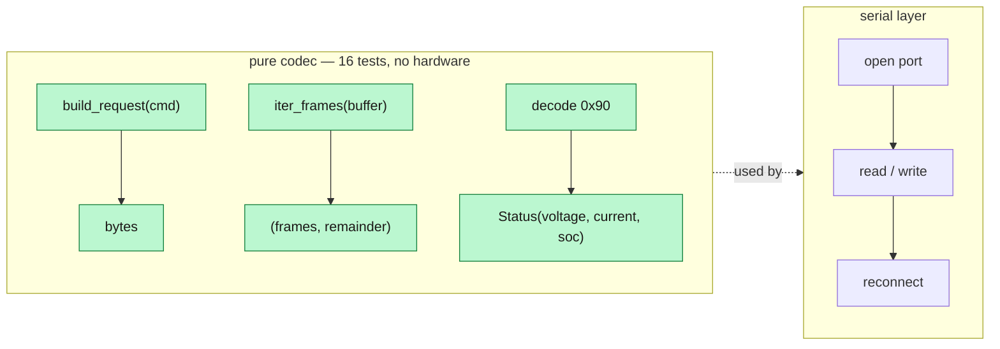
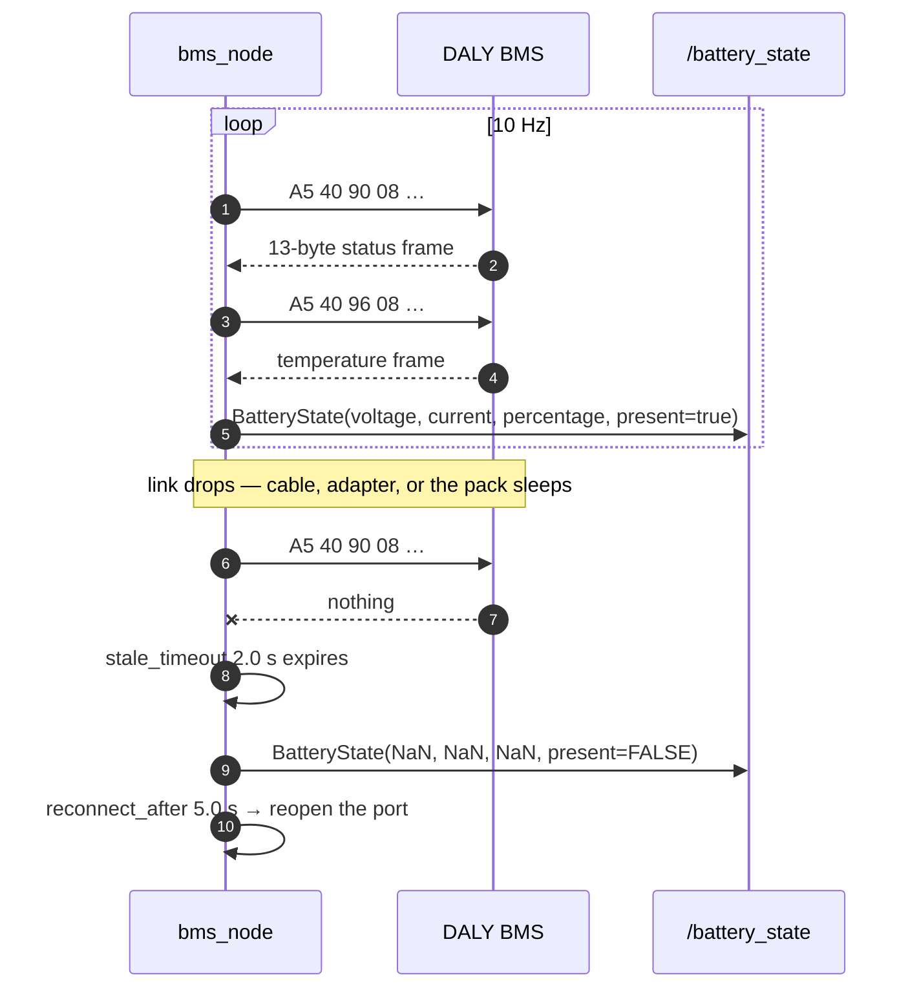

*Companion to video 10. 📺 Watch: **link coming with the video**.*

The robot drives, feels and sees. It has no idea how much longer it can do any
of it.

That sounds like a comfort feature. It is not: article 19 is about a robot that
takes itself to a charger, and a docking controller that acts on a wrong battery
reading is a robot that strands itself in an aisle — or worse, one that keeps
working until the pack cuts out mid-turn.

## 1. What a BMS is for

A lithium pack is not one battery. It is a series string of cells, and the
**Battery Management System** is the board that keeps them from destroying each
other: cell balancing, over- and under-voltage cutoff, over-current protection,
temperature monitoring.

For our purposes it is also the only part of the pack that will talk. It knows
pack voltage, current, state of charge and cell temperatures, and it will hand
them over on a serial link.

The pack here uses a **DALY smart BMS**, at **9600 baud**.

## 2. The protocol

Fixed 13-byte frames in both directions — one of the simplest wire formats in
this whole build:

```
A5   40   CMD   08   D0 D1 D2 D3 D4 D5 D6 D7   CHK
|    |    |     |    |                         └─ sum of the preceding 12
|    |    |     |    └─ payload, always 8 bytes    bytes, low byte only
|    |    |     └─ payload length, always 0x08
|    |    └─ command
|    └─ sender address: 0x40 host, 0x01 BMS
└─ start byte
```

Two commands are polled:

| Command | Carries |
|---|---|
| `0x90` | total voltage, current, state of charge |
| `0x96` | up to 7 temperature probes, one frame per group |

`0x90` is the load-bearing one — it carries everything a battery consumer
actually needs. `0x96` is polled because `sensor_msgs/BatteryState` has a
temperature field and the extra frame costs nothing on an otherwise idle
9600-baud link.

### Two decoding details that are easy to get wrong

**Current is biased, not signed.** The pack fits a charge/discharge swing into an
unsigned 16-bit field by putting "no current" at mid-scale:

```
current_A = (raw − 30000) × scale
```

Subtract the bias **before** scaling, never after. Get that backwards and a
discharging robot reports a charging one.

**Temperature is offset by 40.** Each probe byte is degrees Celsius **plus 40**,
so a byte of 65 is 25 °C. It is a common convention and it is invisible until
your robot reports 65 °C at room temperature.

## 3. Resynchronisation, which matters more than it looks



A pack that is power-cycled, or a USB adapter that drops a byte, leaves the
stream offset by one. A fixed-stride parser then rejects **every** frame
forever, and the only fix is a node restart.

Advancing a single byte on a bad checksum and looking for the next start marker
means the link heals itself within one frame. It is four lines of code and it is
the difference between a driver that survives a shift and one that does not.

## 4. Testing a protocol before it meets a pack

The codec is a **pure module with no I/O**: bytes in, dataclasses out. Nothing in
it opens a serial port.



That split is what makes "did I decode the offset correctly?" a **unit test**
rather than something you discover is wrong while the robot is on charge. Every
offset and scale factor above is covered by one.

Sixteen protocol tests, all running with nothing plugged in.

## 5. Publishing it

```bash
./run.sh bms                        # /dev/ttyUSB0
PORT=/dev/ttyUSB1 ./run.sh bms      # somewhere else

ros2 topic echo /battery_state
```

`sensor_msgs/BatteryState` at 10 Hz — measured at **9.997 Hz**.



The point of publishing `sensor_msgs/BatteryState` rather than a custom message
is that **nothing downstream has to know anything about batteries**. A docking
controller asks "how much runtime is left?" and gets an answer whose units and
semantics are defined by ROS, not by DALY.

Parameters:

| Parameter | Default | Meaning |
|---|---|---|
| `port`, `baud` | `/dev/ttyUSB0`, 9600 | DALY protocol |
| `poll_rate` | 10.0 Hz | |
| `stale_timeout` | 2.0 s | after this the readings go `NaN`, `present: false` |
| `reconnect_after` | 5.0 s | |
| `design_capacity` | 0.0 Ah | |
| `low_soc_warn`, `low_soc_critical` | 20 %, 10 % | |

## 6. The design decision worth arguing about

**The node publishes whether or not the pack answers.**

When the link is down the readings are `NaN` and `present` is `false`.
Deliberately **not zero**.

> **Why not zero?** Because 0 V is indistinguishable from a flat pack, and that
> is the one reading a docking controller must not get wrong. A robot that
> believes it has a flat battery will abandon its mission and drive to a
> charger; a robot that believes it has a *disconnected* battery should raise a
> fault. Those are different responses and the message has to be able to
> distinguish them.
>
> **Why not stop publishing?** Because then every consumer has to implement its
> own staleness timeout, and they will all implement it slightly differently. A
> consumer should never have to infer the battery from the *absence* of a
> message.

This is the same principle the safety layer follows in article 17:
`/safety/state` publishes at 20 Hz whether or not anything is wrong. **State is
asserted, never implied.**

## 7. Serial access, and the numbering trap

Serial devices need the `dialout` group. The container gets it via
`--group-add`, so your host user does not need to be a member. To run the node
directly on the host instead, it does:

```bash
sudo usermod -aG dialout "$USER"    # then log out and back in
```

> **`ttyUSB` numbering follows enumeration order.** Plugging the lidar in first
> silently moves the pack to `ttyUSB1`. By this point in the build the robot has
> the drive on one port, the pack on another and an IMU on a third, and the
> numbering will eventually bite.
>
> Use `/dev/serial/by-id/...` for anything permanent. It is derived from the
> adapter's own descriptors and does not move.

## 8. What to do with the number

A state of charge is only useful if something acts on it. The thresholds are
declared as parameters (`low_soc_warn` 20 %, `low_soc_critical` 10 %) rather
than hard-coded, because the right values depend on the building: the number
that matters is not "how much charge is left" but "is there enough to reach the
dock from the furthest point of the route, with margin".

That calculation belongs to article 19. What belongs here is making sure the
input to it is trustworthy.

## 9. Honest status

| | Simulation | Real robot |
|---|---|---|
| DALY driver | ➖ not applicable | 🧪 16 protocol tests, 9.997 Hz |
| Read against a live pack | — | ❌ **never** |

**It has never met a battery.** Every test so far is against a simulated serial
port. The protocol is right as far as unit tests can establish, the timing is
right, the failure behaviour is right — and the first run against a real pack is
a **bring-up step, not a working feature**.

The first three things to check when it does meet one:

1. Does the pack voltage match a multimeter across the terminals?
2. Does the current sign flip correctly between charging and discharging?
3. Does pulling the cable produce `NaN` and `present: false` within 2 s, and
   does replugging it recover within 5?

## Sign-off

- [ ] `/battery_state` publishes at the configured rate
- [ ] voltage agrees with a multimeter
- [ ] current is **negative** discharging, **positive** charging
- [ ] state of charge tracks sensibly across a real discharge
- [ ] temperatures are plausible (check the +40 offset)
- [ ] unplugging the link gives `NaN` and `present: false`, not zeros
- [ ] replugging recovers without restarting the node
- [ ] the port is a `by-id` path, not `ttyUSB0`

## Next

The robot drives, feels, sees and knows its own power state. Everything needed
to build a map is now on board — a scanner that can see in every direction, an
odometry estimate to tie consecutive scans together, and enough battery
awareness to know whether a survey will finish.

**Next: [Teaching the AMR to Build Its Own Map](../11-slam/).**
