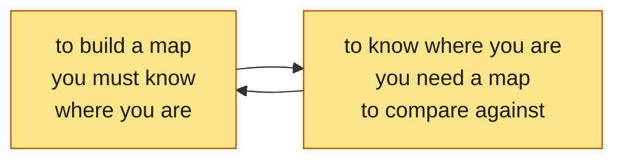
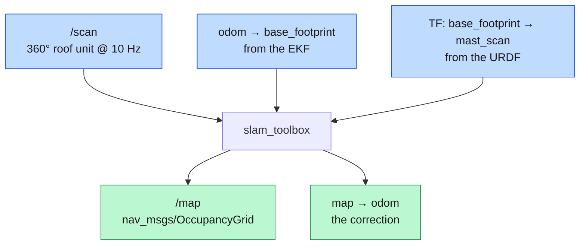
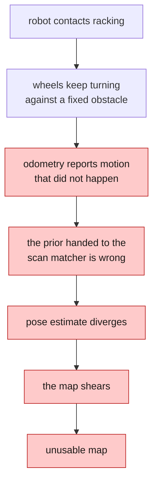
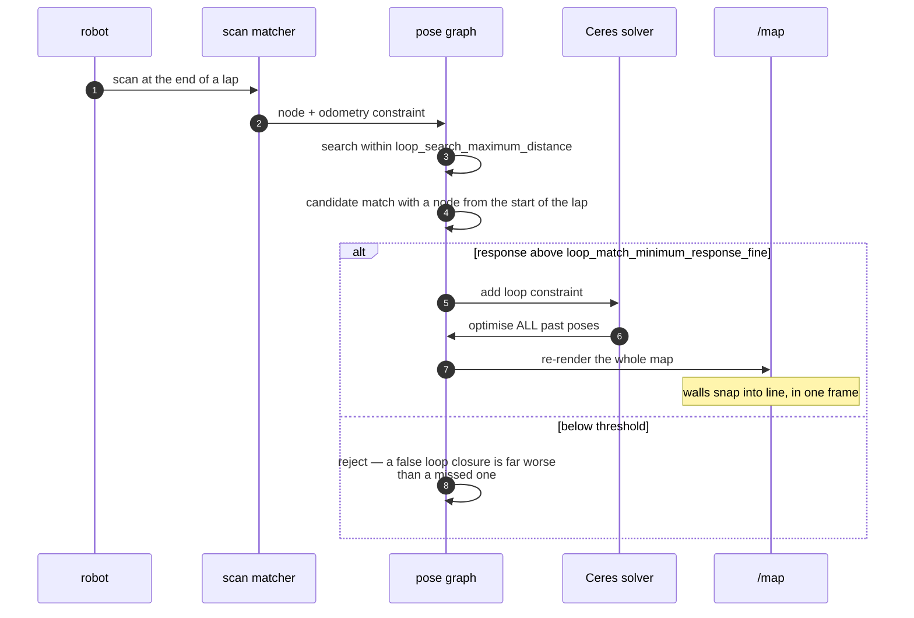
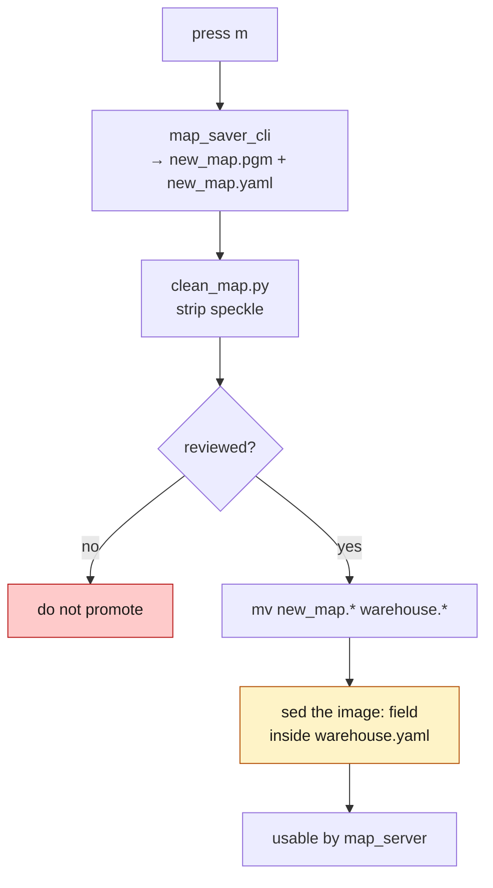

*Companion to video 11. 📺 Watch: **link coming with the video**.*

The robot can see what is around it right now, and it can estimate how it has
moved. Put those two together over time and you get something it has never had:
**memory of a place**.

## 1. What SLAM is actually solving

Simultaneous Localisation and Mapping is one problem, not two, and the reason is
circular:



SLAM breaks the circle by solving both at once and accepting that both answers
are approximate. The mechanism, for a scan-matching graph SLAM like
`slam_toolbox`:

1. Odometry gives a **prior**: roughly where the robot moved since the last scan.
2. Scan matching **refines** it: slide the new scan against the accumulated map
   until it fits best. The correction is usually centimetres.
3. That refined pose becomes a **node** in a pose graph, with the scan attached.
4. **Loop closure** looks for nodes that see the same place from different times
   and adds a constraint between them.
5. The whole graph is **optimised**, which moves every past pose a little, and
   the map is re-rendered from the corrected poses.

The last step is the one that matters and the one that surprises people: **SLAM
edits the past.** A map is not accumulated; it is *re-derived* every time the
graph is optimised.

## 2. The three inputs



Every one of them has to be right, and the failure modes are distinct:

| Input | If it is wrong |
|---|---|
| `/scan` | garbage in, garbage out — including a scanner seeing its own shell |
| odometry | a bad prior makes the matcher search the wrong neighbourhood; a **scale** error smears the map systematically |
| TF | scans are placed at the wrong offset from the robot, and the map is consistently wrong in one direction |

Note what SLAM produces: it does **not** publish `odom → base_footprint`. It
publishes **`map → odom`** — the *correction* between where odometry thinks the
robot is and where the map says it is. That layering is what lets odometry stay
smooth and continuous while the map-frame estimate jumps when a loop closes.

## 3. Configuration, and the two lines that matter most

`slam_toolbox` has a long parameter list. Two entries do most of the work here:

```yaml
max_laser_range: 9.5             # sensor is 10.0 — stay inside it
loop_search_maximum_distance: 8.0
```

**`max_laser_range` must not exceed what the hardware delivers.** Claiming more
makes the scan matcher trust returns that are really range-max fill, and the map
grows soft edges.

**`loop_search_maximum_distance` has to cover the aisle spacing.** Racking rows
look alike. Loop closure is the only thing stopping the map from *shearing* when
the robot comes back down a parallel aisle and the matcher decides it is in the
one next door. Aisles here are 3.0 m apart centre to centre, so the search has
to reach across a couple of them: 8.0 m.

The rest, briefly:

| Parameter | Value | Why |
|---|---|---|
| `resolution` | 0.05 m | 5 cm cells — the Nav2 costmap default, so no resampling |
| `minimum_travel_distance` / `_heading` | 0.3 / 0.3 | add a graph node every 30 cm or 17°, not every scan |
| `scan_buffer_size` | 30 | how much recent history the matcher runs against |
| `mode` | `mapping` | as opposed to `localization` |
| `use_lifecycle_manager` | true | see below |
| solver | Ceres, `SPARSE_NORMAL_CHOLESKY` | the graph optimiser |

> **`slam_toolbox` is a lifecycle node.** It comes up `unconfigured` and
> registers no subscriptions until something transitions it. Left alone it logs
> nothing at all, which reads exactly like a QoS fault — you check the topic,
> you see a publisher and no subscriber, and you go looking for a mismatch that
> is not there. `nav2_lifecycle_manager` with `autostart` handles it.

## 4. Building coverage

Three ways, in increasing order of automation:

```bash
# 1. hand-drive it
./run.sh drive          # terminal 1: sim + slam_toolbox + safety, no planner
./run.sh teleop         # terminal 2: the keyboard

# 2. drive with a planner up, and send goals from RViz too
./run.sh slam

# 3. unattended: drive the route, save, de-speckle
./run.sh map
```

`./run.sh map` is one command and one terminal: it brings up the simulator and
`slam_toolbox`, waits for Nav2, drives the coverage route, saves the result and
strips speckle from it. Headless by default, because the route takes a while.

### The survey drives through Nav2, and that is the whole point

`survey.py` sends `NavigateToPose` goals. It does **not** hand-drive the robot.

The first three versions of that script were bang-bang controllers that drove
blind toward waypoints, and every one of them eventually ground the robot into
racking. A collision is not just lost time:



**Every unusable map produced in this project came out of that loop, not out of
SLAM tuning.** Nav2 brings global planning, a footprint-aware controller and
recovery behaviours, so waypoints only have to be *reachable* — not reachable in
a straight line from wherever the robot happens to be.

### Two things the survey learned the hard way

**While mapping, goals must stay near explored space.** The global costmap only
spans what SLAM has seen, so a distant goal is rejected in milliseconds. The
route is stepped into hops of ≤5 m.

**`wait_for_server()` is not readiness.** `bt_navigator` creates its
`navigate_to_pose` action server when it is *constructed*, well before the
lifecycle manager activates it. Goals sent in that window are rejected in
microseconds with `Action server is inactive`, so an un-retried route burns down
faster than Nav2 can come up:

```
763.944  survey: hop 1/72
763.945  bt_navigator: Action server is inactive
764.041  survey complete: 0/72 hops reached
765.456  lifecycle_manager: Activating bt_navigator   ← 1.4 s too late
```

`survey.py` now polls `/bt_navigator/get_state` until `ACTIVE` before
dispatching, and retries goals that are refused or fail instantly.

## 5. What the map is

`nav_msgs/OccupancyGrid`: a rectangle of cells, each holding one of three kinds
of value.

| Value | Meaning | In the `.pgm` |
|---|---|---|
| 0 | free — observed, nothing there | white |
| 100 | occupied — observed, something there | black |
| −1 | **unknown** — never observed | grey |

**Unknown is not free.** That distinction is what makes `track_unknown_space`
meaningful to the planner, and it is why the ground-truth map in article 12 goes
to the trouble of flood-filling free space from the robot's start pose: without
it, the outside of the building comes out "free" and the global planner will
happily route around the outside of the hall — a perfectly legal path across a
map whose only obstacles are its walls.

## 6. Loop closure, and what it looks like

Drive a lap of the hall and come back to the start. Before the loop closes, the
two ends of the corridor do not quite line up — accumulated drift, a few
centimetres per pass. When the matcher recognises the start of the lap and adds
a constraint, the optimiser runs and:



**In RViz it is a single frame in which the map visibly snaps straight.** It is
the most convincing demonstration in the series that the robot is doing
something more than accumulating scans.

The rejection branch is not a footnote. In a hall of near-identical racking, a
false positive welds two different aisles into one and destroys the map. The
thresholds (`loop_match_minimum_response_coarse` 0.35, `_fine` 0.45) are set on
the principle that **a missed loop closure costs accuracy; a false one costs the
map.**

## 7. Saving it

```bash
# press `m` in the keyboard teleop, or `A` on the gamepad
```

which runs `map_saver_cli` and then `clean_map.py`, writing
`maps/new_map.{pgm,yaml}` — **never** over `warehouse.*`.



That highlighted step is a real trap:

> **The YAML carries the image filename inside it, and `mv` does not rewrite
> it.** Rename the files without fixing the `image:` line and `warehouse.yaml`
> points at a `new_map.pgm` that no longer exists — so the map silently fails to
> load in localisation mode.

```bash
mv src/beebot2_slam/maps/new_map.pgm  src/beebot2_slam/maps/warehouse.pgm
mv src/beebot2_slam/maps/new_map.yaml src/beebot2_slam/maps/warehouse.yaml
sed -i 's/^image: new_map.pgm/image: warehouse.pgm/' \
  src/beebot2_slam/maps/warehouse.yaml
```

Saving to `new_map` rather than over the committed map is deliberate: **a
mapping run that goes wrong still writes a file.** Review before promoting. And
because `warehouse.*` is committed, a bad promotion is recoverable with
`git checkout` — but only if you notice it happened. Article 12 is about
noticing.

## 8. The frame-origin gotcha

Worth stating plainly, because three separate bugs in this project were all
this one thing:

> **`odom` is initialised at the robot's spawn pose, and `slam_toolbox` starts
> `map` coincident with `odom`. So map coordinates are world coordinates
> *minus the spawn pose*.**
>
> **If something is inexplicably 16 m out, this is why.**

The three bugs: the survey route, the map evaluator, and the AMCL initial pose.
All three looked like completely different problems.

And a fourth distinction that only appears once the spawn pose moves: **the map
origin and the spawn pose are two different things.** The map origin is fixed by
wherever the robot was when `slam_toolbox` started, and it does not move
afterwards. `nav_scenarios.py` keeps them as separate constants for exactly that
reason — conflating them put every goal 1.0 m out in y, which showed up as
"successes" reporting 0.6–1.1 m of error against a 0.25 m tolerance.

## 9. Measured

**Online scan-matching against ground truth: 0.011 m.**

That number says the SLAM front end is working well. It is also the number
people quote when a map is bad, and it is the wrong number for that — it
measures *tracking*, not the map.

The saved map tells a different story, and article 12 is entirely about it:

| | RMS | median | p95 |
|---|---|---|---|
| accuracy (invented structure) | 0.557 m | 0.150 m | 1.200 m |
| coverage (structure never seen) | 0.807 m | 0.403 m | 1.856 m |

**The survey completes 18 of 72 hops** and spends the remainder in recovery
behaviours, which smears the map. That is not a SLAM failure — it is a
navigation failure upstream of the map, and it is article 16's problem.

## Sign-off

- [ ] the mapping scanner sees in **every** direction, not just forward
- [ ] `max_laser_range` is inside the sensor's real range
- [ ] `map → odom` is being published, and by exactly one node
- [ ] driving a lap produces a visible loop closure
- [ ] the map does not shear between parallel aisles
- [ ] the robot never touched anything during the survey
- [ ] the saved map went to `new_map`, and was reviewed before promotion
- [ ] the `image:` line inside the YAML matches the actual `.pgm` filename

## Next

There is a map, and it looks right. "Looks right" is not a measurement, and
every navigation goal from here on inherits every error in it.

**Next: [The Map Looks Good — But Is It Actually Good?](../12-map-quality/).**
