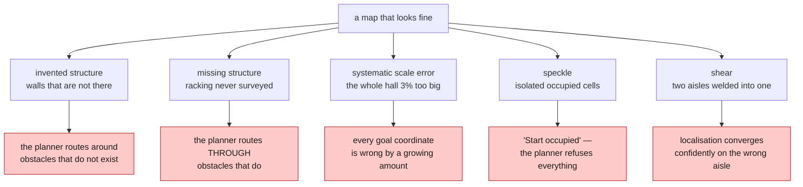
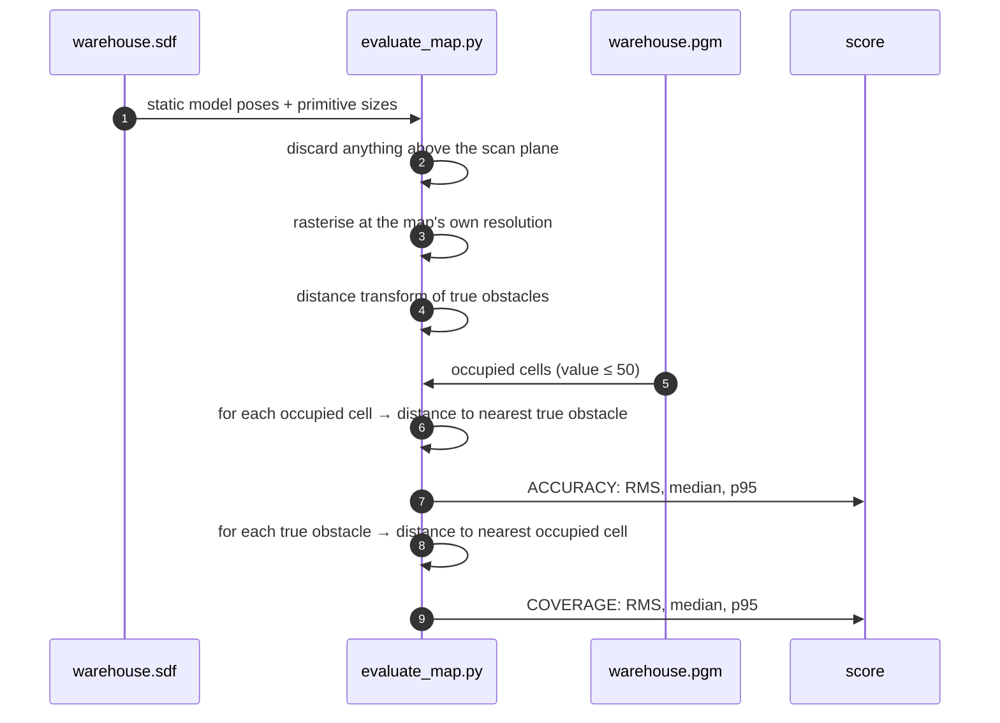
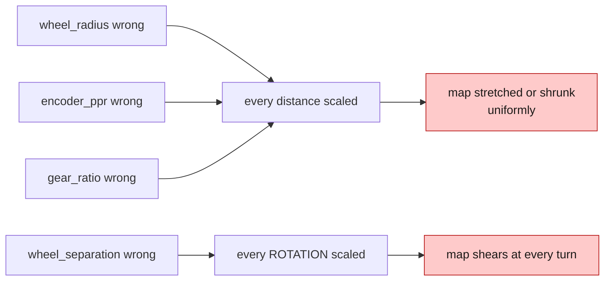
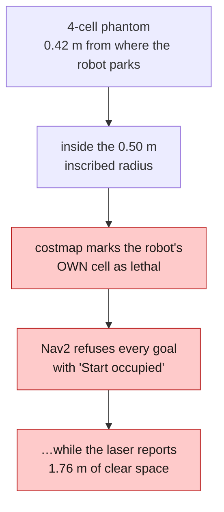
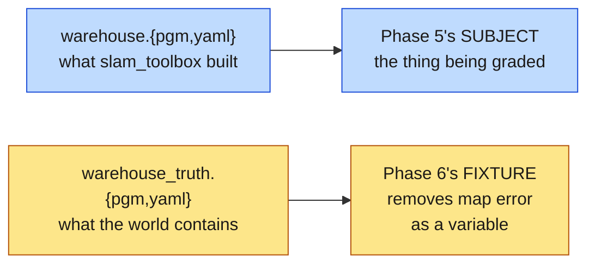
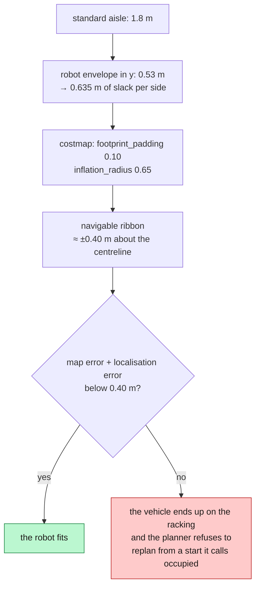

*Companion to video 12. 📺 Watch: **link coming with the video**.*

The robot produced a map, and it looks right. Walls where walls should be,
aisles where aisles should be, the shape of the building recognisable at a
glance.

"Looks right" is not a measurement. And navigation will inherit every error in
it — silently, as a floor under every goal the robot will ever be given.

This article is about refusing to skip that.

## 1. What can be wrong with a map that still looks fine



Four of those five are invisible on the map image. The fifth — speckle — is
invisible **and** lethal, and gets its own section.

## 2. Accuracy and coverage are different failures

The map scorer reports two numbers, not one, because they fail for different
reasons and want different fixes:

| Metric | Question | Large value means | Fix |
|---|---|---|---|
| **accuracy** | for every cell the map calls occupied, how far to the nearest *real* obstacle? | the map **invented** structure — scan-matching drift, or a bad loop closure | SLAM tuning, better odometry |
| **coverage** | for every piece of real structure, how far to the nearest *mapped* occupied cell? | real structure the robot **never saw** | drive a better survey route |

A single RMS number would average these together and hide exactly the thing you
need to know. A map can score beautifully on accuracy while missing a third of
the building, and that map is worse than one with sloppy walls everywhere.

```bash
./run.sh exec 'cd /beebot2_ws && python3 src/beebot2_slam/scripts/evaluate_map.py \
  src/beebot2_slam/maps/warehouse.yaml \
  src/beebot2_gazebo/worlds/warehouse.sdf -16 0'
```

The trailing `-16 0` is the **map origin** in world coordinates. Get it wrong
and a perfectly good map scores as garbage — the same frame-origin trap from
article 11, in its third disguise.

## 3. Where the ground truth comes from

In simulation you have a luxury the real world does not offer: the world file
*is* the truth.



Note the scan-plane filter. Anything taller than the sensor's plane is above
what the robot can ever see, so scoring the map against it would penalise the
map for the sensor's geometry.

**On a real robot** you do not get this. The practical substitutes, in
descending order of usefulness: a building floor plan or CAD model; a
total-station survey of a handful of features; or the crudest and still useful
version — tape-measure a few long straight runs and check whether the map agrees
about their length.

## 4. Systematic scale error, and where it comes from

If the whole map is uniformly a few per cent too big or too small, that is not a
SLAM problem. It traces straight back to odometry:



Which is why articles 02, 03 and 05 spent so long on four numbers. The 46 %
`wheel_separation` error would not have produced a *bad-looking* map — it would
have produced a map that was internally consistent and geometrically wrong, and
the only way to find it is to measure a straight run and a rotation against
something external.

**The diagnostic:** if straight-line distance is right and rotation is wrong,
suspect `wheel_separation`. If both are wrong by the same factor, suspect
`encoder_ppr` or `gear_ratio` — they scale together.

## 5. Speckle: three pixels that stop a robot

`slam_toolbox` leaves isolated occupied cells scattered through free space —
single-scan artefacts that never got cleared.

**Measured: 837 of 13818 occupied cells, 6.1 %.**

They are invisible on the image. They are lethal to a costmap:

```
GridBased plugin failed to plan from (8.41, -0.98): "Start occupied"
```

which reads as a planner or localisation fault and is neither.



Two filters, because SLAM leaves two kinds of rubbish:

| Filter | Removes | Why |
|---|---|---|
| neighbour count | occupied cells with fewer than `min_neighbours` occupied neighbours | lone specks |
| cluster size | connected blobs below `min_cluster` cells (8 cells = 200 cm²) | **the dangerous ones** — a four-cell phantom survives any neighbour test |

Walls and rack faces are hundreds of cells and are untouched.

```bash
./run.sh exec 'python3 /beebot2_ws/src/beebot2_slam/scripts/clean_map.py \
  /beebot2_ws/src/beebot2_slam/maps/warehouse.pgm'
```

Real deployments clean maps before using them, usually by hand in an image
editor. This does it repeatably, and `./run.sh map` does it automatically.

## 6. A map that did not come from SLAM

Phase 5 ("does SLAM reconstruct the hall?") and Phase 6 ("does Nav2 drive to a
goal?") each needed the other to work before either could be measured. Four
rounds of Nav2 controller tuning ran against a SLAM map whose own scorer reports
a **p95 accuracy error of 1.2 m**.

So a second map exists, rasterised directly from the world:

```bash
./run.sh exec 'ros2 run beebot2_slam world_to_map.py \
  /beebot2_ws/src/beebot2_gazebo/worlds/warehouse.sdf \
  /beebot2_ws/src/beebot2_slam/maps/warehouse_truth -16 0'

./run.sh nav map:=warehouse_truth
```

**Exact by construction.** And the result of swapping it in, with **no change to
Nav2 at all**:

| | goal success | localisation error, driving |
|---|---|---|
| `map:=warehouse` (SLAM) | 5/16 | 0.235 m |
| `map:=warehouse_truth` | **9/16** | **0.184 m** |

The four rounds of controller tuning had been chasing map error.



> **Promoting the truth map over `warehouse.*` would make Phase 5 unmeasurable.**
> It has exactly the same standing as `/ground_truth` on the topic side: a
> fixture for tests, never an input to the robot's own estimate of where it is.
>
> And note what scoring `warehouse_truth` with `evaluate_map.py` proves —
> **nothing**. It returns 0.000 on every statistic, because both tools read the
> world through the same rasteriser. That is a consistency check, not a
> validation. What makes the map trustworthy is that its geometry comes from the
> SDF the simulator itself loads; the evidence that it is *better* is downstream,
> in localisation error and goal success.

One subtlety worth stealing: free space is **flood-filled from the map origin**,
so the outside of the building and the sealed voids inside racking come out
*unknown* rather than *free*. Without that the global planner will happily route
around the outside of the hall — a legal path across a map whose only obstacles
are its walls.

## 7. The measured state of this map

| | RMS | median | p95 |
|---|---|---|---|
| accuracy (invented structure) | 0.557 m | 0.150 m | 1.200 m |
| coverage (structure never seen) | 0.807 m | 0.403 m | 1.856 m |

Against a recorded target of **0.050 m median accuracy**. It does not pass.

And the history is more informative than the numbers:

| Survey method | coverage RMS | accuracy median |
|---|---|---|
| hand-driven | 1.464 m | **0.050 m** |
| Nav2-driven | **0.807 m** | 0.150 m |

Coverage improved substantially and accuracy **regressed**. The cause is one
fact: the survey completes **18 of 72 hops** and spends the remainder in Nav2
recovery behaviours — spinning, backing up, re-planning — which smears the map.

That is not a SLAM problem. It is article 16's problem, arriving early.

## 8. When is a map good enough to navigate on?

The honest answer is that there is no universal threshold, and the useful answer
is arithmetic. Work backwards from the tightest place the robot has to fit:



For this warehouse that gives roughly **0.40 m of total error budget**, shared
between map error and localisation error. Measured: map p95 accuracy 1.2 m,
localisation 0.184 m mean and 0.430 m peak against the *exact* map.

**The budget is already spent before the controller is asked to do anything.**
That is the single most useful sentence to come out of measuring the map, and
four tuning rounds happened before anyone wrote it down.

## 9. Doing this on a real robot

Without a simulator's ground truth, the substitutes are cruder but not useless:

| Check | How |
|---|---|
| scale | tape-measure the longest straight run in the building; compare to the map |
| squareness | check that walls that are perpendicular in reality are perpendicular in the map |
| coverage | overlay the map on a floor plan; look for missing racking |
| speckle | run `clean_map.py` and count what it removes |
| repeatability | map the same building twice and diff the results |

That last one is the most underrated. Two independent maps of the same building
that disagree by 30 cm tell you the *precision* of your pipeline without any
ground truth at all.

## Sign-off

- [ ] the map has been scored, not eyeballed
- [ ] accuracy and coverage are reported **separately**
- [ ] the map origin used for scoring is the map origin, not the spawn pose
- [ ] speckle has been removed and the count recorded
- [ ] a long straight run in the map matches a tape measure
- [ ] the error budget has been computed against the tightest aisle
- [ ] the SLAM map and any ground-truth map are kept **side by side**, not merged
- [ ] a bad map is recoverable — the good one is committed

## Next

There is a map, and now there is an honest number attached to it. The robot
still has to work out where it is on that map — and that starts one layer lower
down, with a better answer to how it moved.

**Next: [How Does the AMR Know How It Moved?](../13-odometry-ekf/).**
