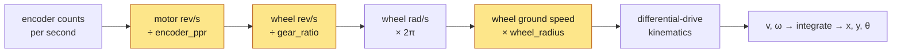
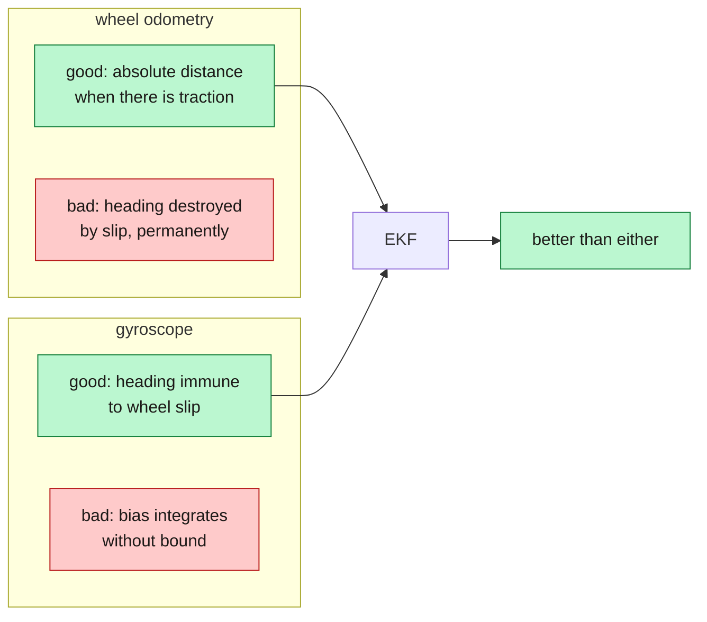
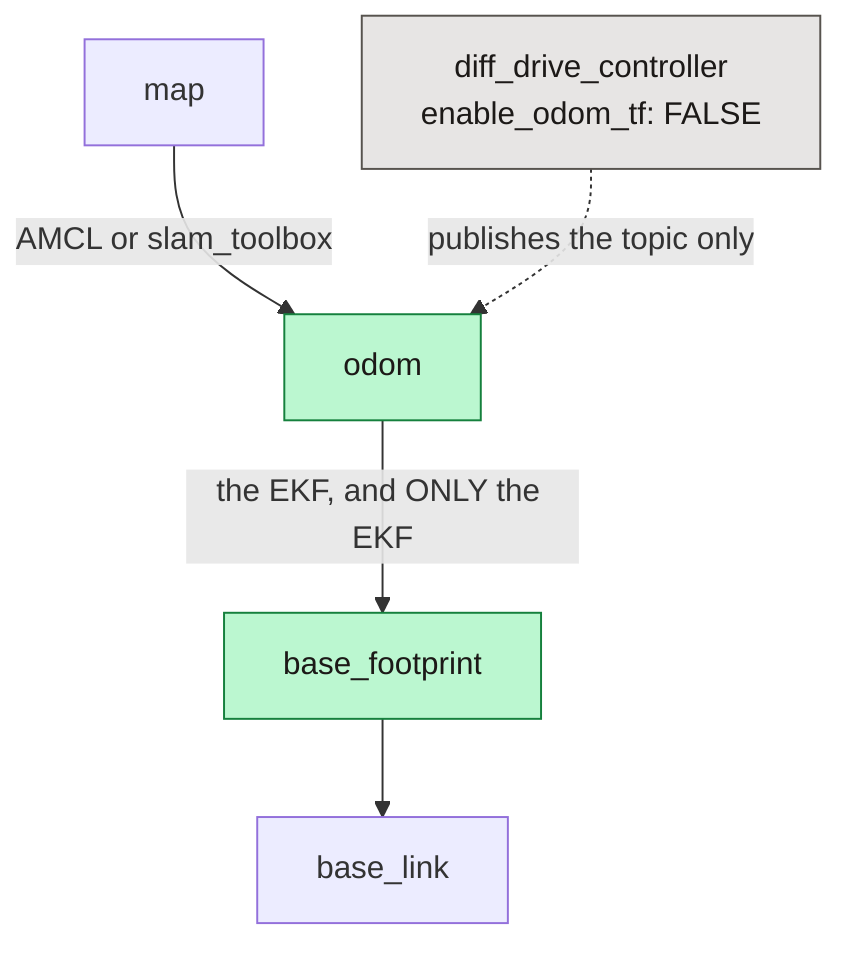
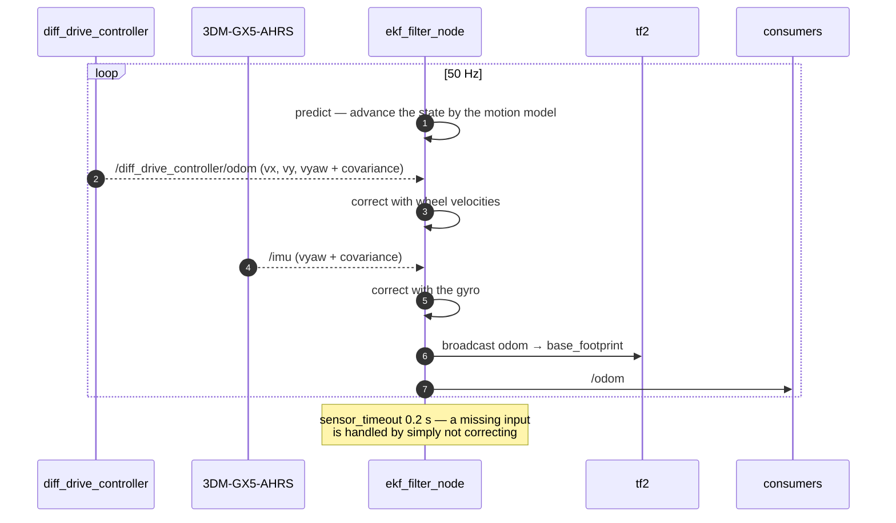

*Companion to video 13. 📺 Watch: **link coming with the video**.*

The robot has wheel odometry and an IMU. Both are wrong in different ways, and
neither one alone is good enough to navigate on.

This article is where they are combined — and, more usefully, where the
combination is **measured** rather than assumed to help.

## 1. From counts to a pose



The kinematics themselves are two lines:

$$
v = \frac{v_R + v_L}{2} \qquad \omega = \frac{v_R - v_L}{b}
$$

where $b$ is the wheel separation — 0.48 m on BEEBOT2. Integrate $v$ and
$\omega$ over time and you have a pose.

Which means **four numbers** stand between an encoder count and a position:

| Number | Value | Scales |
|---|---|---|
| `encoder_ppr` | 60 (measured) | distance |
| `gear_ratio` | 1.0 (direct drive) | distance |
| `wheel_radius` | 0.065 m | distance |
| `wheel_separation` | 0.48 m | **rotation** |

The first three scale distance together, so an error in any of them is
indistinguishable from an error in the others by looking at odometry alone. The
fourth scales rotation only — which is what makes the diagnostic in §7 possible.

## 2. Where wheel odometry fails

It does not fail gracefully. It fails **confidently**.

| Failure | What the encoder reports | What happened |
|---|---|---|
| wheel slip on a start | full rotation | the robot barely moved |
| a wheel jammed against racking | continuous rotation | the robot is stationary |
| uneven floor, a caster catching | normal | the heading changed slightly |
| tyre wear over months | normal | `wheel_radius` is now wrong |

And the structural problem underneath all of them: **heading error never
recovers.** A position error from one slip stays a fixed offset. A *heading*
error from one slip becomes a growing position error for the rest of the run,
because every subsequent metre is integrated in the wrong direction.

That asymmetry is the entire argument for fusing a gyro.

## 3. Where the IMU fails

The gyro has the opposite failure mode:

- **Bias.** A gyro at rest does not read exactly zero. Integrate a constant
  0.002 °/s and you accumulate 0.13° per minute, forever.
- **No absolute reference.** Nothing in the gyro says which way north is. It
  measures *change*, so the heading it produces is only as good as the heading
  it started from.



They are complementary in the precise sense: each is strong exactly where the
other is weak. That is what a fusion filter is for.

## 4. What gets fused, and what is deliberately refused

`robot_localization`'s EKF has fifteen states and a boolean per state per input.
The configuration here is unusually restrictive, and every exclusion has a
reason.

```yaml
odom0: /diff_drive_controller/odom
odom0_config: [false, false, false,     # x     y     z
               false, false, false,     # roll  pitch yaw
               true,  true,  false,     # vx    vy    vz     ← fused
               false, false, true,      # vroll vpitch vyaw  ← fused
               false, false, false]     # ax    ay    az

imu0: /imu
imu0_config: [false, false, false,
              false, false, false,
              false, false, false,
              false, false, true,       # vyaw only
              false, false, false]
```

| Refused | Why |
|---|---|
| wheel **position** (x, y, yaw) | on a diff drive it is just the integral of the velocities — fusing it double-counts and makes the covariance lie |
| IMU **absolute yaw** | it would be a magnetometer-referenced heading, and a magnetometer inside a steel warehouse next to BLDC motors measures the building, not the Earth |
| IMU **linear acceleration** | at AMR speeds it is mostly noise, and integrating it twice invents motion that did not happen |

Plus two settings that carry weight:

```yaml
two_d_mode: true        # planar robot: pins z, roll and pitch
world_frame: odom       # this filter owns odom → base_footprint, NOT map → odom
```

**`two_d_mode` is not a simplification, it is a constraint.** A wheeled robot on
a floor has no z, roll or pitch freedom worth estimating, and letting the filter
estimate them anyway means noise in those states leaking into the ones that
matter.

And the process noise is deliberately **generous on yaw rate**, so the filter
tracks the gyro through wheel slip rather than averaging it away. A filter tuned
to smooth its inputs will smooth away exactly the correction you fitted the
gyro for.

## 5. Who owns which transform

This is the part that produces the most confusing bugs when it is wrong, because
two publishers of the same transform do not error — they fight.



`diff_drive_controller` runs with `enable_odom_tf: false`. It publishes
`/diff_drive_controller/odom` as a topic and **does not** broadcast the
transform. The EKF consumes that topic and owns the transform.

**Exactly one publisher of `odom → base_footprint`, in simulation and on
hardware alike.** Two publishers produce a TF tree that alternates between two
answers at whatever rate they happen to run, and the symptom is a robot that
visibly jitters in RViz while every individual topic looks healthy.

The layering also explains a property people find surprising: `odom →
base_footprint` is **smooth and continuous but drifts**; `map → odom` is
**discontinuous but bounded**. Anything that needs continuity (the controller,
the safety fields) works in `odom`. Anything that needs global correctness (the
planner, goals) works in `map`.

## 6. The filter cycle



That final note is the one to remember: **a configured input that never arrives
is handled silently.** No warning, no error. Which is exactly the state of the
real robot — see §8.

## 7. Measuring it, rather than assuming it

The measurement is a closed loop against ground truth. Drive a ~20 m square and
compare where the filter thinks the robot ended up against where it actually is:

| | wheel odometry | EKF |
|---|---|---|
| position error | 0.375 m | **0.257 m** |
| heading error | 6.52° | **0.72°** |

**Heading is the point.** A 9× improvement in heading, against a 1.5×
improvement in position — because heading is where wheel odometry's failure mode
lives.

### The three-experiment diagnostic

Simulation numbers for the straight-line and rotation checks:

| Check | Result |
|---|---|
| clear-path odometry ratio | 1.073 |
| 4 m straight line | 3.926 m, zero lateral drift |
| commanded 360° rotation | 349.8° |

Both shortfalls are the configured **acceleration limits** (0.7 m/s²,
1.5 rad/s²), not scale error: ramp-up accounts for 0.18 m and 11.7° respectively.
Distinguishing those two is exactly what a ground truth buys you.

And the diagnostic table to keep:

| Straight line | Rotation | Suspect |
|---|---|---|
| right | wrong | `wheel_separation` |
| wrong | wrong, same factor | `encoder_ppr` or `gear_ratio` — they scale together |
| wrong | right | `wheel_radius`, if rotation is measured by the gyro rather than the wheels |

> **Reset the simulator between tests that can collide.** A robot jammed against
> a pillar keeps turning its wheels, so odometry, slip and SLAM error measured
> afterwards are all meaningless. Hours went into chasing a 2× "odometry error"
> that was a robot leaning on a pillar.

## 8. Honest status

| | Simulation | Real robot |
|---|---|---|
| Wheel odometry | ✅ ratio 1.073, 4 m → 3.926 m | 🔨 parameters established, **no distance test run** |
| EKF fusion | ✅ 0.72° vs 6.52° | 🟡 **runs wheel-only** |

The real robot's EKF is configured with `imu0: /imu` and nothing publishes it.
`robot_localization` accepts that without complaint, so the filter runs, the
transform is published, and the heading benefit **silently does not exist**.

**Expect raw wheel-odometry heading drift on hardware until an IMU driver
exists.** The 0.72° figure is a simulation result and quoting it for the real
machine would be dishonest.

The shortest path to closing this, in order:

1. Fit the IMU driver (article 08) so `/imu` actually publishes.
2. Drive a tape-measured 4 m and compare `/odom`.
3. Command a 360° rotation and measure it.
4. Re-derive `wheel_separation` from the rotation error if they disagree.
5. Repeat the square-loop comparison, EKF against wheel-only.

None of steps 2–5 needs a lidar, a map or a planner. They are the cheapest
measurements on the whole roadmap and everything above them depends on the
answers.

## 9. Two configuration traps worth knowing

**ROS 2 param YAML sequences must be type-homogeneous.** Mixing `0` and `0.02`
in a covariance matrix fails to parse.

**`1e-09` is a *string* in YAML 1.1.** Write `1.0e-09`. The
`initial_estimate_covariance` matrix is full of them, and the failure is a parse
error that names the file and not the line.

## Sign-off

- [ ] `odom → base_footprint` has exactly **one** publisher
- [ ] `diff_drive_controller` has `enable_odom_tf: false`
- [ ] the EKF's `imu0` topic matches what the IMU driver actually publishes
- [ ] `/odom` is smooth and continuous — no jumps
- [ ] a tape-measured straight line agrees within the acceleration budget
- [ ] a commanded 360° rotation agrees between wheels and gyro
- [ ] fused heading has been compared against raw heading on a closed loop
- [ ] the improvement has been **measured**, not assumed

## Next

Odometry is as good as it is going to get, and it still drifts without bound —
that is what odometry *is*. The map is fixed. Next the robot anchors one to the
other.

**Next: [How Does the AMR Know Where It Is?](../14-amcl/).**
