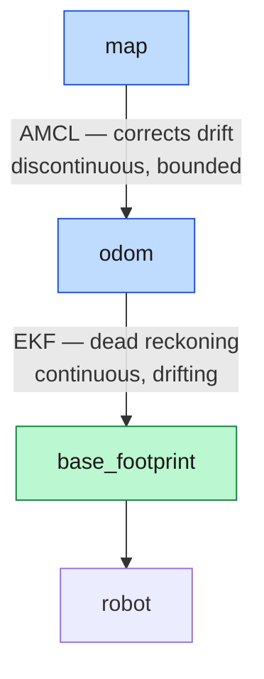
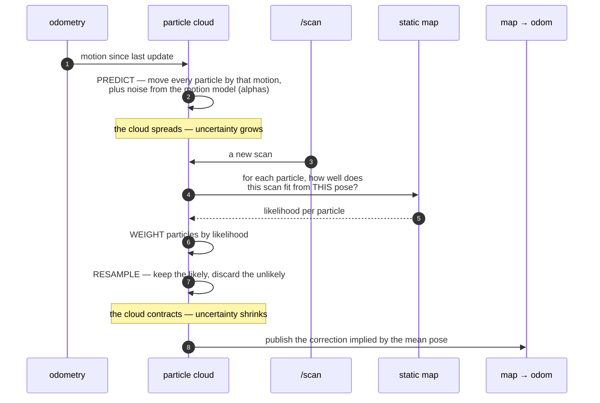
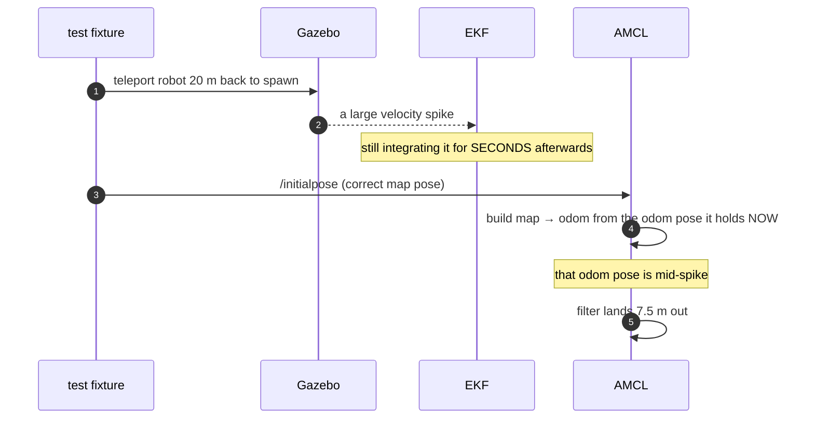

*Companion to video 14. 📺 Watch: **link coming with the video**.*

Odometry drifts. Over a long enough run it **always** drifts — that is what
odometry is, an integration with no external reference. Article 13 made it drift
more slowly. It did not stop it.

The map, meanwhile, does not move. So the robot needs to keep matching what it
sees against what the map says, and use the disagreement to correct itself.

## 1. The layering



**AMCL does not publish where the robot is.** It publishes `map → odom` — the
*correction* between the odometry frame and the map frame. The robot's pose in
the map is the composition of the two transforms.

That layering is the whole design, and it exists so that:

- **`odom → base_footprint` stays smooth.** Controllers and safety fields need
  continuity; a pose that teleports 20 cm when a filter converges would be a
  step input to a velocity controller.
- **`map → base_footprint` stays globally correct.** Planners and goals need
  correctness more than smoothness.

Both properties, in one tree, by putting the discontinuity in a transform that
nothing differentiates.

## 2. What a particle filter is doing

Rather than tracking one pose, AMCL tracks a few thousand **hypotheses**, each
weighted by how well it explains the current scan.



The two halves fight each other, which is the point. **Prediction spreads the
cloud** (the robot moved, we are less sure). **Correction contracts it** (the
scan fits well from here, and badly from there). A filter that only ever
contracts becomes overconfident and cannot recover from being wrong; a filter
that only ever spreads never converges.

| Parameter | Value | Meaning |
|---|---|---|
| `min_particles` / `max_particles` | 500 / 3000 | adaptive — more when uncertain |
| `kld_err`, `kld_z` | 0.02, 0.99 | how the adaptation decides |
| `update_min_d` / `update_min_a` | 0.20 m / 0.20 rad | correct only after this much motion |
| `resample_interval` | 1 | resample every update |
| `laser_model_type` | `likelihood_field` | see below |
| `max_beams` | 180 | subsample; 1081 beams buys nothing here |

## 3. The two models

### The sensor model — likelihood field

Rather than ray-tracing every beam through the map (expensive and brittle), the
likelihood field pre-computes, for every free cell, the distance to the nearest
occupied cell. A beam endpoint then scores by a Gaussian on that distance.

Four mixture weights say what a return can be:

| Weight | Value | Models |
|---|---|---|
| `z_hit` | 0.6 | a real return from real structure |
| `z_rand` | 0.35 | a completely random reading |
| `z_max` | 0.05 | nothing in range |
| `z_short` | 0.05 | an unexpected obstacle in front |

`z_rand` at 0.35 is high, and deliberately so: a warehouse is full of things
that are not on the map — pallets, people, forklifts — and a filter that treats
every unexpected return as evidence against its pose will reject the truth.

### The motion model — and the tuning that must not be done

```yaml
robot_model_type: "nav2_amcl::DifferentialMotionModel"
alpha1: 0.25   # rotation noise from rotation
alpha2: 0.25   # rotation noise from translation
alpha3: 0.15   # translation noise from translation
alpha4: 0.15   # translation noise from rotation
alpha5: 0.10
```

These say how much to spread the cloud per unit of motion. And the obvious
tuning move — tighten them, because this robot's odometry is *good* — was tried,
and it is much worse.

The reasoning that led there was sound: BEEBOT2's yaw scale measures **1.0016**
against ground truth, so `alpha1 = 0.25` ("rotation is very noisy") is
objectively wrong as a description of the odometry.

But the alphas are not only describing odometry. **They are carrying the map.**

| alphas | worst leg | the leg after it |
|---|---|---|
| 0.25 (kept) | 31.638 m | **0.143 m** ← recovers |
| 0.08 (tighter) | 25.143 m | **25.359 m** ← does not |

> **Read the recovery, not the means.** Run-to-run variance over six legs is
> enormous — 0.25 measured 0.364 m mean on one run and 5.598 m on the next,
> entirely depending on whether an excursion happened to fall inside the sample.
> Mean-against-mean between configurations proves nothing here.
>
> What *is* repeatable is the mechanism: with the map covering only ~9 % of the
> hall, the filter regularly crosses ground it cannot match against and runs
> open-loop. It diverges under **both** settings. Wide alphas keep the cloud
> broad enough to re-acquire on re-entering mapped space; tight alphas remove
> that margin and the first excursion is permanent.

**The honest reading: these are loose because the map is thin, not because the
odometry is bad.** Fix coverage first. Only then is there any point revisiting
them — and re-measure if you do.

That is the kind of note worth leaving in a config file, because the next person
to look at `alpha1: 0.25` next to a 1.0016 yaw scale will reach for it
immediately.

## 4. Recovery

```yaml
recovery_alpha_slow: 0.001
recovery_alpha_fast: 0.1
```

These let the filter inject random particles when the short-term average
likelihood drops below the long-term one — i.e. when the scan has suddenly
stopped fitting, which is what being lost looks like from the inside.

The 2018 configuration had both at `0.0`, which meant **no recovery from a
kidnapped robot at all**. Pick the robot up, put it down somewhere else, and the
filter stays convinced it is where it was.

## 5. Seeding the initial pose

AMCL has to start somewhere. `set_initial_pose: false` here, so it is seeded
externally — from RViz's *2D Pose Estimate*, or by publishing `/initialpose`.

Two ways this goes wrong, both found while instrumenting the benchmark:

**Seeding in the wrong frame.** The initial pose is in the **map** frame, and
map coordinates are world coordinates minus the map origin. Seed with world
coordinates and the robot starts 16 m from where you meant.

**Seeding too early.** This one is subtle and cost real time:



**AMCL builds `map → odom` from the odom pose it holds when the initial pose
arrives.** Seed into a transient and you bake the transient into the correction.
The fixture now waits for `/odom` to go quiet before seeding.

## 6. Watching it converge

```bash
./run.sh nav map:=warehouse_truth
# RViz: add ParticleCloud on /particle_cloud
```

Set a deliberately bad initial pose and drive. The cloud starts as a broad
scatter, contracts sharply the first time the robot passes something
distinctive — a corner, a doorway, the end of a rack — and stays tight down a
long featureless aisle only because it entered the aisle confident.

That last behaviour is worth watching for. **A long aisle of identical racking
is unobservable along its length.** The scan constrains lateral position and
heading beautifully and says almost nothing about how far down the aisle the
robot is. The cloud visibly stretches into a cigar shape aligned with the aisle,
and contracts again at the far end.

## 7. Measuring localisation error properly

`map → base_footprint` against ground truth — what the robot believes, minus
what is true:

```bash
ros2 run tf2_ros tf2_echo map base_footprint
# compare against /ground_truth, minus the map origin
```

> **`/amcl_pose` is not the thing to compare.** It only publishes after the
> robot has moved `update_min_d`, so a parked robot produces none and a moving
> one produces a stale value between corrections. The live estimate is the
> **transform**.

And a previously recorded figure of 0.113 m is **not comparable** to anything
here: it was AMCL's own estimate against its own map, which cannot see map error
at all.

### The numbers

| | mean | peak |
|---|---|---|
| against the SLAM map, driving (16 goals) | 0.235 m | 0.493 m |
| against `warehouse_truth`, driving (16 goals) | 0.184 m | 0.430 m |
| against `warehouse_truth`, **stationary and settled** | **0.02–0.09 m** | — |

Against a target of 0.10 m.

**Those three rows are the whole Phase 5/6 story.** The filter is capable of
5 cm. It loses some of that to map error, and it loses the rest **while
moving**. Per-goal peaks reach 0.88 m on the SLAM map — twice the slack a
standard aisle leaves.

## 8. What does not fix it

This is the most useful part of the article, because it is where an obvious
answer was tried and measured and found to do nothing.

Sharpening the sensor model for an exact map:

| Parameter | From | To |
|---|---|---|
| `z_hit` | 0.6 | 0.9 |
| `sigma_hit` | 0.2 | 0.08 |
| `laser_likelihood_max_dist` | 2.0 | 0.5 |
| `max_beams` | 180 | 360 |
| `update_min_d` | 0.20 | 0.10 |
| motion alphas | — | tighter |

Result: driving error **0.186 m → 0.187 m**. No effect. And the filter became
measurably *worse* at recovering from a re-seed. Reverted.

**The residual is not the likelihood field.** The remaining candidates, in the
order worth testing:

1. **The merged scan's timestamp.** It carries the newer of two scans up to
   `max_pair_age` apart, so returns from the older one are transformed as if
   they were taken later. On the AMR that is a real error under motion.
2. **The 0.20 m `update_min_d`** between corrections — 20 cm of pure dead
   reckoning between every correction, at a point where the EKF is integrating a
   7.3 % wheel-odometry scale error.
3. **That scale error itself**, which article 13 has not yet closed on hardware.

Note what those three have in common: **none of them is AMCL.** They are all
about what AMCL is being fed and when.

## 9. Honest status

| | Simulation | Real robot |
|---|---|---|
| AMCL | 🟡 0.02–0.09 m stationary ✅, **0.184 m driving** vs a 0.10 m target | ⬜ blocked on a lidar driver |

Localisation is the **binding constraint** on the whole navigation phase, and
article 16 shows exactly how: a 0.4 m excursion in a 1.8 m aisle puts the
vehicle on the racking, and the planner then refuses to replan from a start it
calls occupied.

## Sign-off

- [ ] `map → odom` is published, by AMCL and nothing else
- [ ] the initial pose is set in the **map** frame, not world coordinates
- [ ] the seed happens after odometry has settled
- [ ] the particle cloud converges, and recovers from a deliberate bad seed
- [ ] error is measured as `map → base_footprint` vs ground truth, not `/amcl_pose`
- [ ] stationary error and driving error are reported **separately**
- [ ] any tuning change was measured over enough runs to beat the variance
- [ ] the error budget has been checked against the tightest aisle

## Next

The robot knows where it is — to within a number it can now quote rather than
guess. It still has no idea where it should go.

**Next: [Teaching the AMR to Go to a Target](../15-navigation/).**
