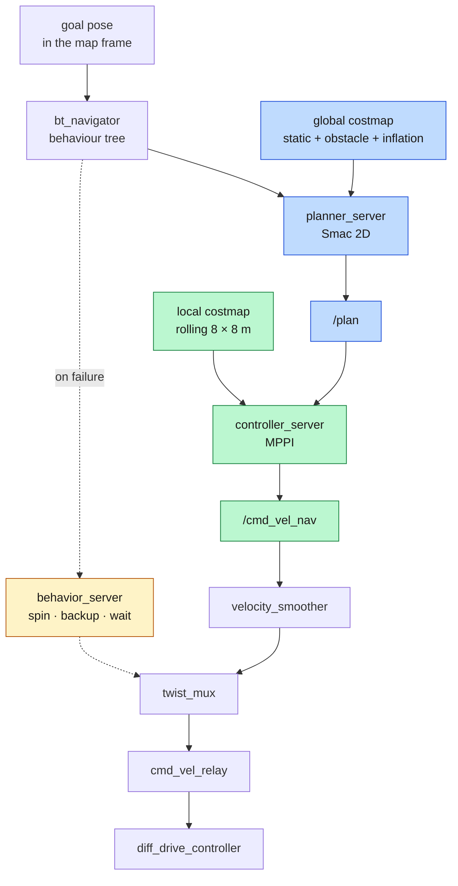
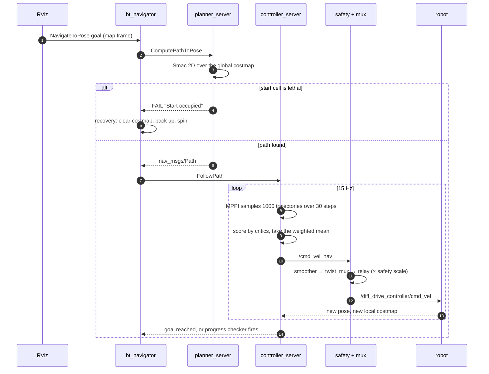
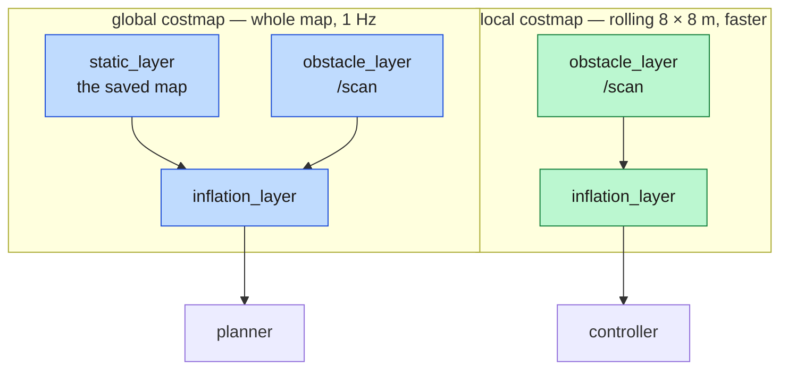
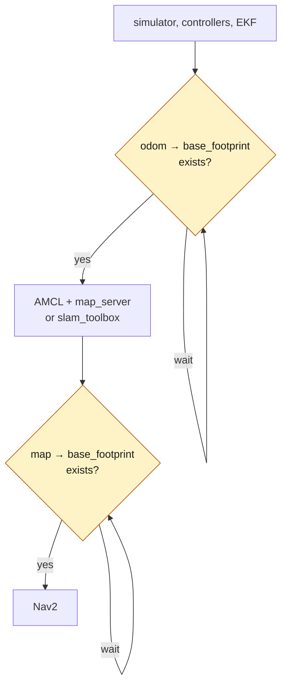

*Companion to video 15. 📺 Watch: **link coming with the video**.*

The robot has a map and knows its position on it. Everything is in place except
a reason to move.

## 1. What Nav2 is, in one diagram



Two planners, two timescales. The **global planner** answers "is there a route
at all, and roughly where does it go?" against the whole map, a few times a
second. The **local controller** answers "what velocity should I command in the
next 67 ms?" against a small rolling window that includes things the map never
knew about.

## 2. Sending a goal

```bash
./run.sh nav        # saved map + AMCL + Nav2 + RViz
```

then click **2D Goal Pose** in RViz. Or from a terminal:

```bash
./run.sh exec 'ros2 action send_goal /navigate_to_pose nav2_msgs/action/NavigateToPose \
  "{pose: {header: {frame_id: map}, pose: {position: {x: 7.0, y: -4.5}, \
    orientation: {w: 1.0}}}}"'
```

> **Goal coordinates are in the `map` frame, which is world coordinates minus
> the spawn pose.** Third appearance of the same trap. If a goal lands 16 m from
> where you meant, this is why.

## 3. What actually happens



The bit worth noticing is the hop through `S`: **the controller's output is not
what reaches the wheels.** `cmd_vel_relay` multiplies every command by the
safety speed scale at the last hop, so Nav2 can be throttled to 30 % without a
single Nav2 log line saying so. That fact is the key to article 16.

## 4. The global planner

```yaml
GridBased:
  plugin: "nav2_smac_planner::SmacPlanner2D"
  tolerance: 0.25
  allow_unknown: true
  max_iterations: 1000000
  max_planning_time: 3.0
  cost_travel_multiplier: 2.0
```

`SmacPlanner2D` searches the costmap as a grid. `cost_travel_multiplier: 2.0`
weights cost against distance — how strongly the planner prefers a longer path
through cheaper (further from obstacles) cells over a short one that hugs the
racking.

`allow_unknown: true` matters while mapping: the global costmap only spans what
SLAM has seen, and a planner that refuses unknown space cannot plan a route into
territory the robot is about to survey.

## 5. The local controller

**MPPI** — Model Predictive Path Integral. Every cycle it samples a batch of
candidate velocity sequences, rolls each one forward through a motion model,
scores the resulting trajectories with a set of critics, and commands the
cost-weighted average.

```yaml
time_steps: 30
model_dt: 0.067
batch_size: 1000
vx_max: 0.7
vx_min: -0.35
wz_max: 1.0
motion_model: "DiffDrive"
```

That is a thousand trajectories, thirty steps each, fifteen times a second.
Which is why the tuning notes below are all about compute:

> **`controller_frequency` is 15, not 20.** MPPI with footprint-aware collision
> checking could not finish a cycle in 50 ms and logged *"Control loop missed
> its desired rate"* repeatedly. **A controller that misses its rate steers on
> stale information**, wanders off the path and hits things — which presents as
> bad tuning rather than as a compute budget problem.
>
> **`model_dt` must be ≥ the controller period**, and MPPI refuses to configure
> otherwise (*"Controller period more then model dt"*). At 15 Hz that is 0.0667.
> Lowering `controller_frequency` without changing this stops the whole nav
> stack from activating — and `bt_navigator` then never appears, so a test just
> hangs waiting for it.
>
> **`batch_size` came down from 1500 × 40.** That was over budget at 15 Hz.

The velocity ceilings are not policy either. They come from the wheel joint:
`vel_limit` is 15.0 rad/s on 0.065 m wheels = 0.975 m/s of rim speed, and the
outer wheel in a turn carries `vx + wz × 0.24`. So `0.7 + 1.0 × 0.24 = 0.94 m/s`
— inside it, with headroom. `controllers_beebot2.yaml` must agree, and does.

### The critics

| Critic | Job |
|---|---|
| `ConstraintCritic` | stay inside the velocity limits |
| `CostCritic` | avoid costly cells — **`consider_footprint: true`** |
| `GoalCritic`, `GoalAngleCritic` | converge on the goal pose |
| `PathAlignCritic`, `PathFollowCritic`, `PathAngleCritic` | stay on the global path |
| `PreferForwardCritic` | do not solve problems by reversing |

`consider_footprint: true` costs compute and buys the ability to fit through a
1.4 m aisle with a rectangular robot. A circular approximation would refuse.

## 6. Costmaps, and the two kinds of safety margin



The footprint is **not the chassis**:

```yaml
footprint: "[[0.25, 0.265], [0.25, -0.265], [-0.25, -0.265], [-0.25, 0.265]]"
footprint_padding: 0.10
inflation_radius: 0.65
cost_scaling_factor: 3.0
```

0.50 × 0.53 m — the true envelope, wider than it is long, because the drive
wheels are outboard. `test_footprint.py` cross-checks it against the URDF so the
two cannot drift.

**Safety distance is set two ways, and both are needed:**

| Mechanism | Value | Kind | Effect |
|---|---|---|---|
| `footprint_padding` | 0.10 m | **hard** | grows the polygon used for collision checking; a path that puts it into an obstacle is rejected outright |
| `inflation_radius` | 0.65 m | **soft** | costs the space around obstacles, so among *legal* paths the planner prefers the one further away |

Padding alone gives clearance but no preference — the robot will happily shave
the margin. Inflation alone gives preference but no guarantee. Together: 0.10 m
that cannot be crossed, and a gradient out to 0.65 m that pulls the path to the
middle of the aisle.

> **`inflation_radius` must exceed the *circumscribed* radius, not the inscribed
> one** — here, circumscribed 0.364 + padding 0.10 = 0.464, and 0.65 clears it.
> Below that threshold Nav2's collision checker loses its fast-reject path and
> errors every cycle.
>
> It is still passable everywhere: the tightest aisle is 1.4 m, so its centre
> line sits 0.70 m from each wall — outside the inflation. That is what keeps
> the pinched aisle **traversable** rather than merely legal.

**And declare a footprint, not a `robot_radius`.** For the larger AMR, a 0.64 m
circle puts 1.28 m of every 1.8 m aisle inside the inscribed band and aisles
become unplannable. The rectangle recovers 0.24 m per side.

## 7. Bringing it up in the right order



`full.launch.py` **enforces** this rather than hoping for it, via
`beebot2_control/wait_for_transform`.

Skipping either gate produces the same symptom, and it is a nasty one: a
lifecycle server fails to activate, the lifecycle manager aborts the bringup —
**and `bt_navigator` carries on accepting goals it will never act on.**

> **"Goal accepted, robot never moves" is almost always a startup-order problem,
> not a planner one.** Work backwards from the wheels:
>
> | Check | Expected |
> |---|---|
> | `ros2 topic hz /diff_drive_controller/cmd_vel` | ~15 Hz while a goal is active |
> | `ros2 topic hz /cmd_vel_muxed` | same |
> | `ros2 node list \| grep cmd_vel_relay` | present |
> | `ros2 topic echo /safety/state --once` | `state: 0` |
> | `ros2 lifecycle get /controller_server` | `active` |

And two more traps in the same family:

**`slam_toolbox` and Nav2 are lifecycle nodes.** They come up `unconfigured` and
register no subscriptions until something transitions them. Left alone they log
nothing, which reads exactly like a QoS fault.

**Bringup fails about one time in three** on a loaded machine, with
`failed to send response to /<node>/change_state (timeout)` from `map_server` or
`planner_server`. It is a startup-load race, not a config error — the same
command succeeds on retry. It is a known open blocker.

## 8. Two goal-shaping decisions

**Goal orientation is enforced.** Requesting a fixed heading makes the robot spin
on arrival at *every* waypoint to satisfy the yaw tolerance, burning the timeout
and reporting failure after driving perfectly. Use direction of travel unless
the heading genuinely matters — at a dock, it does.

**Tolerances are a policy choice, not a default to accept:**

```yaml
xy_goal_tolerance: 0.25
yaw_goal_tolerance: 0.25
```

25 cm and about 14°. Loose enough for a transport goal, and far too loose for a
charging contact — which is why article 19 does not use Nav2 for the final
approach.

## 9. Recovery behaviours

When the behaviour tree's main branch fails, `behavior_server` offers `/spin`,
`/backup`, `/drive_on_heading`, `/wait` and `/assisted_teleop`.

> **`/backup` is the one that clears a protective stop**, because it commands
> linear motion. `/spin` commands only angular velocity, which leaves the safety
> field facing forward and stays blocked — correctly, since turning on the spot
> sweeps the corners 0.169 m further forward than the leading edge the field is
> measured from.
>
> That interaction between a recovery behaviour and a safety layer is article
> 18's entire subject, and it was a genuine deadlock before it was a footnote.

## 10. Honest status

**The robot drives to goals. On a benchmark of 16, it reaches 7.**

Against a recorded target of >95 %. Phase 6 does not pass, and this article
would be dishonest if it ended at "click 2D Goal Pose and watch it work" —
because it does work, and it works 44 % of the time.

What is already known, and what article 16 is about:

- the controller tracks its path to **0.05–0.15 m** cross-track error, on
  failing goals as much as on passing ones. **It is not steering badly.**
- localisation is 0.02–0.09 m stationary but **0.17 m mean and 0.55 m peak while
  driving**, and a standard aisle leaves ±0.40 m of navigable ribbon.
- the remaining failures are **timeouts**, and they correlate hard with time
  spent in the safety warning field.

## Sign-off

- [ ] the footprint matches the URDF envelope, and a test enforces it
- [ ] `inflation_radius` > circumscribed radius + padding
- [ ] a footprint polygon is declared, not a `robot_radius`
- [ ] Nav2 starts only after `map → base_footprint` exists
- [ ] every lifecycle node reaches `active`
- [ ] `/cmd_vel_nav` reaches the wheels — check the relay and the mux
- [ ] a goal succeeds, and the **ground-truth** error at arrival is measured
- [ ] the robot's closest approach to anything has been recorded, not just success

## Next

The robot reached a goal on camera. Reaching one goal once is not a working
navigation system — and the next article is about proving that, with numbers
that are not flattering.

**Next: [It Can Navigate — But Why Does It Still Fail?](../16-navigation-failures/).**
