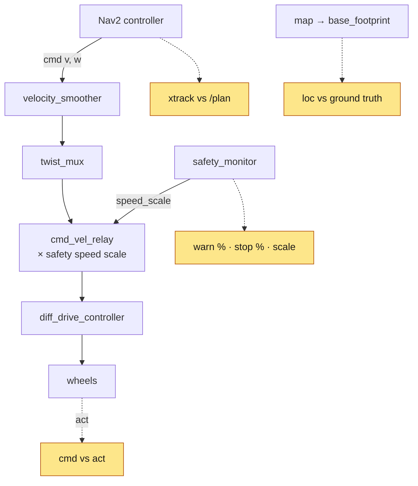
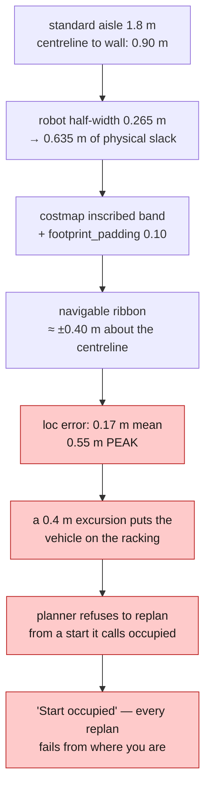
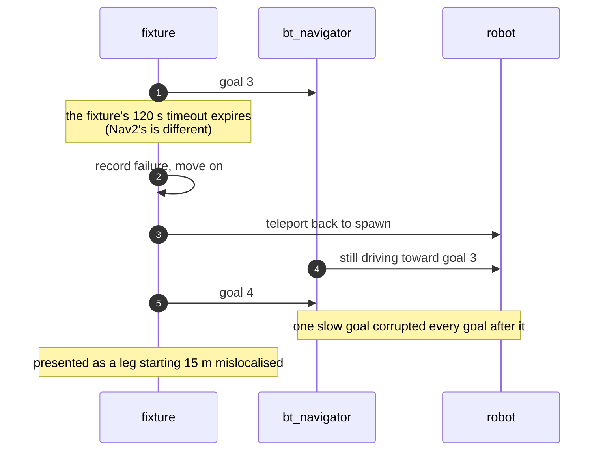

*Companion to video 16. 📺 Watch: **link coming with the video**.*

The robot drove to a goal on camera. On a benchmark of 16 goals it currently
reaches **7**, against a target of over 95 %.

> **A robot that drove once does not mean the system is good.**

This is the most useful article in the series, and it is the one with the worst
numbers in it. Those two facts are related.

## 1. Build a benchmark, not a demo

`nav_scenarios.py` is the acceptance test: eight fixed goals, `repeats:=2` for
sixteen, the same goals in the same order every run so two configurations are
comparable.

```bash
./run.sh nav headless:=true rviz:=false map:=warehouse_truth
./run.sh exec 'ros2 run beebot2_navigation nav_scenarios.py --ros-args -p repeats:=2'
```

**The robot is teleported back to the spawn pose before each goal.** Without that
the goals are not independent: one bad leg leaves the robot wedged against
racking, and every later goal starts from there and fails for the same reason. An
earlier version of the script produced **1/8** that way — which looks like a
controller that fails 88 % of the time rather than one that fails once and
cannot recover.

It reports, per goal:

| Column | Question |
|---|---|
| status | did Nav2 say it succeeded |
| goal error | **ground-truth** distance to the requested pose |
| clearance | closest the envelope came to anything, from the raw scan |
| wedged | did the run end with the planner refusing to plan from here |

That third column matters: a "successful" goal that scraped a rack at 0.02 m is
not a success.

## 2. Four tuning rounds that could not have worked

Before any of the instrumentation below existed, four configurations were tuned
against **outcomes alone**:

| Configuration | Success |
|---|---|
| initial | 0/8 — planner refused every goal, `"Start occupied"` |
| + map cluster filter, spawn moved clear | 1/8 |
| + MPPI at 15 Hz, cheaper batch, rebalanced critics | 2/8 |
| + `RotationShimController` | **regressed**, reverted |

> **An outcome cannot distinguish a controller that steers badly from one that
> steers correctly in a frame that is wrong.** Those two want opposite fixes,
> and four rounds of work went into the first one.

## 3. Instrument the command path

So the benchmark was changed to report what the *command path* was doing, on a
second line per goal:

```
   2   (  -4.0, -5.4)         OK   0.374     0.000     47.8
     safety: warn 10% stop  0% scale 0.93 | cmd v 0.47 w 0.21 -> act 0.39 m/s (0.84x) | xtrack 0.17/0.69 m | loc 0.19/0.32 m
```



| Metric | What it separates |
|---|---|
| `safety` | how much of the run was spent throttled or stopped, and by how much |
| `cmd → act` | whether anything between the controller and the wheels is not honouring the command |
| `xtrack` | "not following the path" from "following the path and not getting there" |
| `loc` | **a hard floor under goal error** |

That last one deserves its own sentence. **A goal reached perfectly in a frame
that is 0.5 m out is scored as a 0.5 m miss, and no controller tuning can close
it.**

## 4. Ruling out the controller

With `xtrack` available, the first question became answerable in one run.

**Cross-track error on failing goals: 0.05–0.15 m. On passing goals: the same.**

The controller follows its planned path to within 5–15 cm and scrapes the
racking anyway — because **the path is drawn in a frame that is not where the
robot is**.

## 5. The fifth cause was the map

Two matched 16-goal runs, identical code, differing only in which map AMCL
localises against:

| | success | `loc` mean | `loc` max | warning | stopped |
|---|---|---|---|---|---|
| `map:=warehouse` (SLAM) | 5/16 | 0.235 m | 0.493 m | 40 % | 7 % |
| `map:=warehouse_truth` | **9/16** | **0.184 m** | 0.430 m | 31 % | 4 % |
| + protective-stop deadlock fixed | 7/16 | **0.172 m** | 0.553 m | 28 % | **2 %** |

**With no change to Nav2 at all.**

> **Read the success column with the variance in mind, and the other columns as
> the real evidence.**
>
> Four goals separate the first two rows and two separate the last two — while
> **two identical halves of one 16-goal run scored 6/8 and 3/8.** Eight goals
> cannot separate a 50 % controller from a 75 % one, which is enough to make a
> tuning round look like an improvement or a regression at random.
>
> What survives repetition is the *mechanism*: `loc` and warning-field time fall
> monotonically down the table, and the deadlock fix halves the time spent
> stopped. The success counts are consistent with that and too coarse to prove
> it.

Quote `repeats:=2` at minimum, and read `loc`, `warn` and `stop` rather than the
success count.

## 6. The aisle arithmetic

Why 0.17 m of localisation error is fatal in a building with 1.8 m aisles:



**This is the binding constraint**, and sharpening AMCL's sensor model does not
touch it — that was measured, and it moved driving error from 0.186 m to
0.187 m (article 14, §8).

## 7. The timeouts, and the throttle nobody logged

The failures that are *not* collisions are timeouts, and they correlate hard
with the safety warning field:

| Time in the warning field | Outcome |
|---|---|
| > 50 % of the run | times out |
| < 10 % of the run | does not |

The mechanism: the vehicle is throttled to **0.3×** by the safety layer while
**Nav2 keeps planning as though it were not**. So a 27 m goal cannot finish in
120 s, and nothing in any Nav2 log says the speed was reduced — because the
reduction happens at `cmd_vel_relay`, downstream of everything Nav2 can see.

Three attempts to relax that throttle:

| Tried | Single-run result |
|---|---|
| continuous speed supervision replacing the 0.3 warning scale | 4/8, protective stops **3 % → 36 %** |
| + supervision margin, bundled with the field-direction change | 3/8, stops 42 % |
| `/speed_limit` seam — a ceiling rather than a multiplier at the relay | 3/8, stops 35 % |

Each was a single 8-goal run, so each success rate sits inside the noise band and
is recorded for the *mechanism*, not the percentage. And the mechanism is
consistent and repeatable:

> **Every change that let the vehicle move faster near obstacles converted
> warning-field time into protective stops, roughly one for one.**
>
> The 0.3 scale is not a tuning value. It is what keeps the vehicle out of the
> protective field.

**But their precondition has since changed.** All three were measured while a
protective stop was a *dead end* (article 18). Converting warning-field time
into stops the vehicle can reverse out of is a different proposition from
converting it into stops it cannot. Worth re-measuring; untested.

## 8. A "standard fix" that regressed

`RotationShimController` is the textbook answer to MPPI turning on the spot
badly — and MPPI does turn on the spot badly here. Scenario 6 arrived 0.203 m
from its target, inside the 0.25 m position tolerance, then timed out unable to
meet the 0.25 rad yaw tolerance. **Position achieved, goal refused.**

Adding the shim moved failures from **0.2–6 m of residual error to 7–25 m**: the
robot stopped colliding and started standing still rotating.

Reverted rather than kept and tuned, on the principle that **an unmeasured
"standard fix" that regresses the benchmark is worth less than the benchmark**.
If it is revisited, start with a much smaller `angular_dist_threshold`.

## 9. Two bugs in the test, not the robot

Both were inflating the failure count, and neither was visible without the `loc`
column.

**The goal was never cancelled on timeout.**



**AMCL was seeded while odometry was still reacting to the teleport.** A 20 m
jump leaves the EKF integrating a velocity spike for seconds afterwards, and
AMCL builds `map → odom` from the odom pose it holds when the initial pose
arrives. Seeding into that put the filter **7.5 m out**. The reset now waits for
`/odom` to go quiet.

> A benchmark is a piece of software and it has bugs like any other. Both of
> these made the robot look worse than it was, which is the *less* dangerous
> direction — the opposite kind of fixture bug is the one that ships.

## 10. Where it stands

**7/16 = 44 %, against a >95 % target. Phase 6 does not pass.**

But the gap is now measured rather than guessed, and the two things worth doing
next are known, in order:

1. **Re-measure the `/speed_limit` seam**, now that a protective stop is
   escapable. That is where the timeouts are.
2. **Attack the 0.17 m driving localisation error.** It is what puts the vehicle
   into the racking in the first place, and it is a hard floor under goal error.

And the accumulated lessons, which are more portable than the numbers:

| Lesson | |
|---|---|
| Measure the command path, not just the outcome | an outcome cannot name its own cause |
| Run enough goals to beat the variance | 6/8 and 3/8 were the same configuration |
| Fix the fixture before blaming the robot | two of the failures were the test |
| A standard fix that regresses is still a regression | measure it, then keep or revert |
| Remove one variable at a time | the ground-truth map is what made Nav2 measurable |

## Sign-off

- [ ] the benchmark is repeatable — same goals, same order, robot reset between
- [ ] goals are cancelled on timeout, not abandoned
- [ ] localisation is re-seeded only after odometry settles
- [ ] goal error is measured against **ground truth**, not Nav2's own report
- [ ] closest approach is recorded, so a scrape is not counted as a success
- [ ] the command path is instrumented end to end
- [ ] every configuration change is measured over ≥16 goals
- [ ] changes that regress are reverted **and recorded with their numbers**

## Next

Navigation is being made reliable, and the biggest remaining cause is understood.
But nothing so far actually stops the robot from hitting anything — every layer
to this point has assumed the world cooperates.

**Next: [Building a Safety System for the AMR](../17-safety-system/).**
