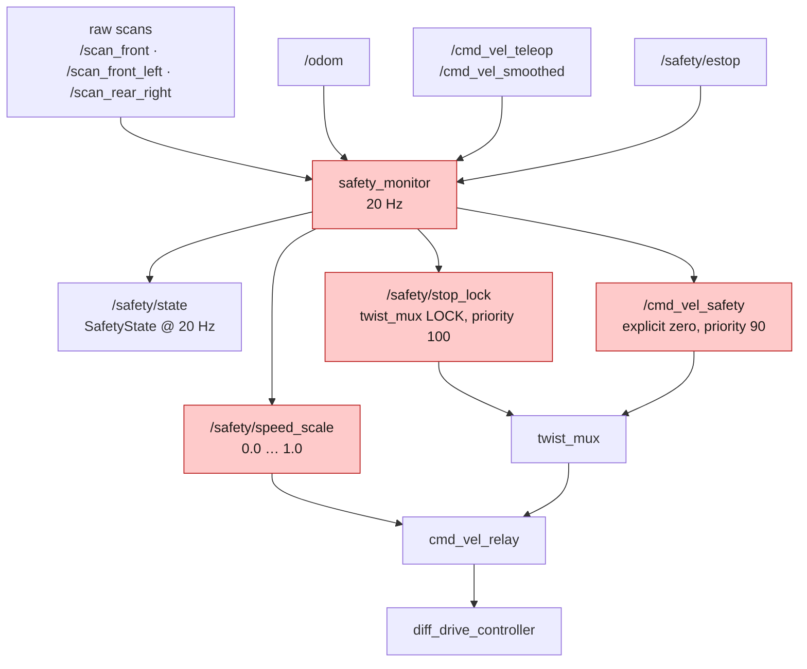
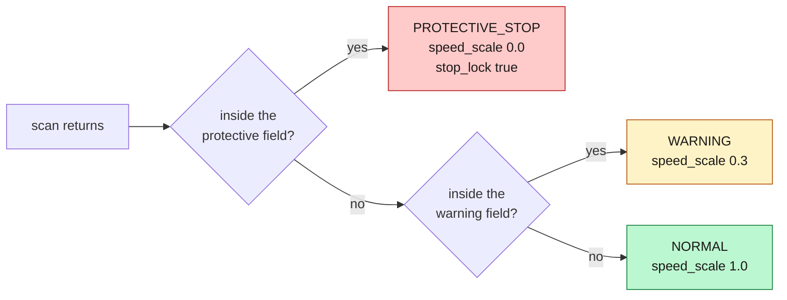
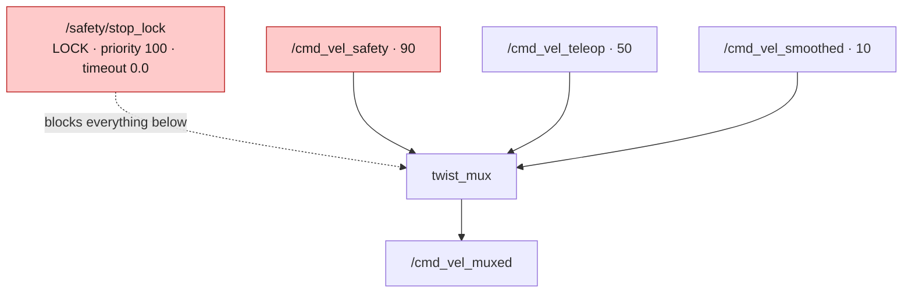
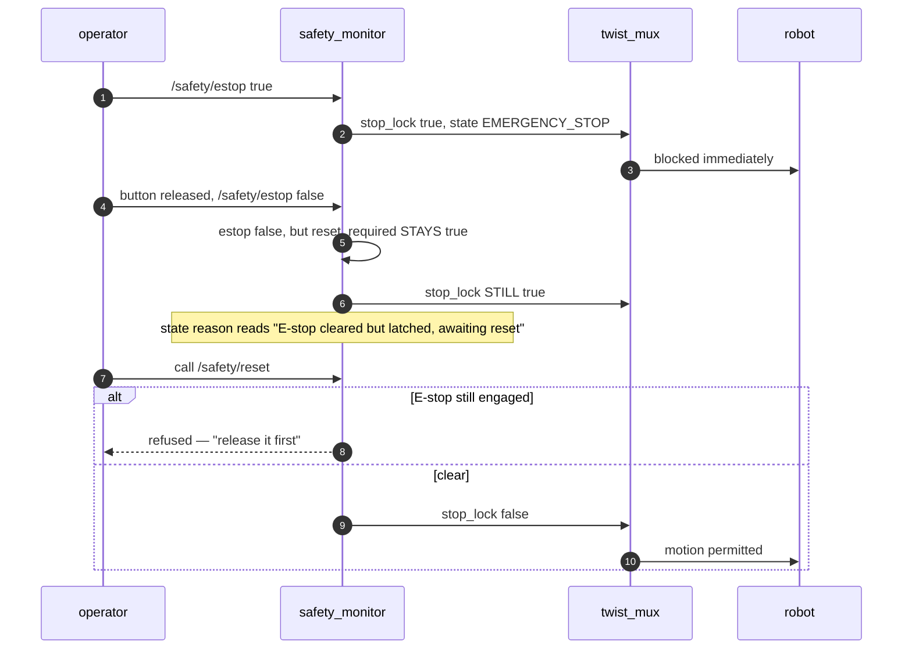
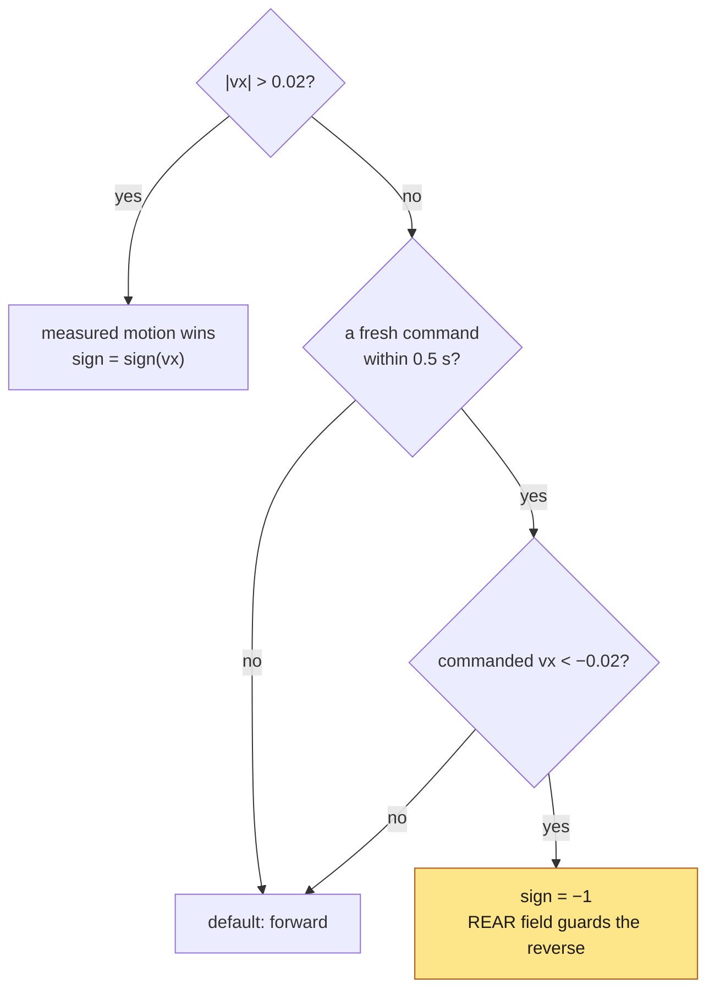

*Companion to video 17. 📺 Watch: **link coming with the video**.*

The robot navigates. Every layer so far has assumed the world cooperates. On a
machine with real mass, that assumption is the dangerous one.

## 1. Where the safety layer sits, and why it is not a costmap layer



Three deliberate choices in that picture:

**It reads the raw per-sensor scans, not the merged `/scan` the costmaps use.**
On a real machine the safety scanner is a *certified device with its own
authority over the drive enable*. Implementing safety as a costmap layer teaches
the software a habit that does not transfer to a certified installation — and
puts a processing node between an obstacle and a stop.

**It blocks motion through `twist_mux` locks, not by asking the planner
nicely.** A planner can be busy, wedged, or not running. A lock is not a request.

**It publishes at 20 Hz whether or not anything is wrong.** A consumer should
never have to infer safety from the absence of a message. Same principle as the
battery driver in article 10: **state is asserted, never implied.**

## 2. Fields that scale with speed

The protective field is not a fixed box. Its depth is computed every cycle from
the vehicle's actual speed:

$$
d = \underbrace{\frac{v^2}{2a}}_{\text{stopping}} + \underbrace{v \cdot t_{\text{react}}}_{\text{reaction}} + \underbrace{c}_{\text{clearance}}
$$

floored at a standstill minimum.

| Parameter | Value |
|---|---|
| `decel` ($a$) | 0.7 m/s² — matches the controller's limit |
| `reaction_time` ($t_{\text{react}}$) | 0.15 s |
| `clearance` ($c$) | 0.20 m |
| `min_field` | 0.25 m — the standstill floor |
| `warning_factor` | 2.0 — warning depth = protective × this |
| `warning_speed_scale` | 0.3 |

**Measured field depth:**

| Speed | Protective field |
|---|---|
| at rest | 0.25 m |
| 0.3 m/s | 0.33 m |
| 0.6 m/s | 0.74 m |

This is what lets an AMR use narrow aisles at low speed without stopping on the
racking, while still stopping in time at corridor speed. Real scanners switch
between pre-configured field sets on the same principle; here the depth is
continuous.

> **`min_field` is 0.25 m and it is not arbitrary.** It has to exceed the
> **0.169 m rotational overhang** — how much further forward the corners sweep
> than the leading edge the field is measured from, when the robot turns on the
> spot. §6 is about why that number matters.

## 3. The two fields, and the two responses



The speed scale is applied at `cmd_vel_relay` — the **last hop** before the
controller. Scaling there means nothing upstream can opt out of it: not the
planner, not the operator, not a future fleet client.

It also means the throttle is invisible from above, which is exactly the trap
article 16 ran into: Nav2 gets throttled to 30 % without a single Nav2 log line
saying so.

## 4. The priority ladder



**`safety > teleop > navigation`.** An operator cannot drive through a protective
stop, and neither can Nav2. Verified end to end in simulation: driving straight
at racking scales to 0.30 and then stops at 0.24 m **with the key still held**.

Two configuration details that carry real weight:

**The lock's `timeout` is 0.0**, so it holds until explicitly cleared rather than
expiring on its own. *A stop that lapses because a publisher died is not a stop.*

**Every input's `timeout` is 0.5 s.** A source that goes quiet is dropped. This
is the same 0.5 s the gamepad relies on in article 04, and it comes back in §6.

## 5. E-stop, and the restart interlock



> **Releasing a button is not consent to move.** Getting this wrong is how
> machines lurch when a button pops back out. The reset is a separate,
> deliberate action, and the service *refuses* while the E-stop is still
> engaged.

**Latching is asymmetric on purpose:**

| Cause | Behaviour |
|---|---|
| protective field | **clears itself** when the obstacle leaves, or when the vehicle is driven out of it |
| bumper, E-stop | **latch** until `/safety/reset` |

A person stepping out of the way should not need an operator, and neither should
backing off a pallet. A physical strike should.

And a small detail that matters at 3 a.m.: a latched stop keeps reporting **what
caused it** after the cause clears. Reporting "bumper" for a released E-stop
sends an operator to look at the wrong end of the machine.

## 6. The direction the fields face

This is the design decision that took a real deadlock to discover, and article 18
is the full story. The summary belongs here because it is part of how the system
works.

**The fields face the direction of travel the vehicle is being *asked* to go, not
the direction it is measured going.**



Both give the same answer whenever the vehicle is moving. They diverge in exactly
one case, and it is the case that matters: **a vehicle held by its own protective
field has `vx = 0`.**

Note carefully what is and is not conceded — the command chooses **which** field
is evaluated, never **whether** one is:

| Situation | Result |
|---|---|
| stopped by something ahead, asked to reverse | rear field guards the reverse; released if clear |
| stopped by something ahead, asked to go forward | still blocked |
| wedged — something at both ends | still blocked, both directions |
| stopped, asked to **rotate on the spot** | still blocked |
| moving | measured motion wins, whatever is being asked for |

**Rotation is deliberately not an escape.** Turning on the spot sweeps the
corners out to the circumscribed radius — 0.169 m further forward than the
leading edge the field is measured from, which is inside the 0.25 m standstill
floor. So a Nav2 `Spin` recovery stays blocked and `BackUp` is the one that
works.

And one more: **a stale command is not a command.** The same 0.5 s timeout
`twist_mux` applies to its inputs applies here, so a source the mux has already
dropped cannot still be steering the protective field.

The requested direction is read from the mux **inputs**, not its output — because
while a stop is asserted, the output *is* the safety zero, and can never carry
the wish to reverse that would clear the stop.

## 7. `SafetyState`: saying why, not just that

```
uint8 NORMAL=0  WARNING=1  PROTECTIVE_STOP=2  BUMPER_STOP=3  EMERGENCY_STOP=4
uint8 state
bool  estop_engaged, bumper_triggered
bool  protective_field_violated, warning_field_violated
bool  reset_required
float32 speed_scale, protective_range, warning_range, nearest_obstacle
string  reason
```

The `reason` field names the direction **and how to clear it**:

```
obstacle 0.17 m ahead inside protective field; reverse to clear
```

"0.18 m ahead" and "0.18 m astern" want opposite responses from an operator, and
an earlier version of this message named neither. A safety message that says only
*that* the machine stopped forces the operator to guess, and a guessing operator
on a stopped 300 kg machine is its own hazard.

This message type lives in `beebot2_interfaces` because it is **the seam a fleet
system attaches to** — see article 21.

## 8. Measured

| Check | Result |
|---|---|
| protective stop | fires at 0.10–0.15 m inside the field, speed → 0.000 |
| field depth at rest / 0.3 / 0.6 m/s | 0.25 / 0.33 / 0.74 m |
| E-stop engaged | blocks immediately |
| button released | **stays blocked** — awaiting `/safety/reset` |
| `/safety/reset` | accepted, motion permitted |
| operator driving into racking | scaled to 0.30, stopped at 0.24 m, rested 0.16 m off — command still `+0.40` |
| reversing out of a protective stop | released, **+1.314 m in 6 s** |

Plus **22 unit tests** covering the field model — a package that previously had
none.

## 9. Two things that are not done

**The bumper never publishes.** The latching logic is written and unit-tested,
and the sensor does not fire even in simulation. Two causes were found and
fixed — Gazebo lumped `bumper_link` into `base_footprint` so the collision name
in the filter did not exist, and the `Contact` system was declared as a model
plugin when it has to be a world one — and **neither was enough**. The topic has
a subscriber and no publisher. Everything else in the chain works without it.

**None of this runs on the real robot.** There is no lidar driver, so
`robot.launch.py` deliberately does **not** start `safety_monitor`:

> It begins with an empty scan dictionary, so with no lidars running it evaluates
> its protective fields against nothing and publishes **"clear"**. A safety layer
> asserting the world is empty is worse than an absent one, because
> `/safety/state` and `/safety/stop_lock` both look healthy.
>
> `safety: no /safety/state` in the teleop status line is the **expected** and
> correct reading on hardware today.

There is also no physical E-stop wired to `/safety/estop` yet. On a real
deployment that is a hardware interlock in series with the drive enable, and the
ROS topic is a *report* of its state, not the mechanism.

## Sign-off

- [ ] `/safety/state` publishes at a fixed rate whether or not anything is wrong
- [ ] field depth grows with speed, and has a standstill floor
- [ ] the standstill floor exceeds the rotational overhang
- [ ] safety outranks teleop, and teleop outranks navigation
- [ ] the stop lock has `timeout: 0.0`
- [ ] an E-stop stays latched after the button is released
- [ ] `/safety/reset` is refused while the E-stop is engaged
- [ ] the state message names the direction and how to clear it
- [ ] the safety layer is **not** started without live scanners

## Next

The robot protects itself. In the next article it protects itself a little too
well — and the failure stays in.

**Next: [A Safety System the Robot Couldn't Escape From](../18-safety-failure/).**
