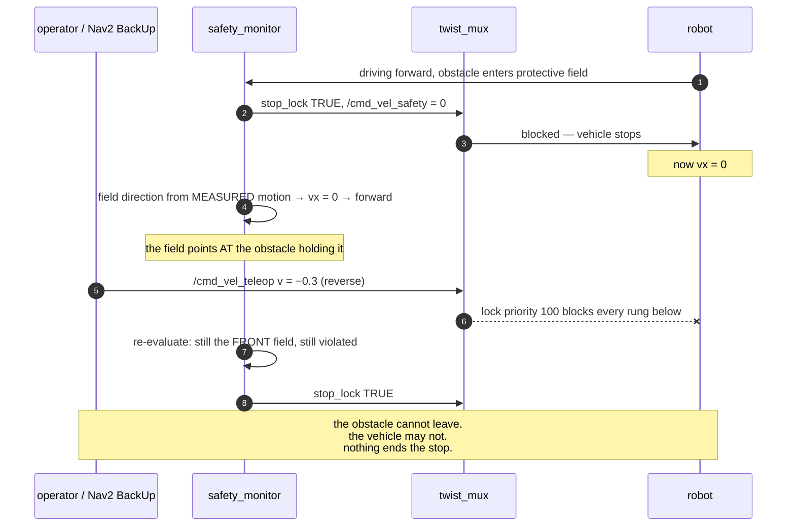
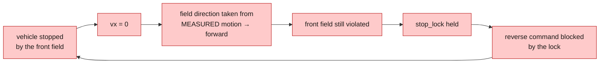
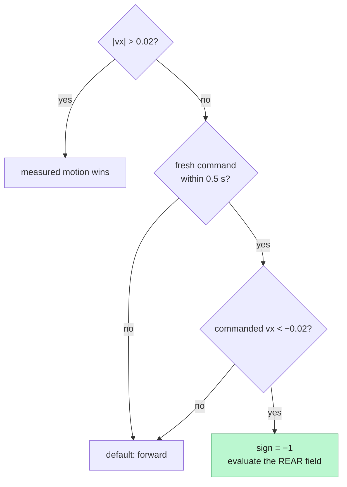

*Companion to video 18. 📺 Watch: **link coming with the video**.*

The safety system works. It works so well that in one situation the robot could
not get out of it.

**The failure stays in.** This is the article with the highest ratio of practical
value to screen time in the series, and every bit of that value comes from the
fact that the bug was real, survived a phase of unrelated tuning, and was
invisible from every topic in the system.

## 1. What it looked like

Nav2 goals timing out.

That is all. No error, no warning, no anomalous topic. The benchmark reported
timeouts, the controller looked healthy, the localisation numbers were what they
always were. It went into the pile marked "Nav2 needs more tuning" and stayed
there through **four tuning rounds**.

## 2. Reproducing it

```bash
./run.sh drive headless:=true rviz:=false      # terminal 1
./run.sh exec 'ros2 run beebot2_safety check_protective_stop'
```

The test drives at a wall until the protective field fires, holds still to
confirm the stop persists on its own, then asks to reverse and reports whether
the vehicle moved.

The output, before the fix:

```
start          -18.000  NORMAL  clear
stopped        -19.132  PROTECTIVE_STOP  obstacle 0.17 m ahead inside protective field
after reverse  -19.132  PROTECTIVE_STOP  obstacle 0.17 m ahead inside protective field
moved          +0.000 m
DEADLOCKED
```

Six seconds of reverse commands. **Zero millimetres.**

## 3. The deadlock



Read it as a circle:



**Nothing recovers.** Not the operator pressing `s`, not Nav2's `BackUp`
recovery, not waiting. The obstacle is racking; it is not going to move.

## 4. Why it was invisible

This is the part worth internalising, because it generalises far beyond safety
systems.

| What you would check | What it showed |
|---|---|
| `/safety/state` | `PROTECTIVE_STOP`, obstacle 0.17 m — **correct** |
| `/safety/stop_lock` | `true` — **correct** |
| `/cmd_vel_teleop` | the reverse command, being published — **correct** |
| `/cmd_vel_muxed` | zero — **correct**, a lock is asserted |
| twist_mux | behaving exactly as configured |
| the robot | stopped, in front of an obstacle |

**Every single component was doing exactly what it was designed to do.** From
every topic in the system, a deadlocked stop is byte-identical to a healthy stop
in front of an obstacle that has not moved yet.

There was no failing component. The failure was in the *composition* — a policy
that is correct in isolation, meeting a lock that is correct in isolation.

> **The lesson.** A behaviour that only exists in the interaction between two
> correct components cannot be found by inspecting either one. It has to be
> tested as a behaviour: *can the vehicle get out?* That is a different question
> from *does the vehicle stop?*, and only the second one had ever been asked.

## 5. The fix

**Take the field direction from the *requested* direction of travel, not the
measured one.**



The two rules agree whenever the vehicle is moving. They differ in exactly one
case — the stopped one — and that is the case the deadlock lives in.

**This is what real scanners do.** A certified safety laser scanner selects its
field set from the vehicle's *requested* direction of travel, for precisely this
reason. The fix is not a clever workaround; it is the industry behaviour that had
been quietly dropped.

### Three implementation details that make it safe

**The command chooses which field, never whether.** A reverse request does not
disable the safety system; it asks the *rear* field to guard the reverse. If
something is behind as well, the vehicle stays stopped. That is the wedged case
and it is the correct answer.

**Only a definite request counts.** Zero is every input's resting state and says
nothing about which way the vehicle wants to go next:

```python
if abs(msg.linear.x) > 0.02:
    self.cmd_vx = msg.linear.x
    self.cmd_stamp = now()
```

Recording zeros would erase a reverse request 50 ms after it arrived.

**The request is read from the mux *inputs*, not its output.** While a stop is
asserted, the mux output *is* the safety zero — so the output can never carry the
wish to reverse that would clear the stop. `safety_monitor` therefore subscribes
to `/cmd_vel_teleop` and `/cmd_vel_smoothed` directly. That upward edge in the
graph is not decoration; without it the fix does not work at all.

**A stale command is not a command.** The same 0.5 s timeout `twist_mux` applies
to its inputs applies here, so a source the mux has already dropped cannot still
be steering the protective field.

## 6. Re-testing

```
start          -18.000  NORMAL  clear
stopped        -19.132  PROTECTIVE_STOP  obstacle 0.17 m ahead inside protective field; reverse to clear
after reverse  -17.755  NORMAL  clear
moved          +1.314 m
ESCAPED
```

`DEADLOCKED, moved +0.000 m` → **`ESCAPED, moved +1.314 m`**.

Note the message also changed. It now says **how to get out**:

```
obstacle 0.17 m ahead inside protective field; reverse to clear
```

A stop that can be escaped is only useful if the person or planner facing it
knows which way to go.

## 7. Latched stops are a different thing

Worth being precise, because the two look identical from a distance and want
opposite responses:

| Kind | Cause | How it clears |
|---|---|---|
| **protective stop** | something in the protective field | it leaves, **or you drive out of it** |
| **latched stop** | bumper strike, E-stop | `/safety/reset`, explicitly |

In the keyboard teleop:

- **`s`** — reverse. This is what clears a protective stop.
- **`r`** — reset. This is for a *latched* stop, and **will not help** with a
  protective one.

The status line names which one you have. If reversing does not release it,
something is behind you too — that is the wedged case, and it is the correct
answer.

## 8. What it was worth

Honest accounting, because the headline number is not impressive:

| Measure | Before | After |
|---|---|---|
| `check_protective_stop` | `DEADLOCKED +0.000 m` | **`ESCAPED +1.314 m`** |
| time spent stopped, benchmark | 4 % | **2 %** |
| goals reached | 9/16 | 7/16 |

**The goal count went down.** Two goals, which is inside the noise band — two
identical halves of one 16-goal run scored 6/8 and 3/8. On the exact map the
vehicle rarely reached a protective stop in the first place, so there was very
little for the fix to improve.

It counts for more on the SLAM map, where 7 % of the run is spent stopped. And
its real value is as a **precondition**: article 16 lists three attempts to relax
the warning-field throttle, each of which converted warning-field time into
protective stops roughly one for one, and each of which was reverted.

> **All three were measured while a protective stop was a dead end.** Converting
> warning-field time into stops the vehicle can reverse out of is a completely
> different proposition from converting it into stops it cannot. That trade is
> worth re-measuring, and it is untested.

Which is the second lesson of the article: **a fix that does not move the
headline number can still unblock the thing that will.**

## 9. Why this became an acceptance test

`check_protective_stop` exists as a *script* rather than as a paragraph in a
design document, because the behaviour it checks cannot be verified by reading
code or watching topics. It is an emergent property of three components
interacting, and the only way to know is to try it.

It prints one of two words:

```
ESCAPED     reversing released the stop
DEADLOCKED  reversing did not, and nothing else will either
```

**Both are correct answers to different questions**, which is why it reports
which rather than passing or failing silently. And it publishes on the teleop
rung of the mux, so it exercises the same path as an operator pressing `s` and
as Nav2's `BackUp` recovery — not a special test path that might behave
differently.

On a real machine there is no teleport: drive it at a pallet by hand and watch
`/safety/state`.

## Sign-off

- [ ] a protective stop can be escaped by reversing
- [ ] a protective stop **cannot** be escaped by driving forward
- [ ] a protective stop **cannot** be escaped by rotating on the spot
- [ ] wedged (obstacles both ends) stays stopped, in both directions
- [ ] a bumper or E-stop stop is **not** escapable by driving — it needs a reset
- [ ] the state message names the direction and how to clear it
- [ ] the escape behaviour is an automated test, not a paragraph
- [ ] Nav2's `BackUp` recovery can clear a stop, and `Spin` cannot

## Next

The robot is safe, and it can recover from its own safety system. Next it learns
to keep itself running — because a robot that stops dead when the battery runs
out and waits for someone to plug it in is not autonomous, it is just
well-supervised.

**Next: [Teaching the AMR to Find Its Charging Station](../19-docking-charging/).**
