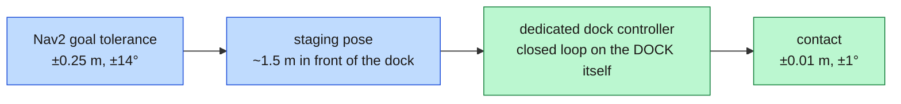
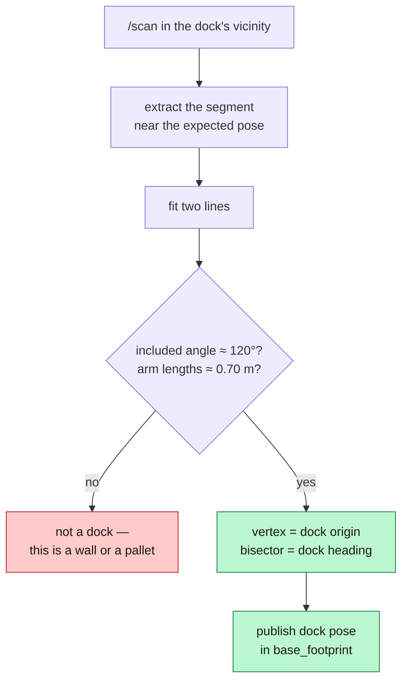
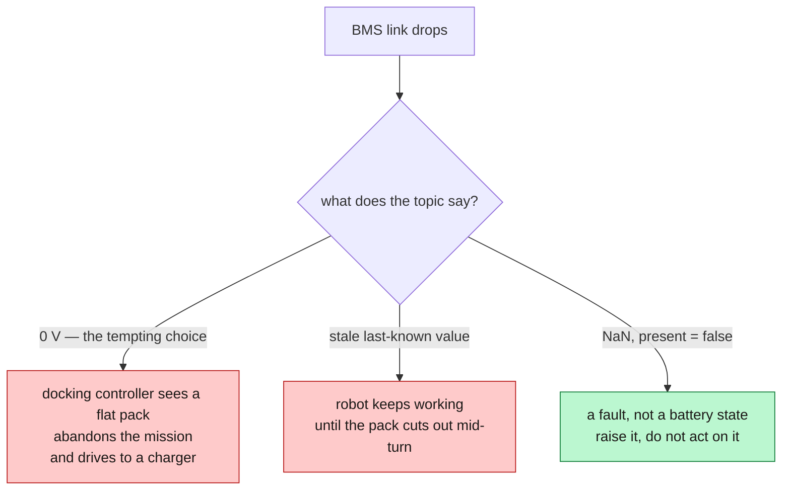
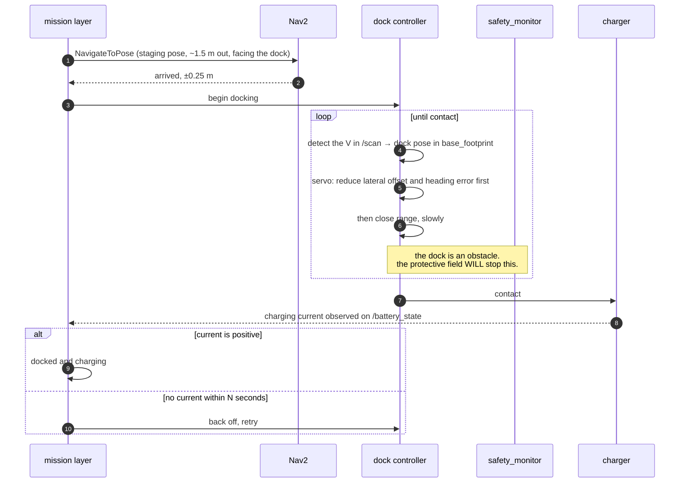
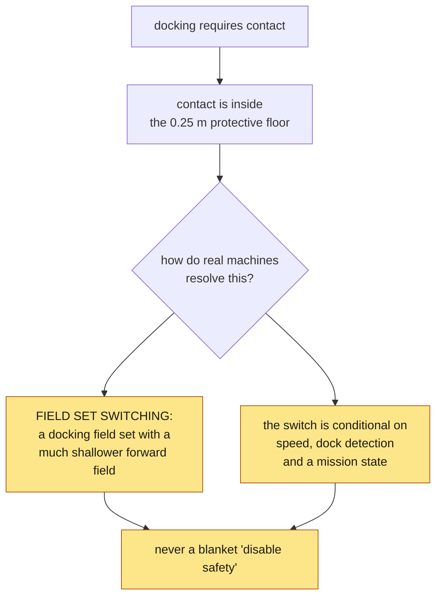

*Companion to video 19. 📺 Watch: **link coming with the video**.*

The robot navigates and protects itself. It still stops dead when the battery
runs out, and someone has to go and plug it in.

> **Status: this phase is not built.** The battery telemetry from article 10
> exists and is protocol-tested. The warehouse world already contains two
> charging docks, shaped for this. **Dock detection, the docking controller and
> the charge state machine do not exist yet.**
>
> So this article is the design and the arithmetic, with the parts that are real
> marked as real. Where a number is a target rather than a measurement, it says
> so.

## 1. Why navigation is not enough

Nav2's goal tolerances on this robot:

```yaml
xy_goal_tolerance: 0.25
yaw_goal_tolerance: 0.25
```

25 cm and about 14°. Entirely reasonable for "go to the end of aisle 3". Useless
for a charging contact, which needs single-digit millimetres and a degree or two.



**Two stages, two different control problems.** Navigation gets the robot to a
pose in the *map* frame, where the error is dominated by localisation — 0.17 m
mean, 0.55 m peak (article 14). Docking gets the robot onto the *dock*, in the
dock's own frame, where localisation error does not appear at all because the
robot is servoing on what it can currently see.

That is the single most important idea in this article: **the final approach must
close the loop on the dock, not on the map.**

## 2. Making a dock findable

The docks in the warehouse world are not flat plates. Each has a **V-notch** —
a back panel with two cheeks angled 30° inward.



The shape is the point. A flat dock face looks like every other flat wall in a
warehouse, and a detector that matches flat surfaces will confidently dock the
robot against a rack end. A V gives:

- **A unique signature** in a building full of straight lines.
- **A vertex**, which is a point, not a line — so it constrains position in both
  axes rather than just one.
- **A bisector**, which gives heading directly.

This is why real docks have reflective markers, retroreflective tape or a
geometric feature. Any of the three works; what does not work is expecting a
scanner to find a flat rectangle.

> **What exists today:** the dock geometry in `generate_warehouse.py`, with a
> comment noting it is shaped so Phase 8 can match against it. **The matcher
> itself is not written.**

## 3. Deciding when to go

A state of charge percentage is not a decision. The decision is:

> **Is there enough charge to reach the dock from the furthest point on the
> route, plus a reserve?**

which is an arithmetic problem about the *building*, not about the battery:

| Term | Where it comes from |
|---|---|
| worst-case distance to a dock | the map, plus the mission area |
| energy per metre | measured over a shift, not from a datasheet |
| reserve for a failed docking attempt | at least one full retry cycle |
| reserve for a queued dock | how many robots share how many docks |

`bms_node` already exposes the thresholds as parameters
(`low_soc_warn` 20 %, `low_soc_critical` 10 %) rather than hard-coding them,
precisely because the right values are a property of the deployment.

**And the reason article 10 refused to publish zeros comes due here:**



**0 V is indistinguishable from a flat pack**, and that is the one reading a
docking controller must not get wrong.

## 4. The approach



Two things in that flow are worth pulling out.

### The order of corrections

Reduce **lateral offset and heading first, range last**. A robot that closes
range while still misaligned runs out of room to correct — the geometry gets
worse the closer it gets, because the same angular error becomes a smaller and
smaller correctable displacement. Real docking controllers approach along the
dock's normal for exactly this reason.

### The safety system will fight you, correctly

This is the design problem nobody mentions until they hit it.

A charging contact requires driving **into** an obstacle. The protective field's
standstill floor is `min_field: 0.25 m` (article 17), so the safety layer will
assert a protective stop well before contact — and it will be right to.



A certified scanner switches **field sets**, and the switch is an input the
safety controller validates — not a software flag that disables protection.
Whatever this project eventually implements has to preserve that property: a
narrowed field, at a bounded low speed, only while a valid dock is detected, and
only while the mission layer says docking is in progress.

**`safety_monitor` has no field-set concept today.** Adding one is Phase 8 work,
and it is the part of this article that most needs to be got right rather than
got working.

## 5. Confirming charge

Docking is not "the controller says it arrived". It is **current flowing**.

`/battery_state` already carries a signed current — positive charging, negative
discharging (article 10, and mind the 30000 bias). So the acceptance condition
is a measurement, not a controller's own opinion:

| Signal | Means |
|---|---|
| positive current within *N* seconds | docked and charging |
| no current | mechanical contact without electrical contact — back off and retry |
| current then loss | the robot settled, or the contacts are dirty |

That middle row is the common real failure, and it is why the retry loop exists.
Contacts oxidise; a dock that worked yesterday needs a 2 cm nudge today.

## 6. Undocking

Simpler, and easy to get dangerously wrong.

The robot is **against an obstacle**, so its front protective field is violated
by definition. Reversing out is exactly the manoeuvre article 18 spent an entire
article making possible:

> The fields face the direction of travel being **requested**. A vehicle held by
> a front-field violation, asked to reverse, gets its **rear** field consulted —
> and is released if that is clear.

Undocking is therefore a normal reverse under normal safety, with the rear field
doing its job. Had the deadlock in article 18 not been fixed, **a docked robot
could not have left the dock.**

Then: reverse to the staging pose, and only then rotate. Rotating while still
inside the dock sweeps the corners out to the circumscribed radius and hits the
cheeks.

## 7. Recovery, because it will fail

| Failure | Response |
|---|---|
| dock not detected at the staging pose | re-approach from a slightly different angle; then flag the dock |
| detected but the fit is poor | do not dock. A bad fit is worse than no fit |
| contact without current | back off 0.2 m, retry, limited attempts |
| dock occupied by another robot | queue, or route to the second dock |
| repeated failures | mark the dock unavailable and tell the fleet layer |

Two docks exist in the world for the last two rows. A single-dock design has no
answer to "the dock is broken" other than a stranded robot.

## 8. What is real today, and what is not

| | Status |
|---|---|
| `sensor_msgs/BatteryState` at 10 Hz | 🧪 16 protocol tests, **never read against a live pack** |
| `NaN` / `present: false` on link loss | ✅ implemented and tested |
| dock geometry in the world | ✅ two V-notch docks, shaped for matching |
| dock detection | ⬜ not started |
| `opennav_docking` integration | ⬜ not started |
| docking field set in `safety_monitor` | ⬜ not started |
| charge control state machine | ⬜ not started |

**Phase 8 is started, not done.** The honest ordering of what to build first:

1. Read the BMS against a **live pack** — everything else is downstream of a
   battery reading anyone believes.
2. Write the dock detector and evaluate it standing still, against a known dock
   pose, before any motion is involved.
3. Add the field set to `safety_monitor`, with its interlocks, before the first
   approach.
4. Only then close the loop.

That ordering is the same discipline as article 02's bench test: bring up one
layer at a time, and never debug two unknowns at once.

## Sign-off

- [ ] the BMS has been read against a real pack and agrees with a multimeter
- [ ] the dock has a geometric or reflective signature, not a flat face
- [ ] detection is validated **stationary** before it is used in a control loop
- [ ] the final approach closes the loop on the dock, not on the map
- [ ] lateral and heading error are corrected before range
- [ ] the safety field is *narrowed under interlock*, never disabled
- [ ] charge is confirmed by **current**, not by the controller's own opinion
- [ ] undocking reverses before it rotates
- [ ] a failed dock is retried, then reported, and never silently repeated

## Next

The robot can keep itself running. Now it needs a reason to exist — something
useful to do between the charger and the aisle.

**Next: [Turning the AMR into a Real Service Robot](../20-payload-hmi/).**
