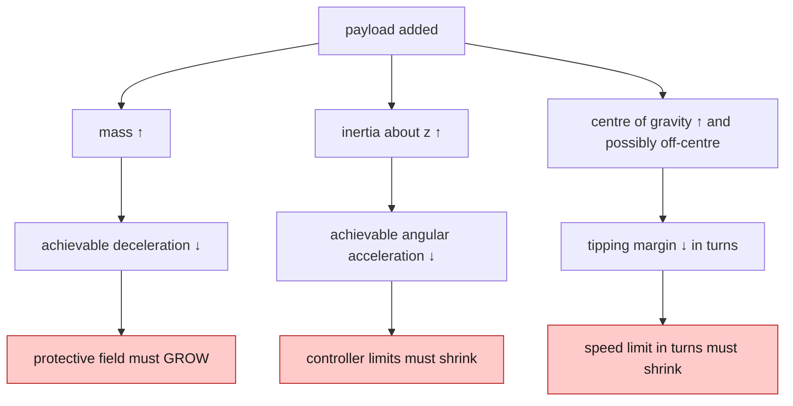
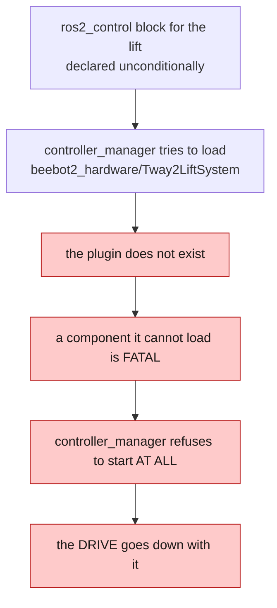
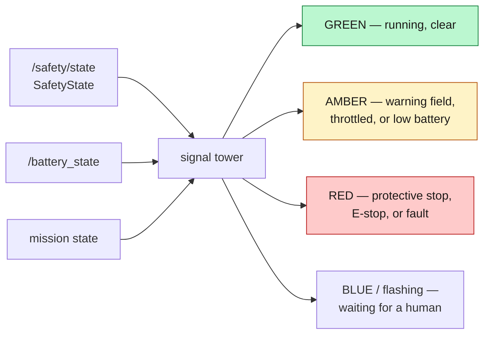
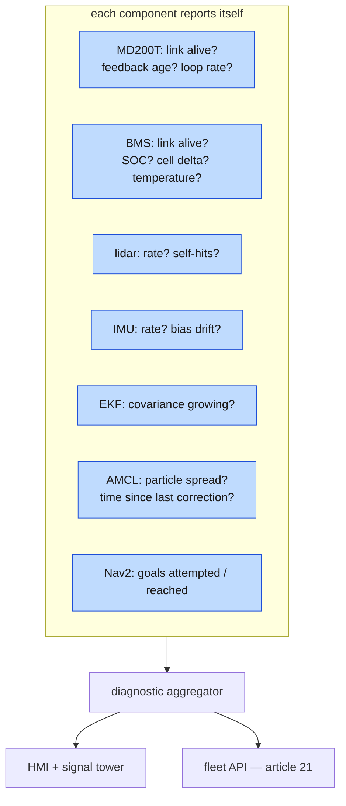

*Companion to video 20. 📺 Watch: **link coming with the video**.*

The robot drives, navigates, protects itself and charges. It does not yet do
anything useful for anyone.

> **Status: this phase is not started.** A prismatic lift joint exists in the
> larger robot's URDF with 0.15 m of travel, and a `lift_controller` loads and
> moves it in simulation — never measured. The warehouse world has four pick/drop
> stations and five pallets. **There is no lift hardware component, no signal
> tower, no HMI and no diagnostics.**
>
> This article is the design, and the parts of it that are already forced by
> decisions made earlier in the series.

## 1. Payload changes the robot, not just the mass

This is the section that matters most, because it is the one where a "just add a
shelf" attitude produces a safety failure.

Article 17's protective field depth:

$$
d = \frac{v^2}{2a} + v \cdot t_{\text{react}} + c
$$

with `decel` $a$ = 0.7 m/s², chosen to match the controller's own limit.

**$a$ is a property of the *loaded* vehicle.** Put 100 kg on a 300 kg robot and
the deceleration it can actually achieve drops — traction is unchanged, inertia
is not. If $a$ falls and $d$ does not, **the protective field is now shorter than
the stopping distance**, which is the exact failure the field exists to prevent.

So a real payload story needs three linked things:

| Need | Why |
|---|---|
| the robot **knows** it is loaded | a lift position, a load sensor, or a mission state |
| the safety parameters **change** with load | `decel` in `safety_monitor`, matched to reality |
| the controller limits **change** with load | `diff_drive_controller` and MPPI's `ax_max`, `az_max` |

And measurement for each state, not interpolation: **measure the loaded stopping
distance**, the way article 13 measured a 4 m line. A field depth derived from an
assumed deceleration is a number that looks like engineering and is not.

## 2. The lift, and a `controller_manager` trap

The AMR carries a prismatic lift:

| | |
|---|---|
| travel | 0.15 m |
| velocity | 0.05 m/s |
| effort | 4000 N |
| mass | 40 kg |

In simulation, `lift_controller` loads and the joint moves. It has never been
measured against a criterion, so it is 🔨 — built and running, not done.

On hardware there is **no hardware component behind it**, and that produces a
failure worth understanding:

**A missing lift takes the whole robot off the road.** So `lift` is a parameter
of the xacro macro, defaulting to `false`, and `robot.launch.py` neither passes
it nor exposes it — there is no `lift:=true` to hand `./run.sh robot`. Enabling
it means writing the hardware component first, then plumbing the argument
through.

Note also the distinction between two similar-sounding flags:

| Flag | Asks |
|---|---|
| `has_lift` | does this robot have the joint at all? |
| `lift` | is there real hardware behind it? |

Gazebo can drive a lift with no driver behind it, so the AMR keeps `has_lift` in
simulation. BEEBOT2 has no lift joint at all, and emitting an interface for it
would have a controller claim an axis that is not there.

## 3. Attaching and detaching a load

The mechanical question is "lift a pallet". The software questions are harder,
and all four are about **state**:

| Question | Why it is not obvious |
|---|---|
| is the load actually attached? | a lift that reached its travel proves nothing about what is on it |
| is it centred? | an off-centre load changes the tipping margin, not just the mass |
| did it shift in transit? | the robot must notice, not discover it at the drop |
| is the drop clear? | dropping onto an occupied station is a two-robot incident |

The cheapest honest answer to the first is **lift current or effort** — a loaded
lift draws more than an empty one, and the difference is measurable. The cheapest
answer to the fourth is the scanner the robot already has.

What should *not* happen is a mission layer that assumes a pick succeeded because
a service call returned. Same principle as confirming charge by current in
article 19: **confirm the physical event physically.**

## 4. Making state visible across a room

A signal tower is not decoration. On a floor shared with people, it is the only
interface most of them will ever use.

The mapping should be **derived from `/safety/state`**, not maintained
separately. A tower with its own copy of the state machine is a tower that will
eventually disagree with the robot, and the person on the floor will believe the
tower.

`SafetyState` already carries everything needed: `state`, `reset_required`,
`speed_scale` and a human-readable `reason`. It was designed that way in article
17 precisely so that consumers do not have to reconstruct it.

## 5. An HMI for someone who will not open a terminal

Everything in this series so far has been driven from a terminal or RViz.
Neither is an operator interface.

What an on-robot HMI actually has to answer, in rough order of how often it is
asked:

1. **Why has it stopped?** — `reason` already says, in words.
2. **What do I do about it?** — "reverse to clear" versus "press reset" are
   different answers and the message distinguishes them.
3. **What is it doing?** — current mission, next stop.
4. **How much battery is left?** — in minutes, not per cent.
5. **How do I stop it?** — a physical button, always, not a touchscreen one.

That last one is not an HMI feature. **An E-stop is a hardware interlock in
series with the drive enable**; the ROS topic `/safety/estop` is a *report* of
its state, not the mechanism. A software E-stop on a touchscreen is a
convenience, and must never be the only one.

Point 4 is worth dwelling on too. "18 %" means nothing to a person with a pallet
to move. "22 minutes" is actionable — and computing it needs the energy-per-metre
measurement from article 19, not a datasheet capacity.

## 6. Diagnostics: saying what is wrong before it stops

ROS 2 has `diagnostic_msgs` and `diagnostic_updater` for this, and the value is
in what gets published rather than in the machinery.

The useful ones are **not** "is the node alive". They are the numbers this series
has already had to measure by hand:

| Diagnostic | Already known to matter |
|---|---|
| serial loop rate below expected | the 52 Hz cap that means the drive reset to 19200 baud (article 02) |
| feedback age | the 500 ms timeout that stops the motors (article 03) |
| lidar beams under `range_min` | 211 of 811 was a mounting error (article 09) |
| localisation error growing | the binding constraint on navigation (article 14) |
| time in the warning field | correlates with every Nav2 timeout (article 16) |

**A diagnostic that only fires when something has already broken is a log entry.
A diagnostic that reports a trend is a maintenance decision.**

## 7. Fault injection

The counterpart to diagnostics, and the thing that makes them trustworthy: can
you *cause* each fault on demand and confirm the robot notices?

| Injected fault | Expected response |
|---|---|
| pull the drive serial cable | motors stop within 500 ms, hardware deactivates |
| pull the BMS cable | `NaN`, `present: false` within 2 s, fault raised |
| stop the lidar driver | safety must **not** report "clear" |
| block one scanner | protective stop on that side |
| engage the E-stop | immediate block, latched until reset |
| flat-battery simulation | mission aborts, robot returns to dock |

The third row is the interesting one, because it is a known unsolved problem:
`safety_monitor` starts with an empty scan dictionary and publishes "clear"
against no scans, which is why `robot.launch.py` refuses to start it without
scanners. **A scan source that dies mid-mission should produce a fault, not a
clear field** — and that check does not exist yet. It belongs here.

## 8. What is real today

| | Status |
|---|---|
| lift joint in the URDF (AMR) | ✅ 0.15 m travel |
| `lift_controller` in simulation | 🔨 loads and moves, never measured |
| lift hardware component | ⬜ does not exist; `lift:=false` is mandatory |
| pick/drop stations and pallets in the world | ✅ 4 stations, 5 pallets |
| load attach / detach | ⬜ not started |
| signal tower | ⬜ not started |
| HMI | ⬜ not started |
| diagnostics and fault injection | ⬜ not started |

**Phase 9 has not begun.** The one thing in it that should not wait for the rest
is the payload-versus-safety-parameter link in §1 — because a robot that carries
a load with an unchanged `decel` is not an incomplete feature, it is a shortened
protective field.

## Sign-off

- [ ] the robot knows whether it is loaded
- [ ] `decel` and the controller limits change with load state
- [ ] loaded stopping distance has been **measured**, not assumed
- [ ] a pick is confirmed physically, not by a service return
- [ ] the signal tower derives from `/safety/state`, not a second state machine
- [ ] the HMI answers "why did it stop" and "what do I do" in words
- [ ] the E-stop is a hardware interlock; the topic only reports it
- [ ] battery is presented in minutes, not per cent
- [ ] every diagnostic can be triggered on demand and is observed to fire
- [ ] a dead scan source produces a **fault**, never a clear field

## Next

One robot does a job. The last two articles are about robots that are not alone —
starting with the question of how anything outside ROS 2 tells this one what to
do.

**Next: [Controlling an AMR from Outside ROS 2](../21-robot-api/).**
