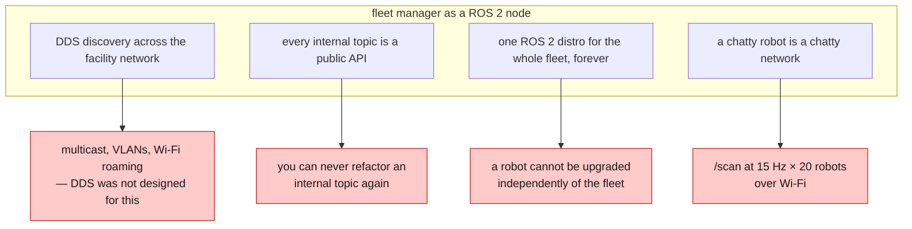
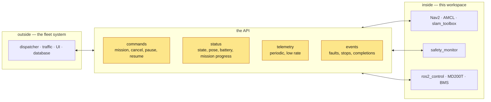
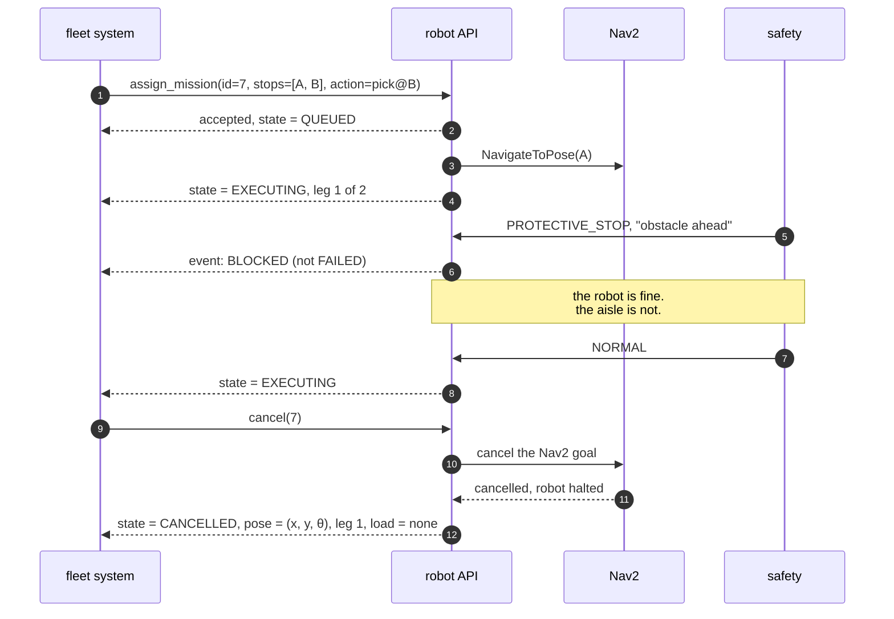

*Companion to video 21. 📺 Watch: **link coming with the video**.*

The robot does a job when someone sends it a goal from RViz. **Nothing in a real
facility runs RViz.**

> **Status: this phase is not started.** `beebot2_interfaces/SafetyState` exists
> and is the beginning of the seam. There is no API, no mission model and no
> telemetry channel.
>
> What follows is design — but design constrained by decisions already made in
> this series, which is why it is worth writing down now rather than after the
> first integration.

## 1. Why a fleet system should not speak ROS 2

The tempting architecture is to run the fleet manager as another ROS 2 node and
let DDS handle it. It is tempting because it works immediately on a bench, and it
fails in production for four separate reasons.



The second one is the killer, and it is a design problem rather than an
engineering one. **If the fleet system subscribes to `/cmd_vel_muxed`, then
`/cmd_vel_muxed` is a public API** — and everything this series did to that
topic, every rename, every type change, becomes a breaking change for a system
somebody else maintains.

So there is a seam, and the robot's internals stay behind it.

## 2. What is on each side



**The seam is narrow on purpose.** Four message categories, and none of them is
a velocity.

> **The fleet system never commands velocity.** It commands *intent*. "Go to
> station 3" is a mission; "drive at 0.4 m/s" is not something a system on the
> other side of a Wi-Fi link has any business saying to a 300 kg machine whose
> safety layer it cannot see.
>
> This falls straight out of article 17's priority ladder. A fleet client that
> published velocity would have to enter that ladder somewhere, and every
> position is wrong: above safety is unacceptable, above teleop overrides the
> operator, and below navigation means it never wins.

## 3. The four categories

### Commands — intent, not motion

| Command | Semantics |
|---|---|
| `assign_mission` | a sequence of stops with actions; returns a mission id |
| `cancel` | stop *this* mission, safely, and say where the robot ended up |
| `pause` / `resume` | hold position without losing mission state |
| `return_to_dock` | the charge decision from article 19, forced externally |

Every one of them is **acknowledged**, and the acknowledgement is not the same as
completion. `assign_mission` returning `accepted` means the robot has the
mission, not that it has done it.

### Status — the robot's own view

| Field | Source |
|---|---|
| pose | `map → base_footprint`, **not** `/amcl_pose` (article 14) |
| localisation confidence | particle spread, or time since last correction |
| safety state | `SafetyState.state` and `reason`, verbatim |
| battery | `sensor_msgs/BatteryState`, including `present: false` |
| mission state | see §4 |
| health | the diagnostics aggregate from article 20 |

### Telemetry — periodic and low rate

Position, speed, battery, at 1–5 Hz. **Not `/scan`. Not `/odom` at 50 Hz. Not
the camera.** If the fleet system needs a scan, that is a debugging session with
a rosbag, not a production data path.

### Events — things that happened

Faults, protective stops, mission completions, dock failures. Push, not poll —
a fleet system that discovers a protective stop three seconds later on the next
status poll has already routed another robot into the same aisle.

## 4. Mission state, and what cancel actually means



Three things that experience forces:

**`BLOCKED` is not `FAILED`.** A robot held by its own safety field in a busy
aisle is working correctly. A fleet system that treats that as a failure will
reassign the mission, and now two robots are heading for the same place.

**Cancel must report where the robot ended up.** A cancelled mission leaves the
robot somewhere in the middle of the building, possibly holding a load. A cancel
that returns only `ok` forces the fleet system to guess.

**Cancel must actually cancel.** Article 16 found this the hard way in the test
fixture: the benchmark's own timeout expired without cancelling the Nav2 goal, so
`bt_navigator` kept driving toward an abandoned goal — through the next reset and
into the next leg. **One slow goal corrupted every goal after it**, and it
presented as a leg starting 15 m mislocalised.

That was a bug in a test. The same bug in a fleet integration is a robot driving
to a cancelled destination while the dispatcher believes it is idle.

## 5. Keeping the interface stable while the internals change

The whole point of a seam is that one side can change without the other. That
requires discipline rather than technology:

| Rule | Why |
|---|---|
| the API has its own version, independent of the robot software | a robot must be upgradeable without a fleet release |
| additive changes only, within a version | a new optional field is safe; a renamed one is not |
| **no internal topic names on the wire** | `/cmd_vel_muxed` is an implementation detail and must stay one |
| ids are opaque to the robot | mission ids belong to the fleet system |
| every field has defined units and a defined frame | "position" without a frame is a bug waiting for a second robot |

That third rule is the one that gets broken first, usually by exposing a topic
"just for debugging" that becomes load-bearing within a month.

**And there is an industry answer worth knowing about:** VDA 5050 is the
interoperability standard for AGV/AMR fleet communication in this space, with a
defined MQTT topic structure and message schema for orders, state and
instant actions. Adopting an existing schema means a fleet system that already
speaks it can drive this robot without a bespoke integration. Whether or not that
is the right choice here, it is the right thing to have read before designing a
bespoke one.

## 6. The seam that exists today

`beebot2_interfaces/SafetyState` — one message type, and the beginning of the
pattern:

```
uint8   state          # NORMAL · WARNING · PROTECTIVE_STOP · BUMPER_STOP · EMERGENCY_STOP
bool    estop_engaged, bumper_triggered
bool    protective_field_violated, warning_field_violated
bool    reset_required
float32 speed_scale, protective_range, warning_range, nearest_obstacle
string  reason
```

Look at what it does *not* do. It does not expose which scanner fired, or the
field geometry, or the internal topic the stop was asserted on. It reports a
**state**, its **cause**, and a human-readable **reason** — exactly what an
external consumer needs and nothing that ties it to the implementation.

It also publishes **at a fixed rate whether or not anything is wrong**, which is
the property an external system needs most: *silence must never mean "fine"*.
Across a network link, silence means the link is down.

Those three properties — report state not mechanism, publish unconditionally,
name the cause in words — are the whole design brief for the rest of the API.

## 7. One rule already written down

There is a rule in this workspace that belongs in the API layer, and it is
currently enforced by convention only:

> **No robot node may subscribe to `/ground_truth`.**

It is bridged from Gazebo for tests, in the same category as the ground-truth map
in article 12: a fixture used to *score* the robot's beliefs, never an input to
them.

Phase 10 adds a CI check that enforces it. Until then, one careless subscription
turns every simulation result in this series into a claim about a robot that
knows the answer.

## 8. What is real today

| | Status |
|---|---|
| `beebot2_interfaces/SafetyState` | ✅ published at 20 Hz, consumed by the teleops and the benchmark |
| mission model | ⬜ not started |
| command / status / telemetry / event API | ⬜ not started |
| transport (MQTT, REST, gRPC, …) | ⬜ not chosen |
| CI check on `/ground_truth` | ⬜ not started |
| `launch_testing` acceptance suite | ⬜ not started |

**Phase 10 has not begun.** The two things listed as already known to be needed
are the `/ground_truth` check and turning `check_protective_stop` and
`nav_scenarios.py` — both currently run by hand against a live simulator — into
a proper `launch_testing` suite.

Neither is glamorous. Both are the difference between a project with tests and a
project whose tests run.

## Sign-off

- [ ] the fleet system commands **intent**, never velocity
- [ ] no internal topic name appears on the wire
- [ ] status publishes unconditionally — silence is never "fine"
- [ ] `BLOCKED` and `FAILED` are distinguishable
- [ ] cancel actually cancels, and reports where the robot ended up
- [ ] every field has a unit and a frame
- [ ] the API is versioned independently of the robot software
- [ ] an existing standard was evaluated before a bespoke schema was written
- [ ] no robot node subscribes to a test fixture

## Next

One robot can be commanded from outside. Now put several of them in the same
building — and watch a set of assumptions that have held for twenty articles stop
holding all at once.

**Next: [When Multiple AMRs Share One Warehouse](../22-multi-robot/).**
