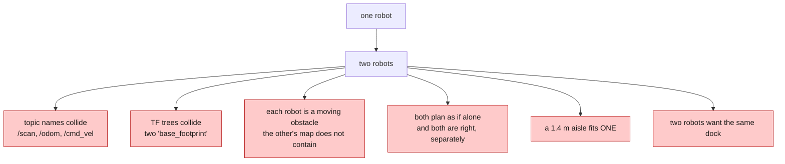
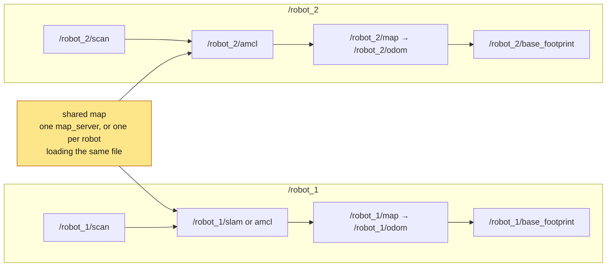
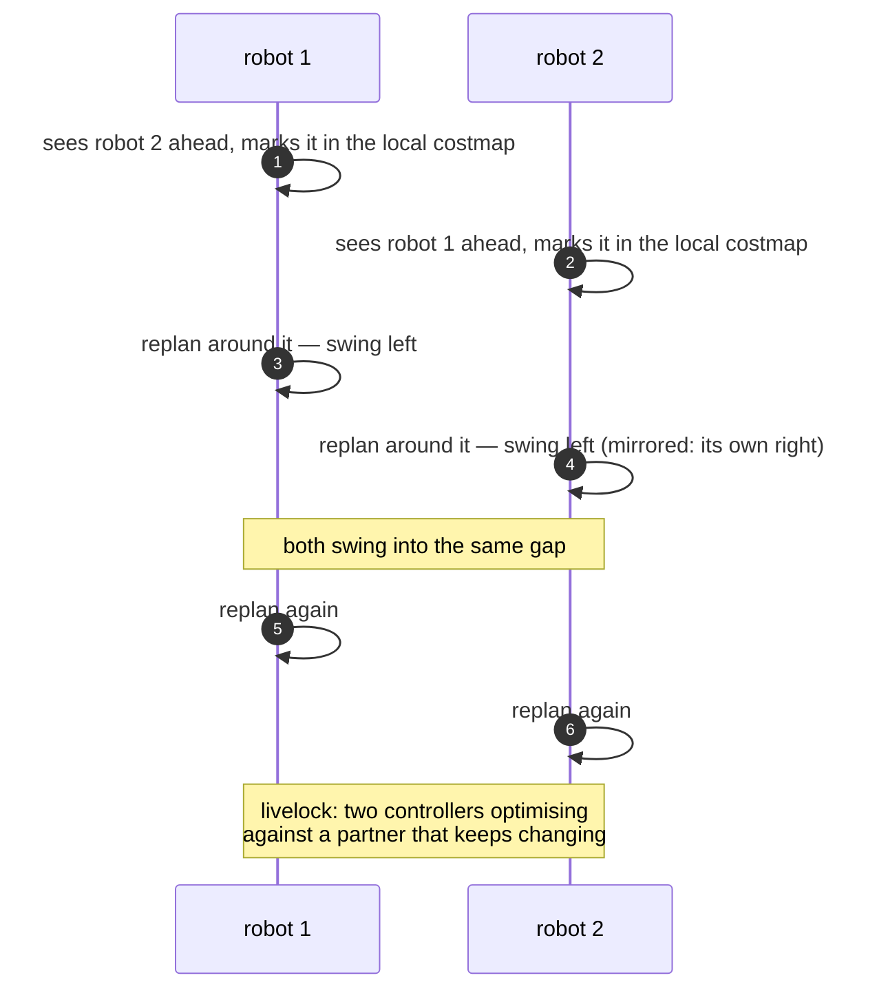
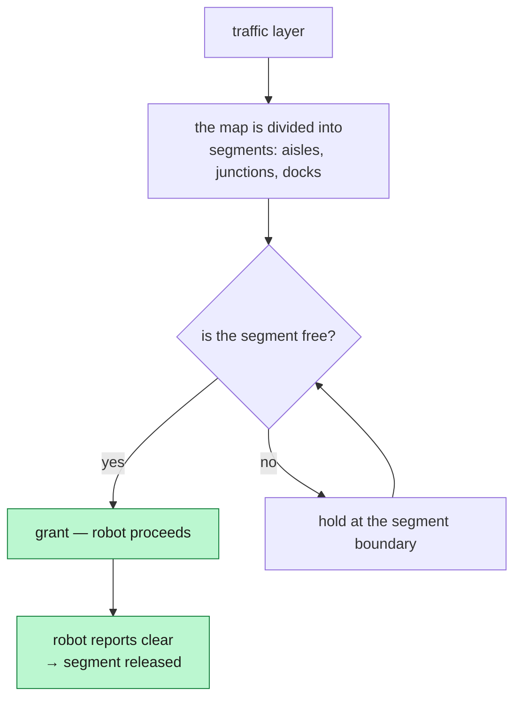
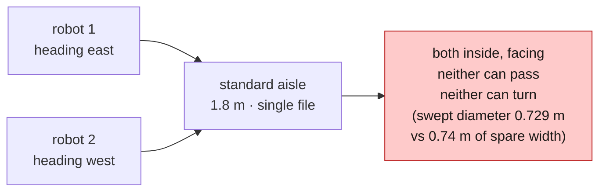
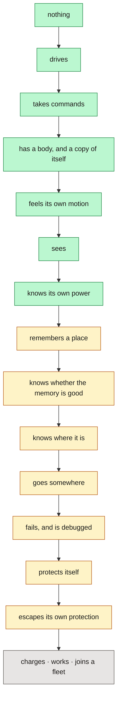

*Companion to video 22. 📺 Watch: **link coming with the video**.*

Everything so far assumed one robot in an empty building. Add a second robot and
several assumptions quietly stop holding.

> **Status: this phase is not started.** No namespaced spawn, no multi-robot
> launch, no traffic layer. This article is design plus the arithmetic of *this*
> building, which is the part that transfers regardless of what gets built.

## 1. What breaks when there are two

The first two are plumbing. The last four are the actual problem, and no amount
of namespacing touches them.

## 2. Namespacing

Every topic and every frame gets a prefix. Three things make this less mechanical
than it looks:

**TF frames need prefixing too, not just topics.** Two robots publishing
`base_footprint` into one tree is not a name collision that errors — it is a tree
with two children of the same name, and lookups return whichever arrived last.

**The map frame is the shared one.** Each robot localises privately, in its own
`map → odom`, but all of those corrections are expressed relative to *the same
map*. That is what makes robot 1's pose meaningful to robot 2.

**`use_namespace` is not free in Nav2.** Costmap `global_frame`, the behaviour
tree's frame parameters and every launch remap have to agree, and a single one
left unprefixed produces a robot that plans in someone else's frame.

## 3. One map, private localisation

| Shared | Per robot |
|---|---|
| the static map file | the particle filter |
| the map **frame** | `map → odom` |
| the traffic layer's view | the local costmap |
| the dock and station registry | odometry, safety, drive |

The reason localisation stays private is that it is a *belief*, and beliefs
differ. Robot 1 being 0.2 m out is robot 1's problem to correct, and merging
estimates would propagate one robot's error into another's.

The reason the map is shared is that the building does not change per robot, and
two robots with independently-built maps have no common coordinate system to
negotiate in.

## 4. The arithmetic of this building

This is where a general article becomes a specific one. BEEBOT2's envelope is
**0.50 × 0.53 m**, swept diameter **0.729 m**.

| Space | Width | Two robots passing? |
|---|---|---|
| central corridor | 4.8 m | **yes**, comfortably — 4.8 − 2 × 0.53 = 3.74 m spare |
| cross aisle | 2.0 m | **yes**, tight — 0.94 m spare, but no room to turn |
| standard aisle | 1.8 m | **marginal** — 0.74 m spare before any costmap margin |
| **pinched aisle** | **1.4 m** | **no** — 0.34 m spare, less than one footprint padding either side |

And once the costmap's `footprint_padding` (0.10 m) and the inflation gradient
(0.65 m) are included, the *planner's* answer is harsher than the tape measure's:
in a 1.8 m aisle the navigable ribbon is about ±0.40 m about the centreline
(article 16), which two robots cannot both occupy.

**So the standard aisle is single-file, and the pinched aisle is single-file with
no possibility of reversal.** That is not a tuning outcome; it is the building.

For the larger 1.14 × 0.94 m AMR, with a 1.477 m swept diameter, the pinched
aisle is impassable for *one* robot, let alone two.

> **Design consequence:** in a building like this, traffic management is not an
> optimisation. It is the difference between working and deadlocked, and it has
> to exist before the second robot is switched on.

## 5. Robots as obstacles that plan back

The naive approach — let each robot see the other in its own scan and treat it as
an obstacle — works, up to a point, and then fails in a specific way:

**The failure is not collision, it is livelock.** Each robot is behaving
correctly against a model that assumes the obstacle is passive, and the obstacle
is not passive — it is running the same algorithm.

Reactive avoidance is still worth having as a last line, because it handles the
things the fleet layer cannot know about: a person, a dropped pallet, a forklift.
But it cannot be the mechanism for robot-to-robot traffic.

## 6. Traffic management

The alternative is a layer that knows about all of them and grants the right to
occupy space:

Two properties make this work and are easy to omit:

**Hold at the boundary, not inside.** A robot that stops in the middle of a
single-file aisle blocks it for everyone, including itself if it needs to reverse
out. Waiting happens where waiting is cheap — at a junction, in a corridor, in a
lay-by.

**Release on report, not on a timer.** A segment freed by a timeout is a segment
two robots may believe they own. The robot that leaves says so, and the robot
that dies says nothing — which is why every grant needs a **liveness** condition,
not an expiry.

And a claim ordering rule, because otherwise the layer just relocates the
deadlock: acquire segments in a **globally consistent order**, or acquire a whole
route atomically. Two robots each holding one half of the other's route is the
textbook deadlock, and it is entirely reachable in a warehouse with a loop of
aisles.

## 7. Deadlock in a narrow aisle

The concrete case in this building:

Turning around is not available: the swept diameter is 0.729 m against roughly
0.74 m of spare aisle width, before any costmap margin. So the only resolutions
are:

| Resolution | Requires |
|---|---|
| one robot reverses out | reversing the full length of the aisle, under safety |
| prevention: single-occupancy segments | a traffic layer, before the fact |
| prevention: one-way aisles | a route graph with directions |

Note that the first one **depends on article 18**. A robot reversing down an
aisle with another robot in front of it is driving with its rear field guarding
the motion — and if a protective stop could not be escaped by reversing, the
recovery would not exist at all.

That is the series' running theme arriving at the end: **the deadlock fix that
moved the benchmark by two goals — inside the noise — is what makes a two-robot
recovery possible.** Some fixes are worth more than their headline number.

## 8. Mission management

Who gets which task is a scheduling problem, and the naive answer — nearest
robot wins — is wrong in a way that is easy to demonstrate:

| Factor | Why nearest-robot ignores it |
|---|---|
| battery | the nearest robot may not finish the job |
| current mission | interrupting a loaded robot to drop its load is expensive |
| **traffic** | the nearest robot may be behind three others in a single-file aisle |
| dock queue | the nearest robot may be due at a charger |
| load state | only some robots may be able to carry this |

**Travel time, not distance.** In a building whose aisles are single-file, those
two are not proportional — and the difference between them *is* the traffic
layer's model.

## 9. Simulating it

The cheapest useful version, and the natural next step for this workspace:

1. **Namespaced spawn.** Two BEEBOT2s in the existing warehouse, each with its
   own controllers, EKF, AMCL and Nav2, prefixed throughout.
2. **A shared map, loaded twice.** No new infrastructure needed.
3. **Scenario tests.** The obvious first three: head-on in a standard aisle, both
   robots to the same dock, both robots to the same pick station.
4. **Measure the same things.** `nav_scenarios.py` already reports goal success,
   ground-truth error, closest approach, cross-track and localisation error.
   Multi-robot adds two: **time spent waiting** and **deadlocks per hour**.

The existing world is already suitable — two docks, four pick/drop stations, a
wide corridor, three grades of aisle and one deliberately impassable corner. It
was generated with clearance arithmetic against the robot's radius, and that
arithmetic is exactly what a traffic layer needs.

## 10. What is real today

| | Status |
|---|---|
| `beebot2_interfaces` seam | ✅ one message type |
| namespaced spawn | ⬜ not started |
| multi-robot launch | ⬜ not started |
| traffic / segment management | ⬜ not started |
| mission allocation | ⬜ not started |
| `launch_testing` scenario suite | ⬜ not started |

**Phase 10 has not begun**, and it should not begin before Phase 6 does. A fleet
of robots that each reach 44 % of their goals is not a fleet; it is nine
simultaneous debugging sessions.

## The end of the series

Twenty-two articles, and the robot went from an empty workspace to — honestly —
a machine that drives on hardware, and does everything else in simulation. The
gap between those two is written down rather than glossed over, subsystem by
subsystem, which was the point.

What the series was actually about is visible in retrospect:

**ROS 2, Gazebo, LiDAR, IMU, SLAM and Nav2 were never the subject.** They showed
up when the robot needed them, in the order it needed them, and each one arrived
carrying a problem the previous article could not solve.

And one rule held for the whole series:

> **Nothing is called "done" because it ran once.** Every claim in these articles
> carries the measurement behind it, or it is labelled as untested. Where the
> real robot disagrees with the simulation, both numbers are shown.

Which is why the last article ends with a table of things that do not exist yet,
rather than a highlight reel. That table is the most useful page in the series.

## Sign-off

- [ ] every topic **and every TF frame** is namespaced
- [ ] the map is shared; localisation is private
- [ ] passing width has been computed against the *costmap* ribbon, not the tape
- [ ] robot-to-robot traffic is managed, not left to reactive avoidance
- [ ] robots hold at segment boundaries, never inside single-file aisles
- [ ] segments are released on report, with a liveness condition — never a timer
- [ ] routes are claimed in a consistent order, or atomically
- [ ] allocation uses travel **time**, not distance
- [ ] deadlocks per hour is a measured number

## Next

That is the series. If you build one of these, the most useful thing you can copy
is not any configuration file in it — it is the habit of writing down what has
been measured, what has not, and what the difference between them costs.

**Back to: [the series index](../).**
