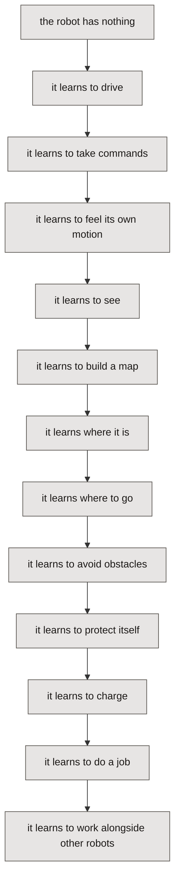

*Companion articles to the [Build an AMR from Zero](https://www.youtube.com/@phatcvo-beelab) video series.*



The videos show the build. These articles are the notes behind them — the numbers, the parameters, the failures, and the reasoning that does not fit in ten minutes of screen time.

## The philosophy

> The robot is the main character. ROS 2, Gazebo, LiDAR, IMU, SLAM and Nav2 are just tools that give it new abilities.

So the series is not organised as "today we learn ROS 2, today we learn Gazebo, today we learn SLAM." It is organised as:

Every article is one step of that ladder. Each one starts from a problem the
robot cannot yet solve, builds the smallest thing that solves it, tests it, and
ends with the next problem.

## The plan

| Phase | Articles |
|---|---|
| **1 — Introduction** | 01 |
| **2 — Drive system** | 02, 03, 04 |
| **3 — Digital robot** | 05, 06 |
| **4 — Simulation ↔ real** | 07 |
| **5 — Sensing** | 08, 09 |
| **6 — Power** | 10 |
| **7 — Mapping** | 11, 12 |
| **8 — Localisation** | 13, 14 |
| **9 — Navigation** | 15, 16 |
| **10 — Safety** | 17, 18 |
| **11 — Service robot** | 19, 20 |
| **12 — Fleet** | 21, 22 |

## Who this is for

- Robotics, mechatronics and automation students.
- Engineers learning robotics, or moving from ROS 1 to ROS 2.
- Anyone who wants a practical route into AMRs rather than a tutorial tour of individual packages.

You do not need prior ROS experience for article 01. From article 02 onward, a Linux machine and a willingness to read a serial protocol datasheet will take
you a long way.

## One rule for the whole series

**Nothing is called "done" because it ran once.** Every claim in these articles carries the measurement behind it, or it is labelled as untested. Where the real robot disagrees with the simulation, both numbers are shown.

Read them in order below.
