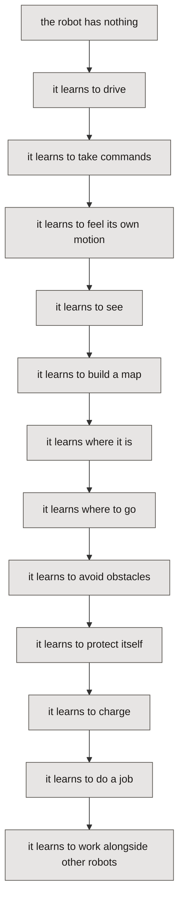

*Companion articles to the [Build an AMR from Zero](https://www.youtube.com/@phatcvo-beelab) video series.*



The videos show the build. These articles are the notes behind them — the numbers, the parameters, the failures, and the reasoning that does not fit in ten minutes of screen time.

## The philosophy

> The robot is the main character. ROS 2, Gazebo, LiDAR, IMU, SLAM and Nav2 are just tools that give it new abilities.

So the series is not organised as "today we learn ROS 2, today we learn Gazebo, today we learn SLAM." It is organised as:

```mermaid
flowchart TD
  A["the robot has nothing"] --> B["it learns to drive"]
  B --> C["it learns to take commands"]
  C --> D["it learns to feel its own motion"]
  D --> E["it learns to see"]
  E --> F["it learns to build a map"]
  F --> G["it learns where it is"]
  G --> H["it learns where to go"]
  H --> I["it learns to avoid obstacles"]
  I --> J["it learns to protect itself"]
  J --> K["it learns to charge"]
  K --> L["it learns to do a job"]
  L --> M["it learns to work alongside other robots"]

  classDef step fill:#e7e5e4,stroke:#57534e,color:#1c1917
  class A,B,C,D,E,F,G,H,I,J,K,L,M step
```

Every article is one step of that ladder. Each one starts from a problem the
robot cannot yet solve, builds the smallest thing that solves it, tests it, and
ends with the next problem.

## The plan — four phases

Twenty-two articles, grouped by what the robot can do at the end of each block.
A phase is finished when its exit criterion is met **on the robot**, not when
its last article is published.

### Phase 1 · It moves — articles 01–07

From an empty workspace to a robot that exists twice: once on the bench, once in
Gazebo, both driven through the same ROS 2 graph. Drive electronics, RS485,
teleop, URDF, simulation, and the single hardware seam that keeps the two in
step.

> **Exit criterion.** One `/cmd_vel` turns real wheels and simulated wheels
> through the same `diff_drive_controller`, with only the hardware component
> swapped underneath.

### Phase 2 · It senses — articles 08–10

The robot starts measuring: how it is actually moving, what is around it, and
how much energy it has left. IMU, LiDAR, and battery telemetry as first-class
ROS 2 topics rather than debug prints.

> **Exit criterion.** The IMU, both scanners and the BMS publish **on hardware**,
> in the right TF frames, at their rated rates — and the pack reading agrees with
> a multimeter.

### Phase 3 · It navigates — articles 11–16

The phase where the robot stops being driven and starts deciding. Build a map,
prove the map is worth trusting, fuse wheel odometry with the IMU, find itself
on a map it already has, plan a route, follow it — and measure every failure
instead of retrying until one run looks good.

> **Exit criterion.** Map median accuracy ≤ 0.050 m, AMCL position error
> ≤ 0.10 m *while driving*, and **> 95 % of ≥ 16 benchmark goals** reached.

### Phase 4 · It works — articles 17–22

Everything that separates a robot that navigates from a robot you would leave
running in a building with people in it: safety fields with real authority, a
robot that charges itself, carries something, takes orders from software that
has never heard of ROS 2, and shares an aisle with another robot.

> **Exit criterion.** An unattended shift — mission in, payload moved, dock,
> charge, repeat — with a second robot working the same map.

| Phase | Articles | The robot goes from… | …to |
|---|---|---|---|
| **1 · It moves** | 01 – 07 | nothing | a body that drives, in two worlds |
| **2 · It senses** | 08 – 10 | blind and unaware | measuring motion, space and energy |
| **3 · It navigates** | 11 – 16 | driven | deciding its own route |
| **4 · It works** | 17 – 22 | a demo | a machine that can be left running |

> **A note on the word "phase."** Inside the articles you will also meet
> *Phase 5*, *Phase 6*, *Phase 8* and so on. Those are the development phases of
> the BEEBOT2 workspace — the codebase's own roadmap — not these four. The four
> above group the reading; the numbered ones in the text track the build.

## The final target

Everything above points at one thing:

> **BEEBOT2 accepts a mission from a system that has never heard of ROS 2,
> drives to a point in a warehouse it mapped itself, moves a payload, returns to
> its dock and charges — unattended, repeatably, on real hardware, while a second
> robot works the same aisles.**

Repeatably and on real hardware are the load-bearing words. In line with the one
rule below, the target is written as numbers that can be checked, together with
where the project actually stands against each:

| What "done" means | Measured by | Target | Today |
|---|---|---|---|
| It knows the building | SLAM map vs. ground truth, median accuracy | ≤ 0.050 m | 0.150 m, simulation |
| It knows where it is | AMCL error vs. truth map, driving, 16 goals | ≤ 0.10 m | 0.184 m, simulation |
| It gets where it is sent | benchmark goals reached | > 95 % of ≥ 16 | 7 / 16 = 44 %, simulation |
| It stops before it hits | protective stop from 0.6 m/s | speed → 0, every time | ✅ simulation |
| Its safety cannot trap it | recovery from a protective stop | releases and reverses out | ✅ fixed in article 18 |
| It runs a shift alone | dock, charge, resume | unattended | ⬜ not started |
| It takes orders from outside ROS 2 | mission API round trip | mission in, status out | ⬜ not started |
| It shares the floor | two robots, one map | no deadlock | ⬜ not started |
| **All of the above on the robot** | the same numbers, off the desk | not simulation | **drive only** |

Two things gate the rest. **There are no sensor drivers in the workspace** — no
LiDAR, no IMU, no camera — so every row above marked *simulation* is stuck there
until they exist. And **localisation is the binding constraint on Phase 3**: at
0.184 m of drift while driving, a 0.4 m excursion in a 1.8 m aisle puts the
vehicle on the racking, which is exactly the 44 % in row three.

Neither is hidden, and neither is close to solved. That is the state of the
project, and the series is written from it rather than around it.

## Who this is for

- Robotics, mechatronics and automation students.
- Engineers learning robotics, or moving from ROS 1 to ROS 2.
- Anyone who wants a practical route into AMRs rather than a tutorial tour of individual packages.

You do not need prior ROS experience for article 01. From article 02 onward, a Linux machine and a willingness to read a serial protocol datasheet will take
you a long way.

## One rule for the whole series

**Nothing is called "done" because it ran once.** Every claim in these articles carries the measurement behind it, or it is labelled as untested. Where the real robot disagrees with the simulation, both numbers are shown.

Read them in order below.
