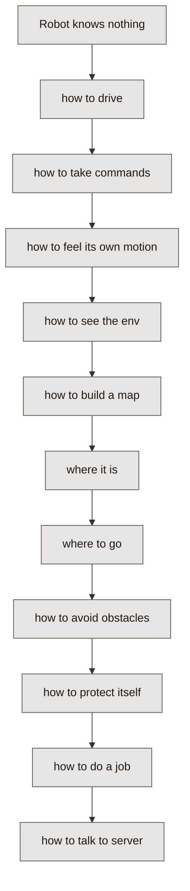

*Companion articles to the [Build an AMR from Zero](https://www.youtube.com/@phatcvo-beelab) video series.*



The videos show the build. These articles are the notes behind them — the numbers, the parameters, the failures, and the reasoning that does not fit in ten minutes of screen time.

## The philosophy

> The robot is the main character. ROS 2, Gazebo, LiDAR, IMU, SLAM and Nav2 are just tools that give it new abilities. It is organised as:

```mermaid
flowchart TD
  A["Robot knows nothing"] --> B["how to drive"]
  B --> C["how to take commands"]
  C --> D["how to feel its own motion"]
  D --> E["how to see the env"]
  E --> F["how to build a map"]
  F --> G["where it is"]
  G --> H["where to go"]
  H --> I["how to avoid obstacles"]
  I --> J["how to protect itself"]
  J --> L["how to do a job"]
  L --> M["how to talk to server"]

  classDef step fill:#e7e5e4,stroke:#57534e,color:#1c1917
  class A,B,C,D,E,F,G,H,I,J,K,L,M step
```

Every article is one step of that ladder. Each one starts from a problem the
robot cannot yet solve, builds the smallest thing that solves it, tests it, and
ends with the next problem.

## The plan — four phases

Twenty-two articles, grouped by what the robot can do at the end of each block.
A phase is finished when its exit criterion is met **on the robot**, not when
its last article is published.

| Phase | Articles | The robot goes from… | …to |
|---|---|---|---|
| **1 · It moves** | 01 – 07 | nothing | a body that drives, in two worlds |
| **2 · It senses** | 08 – 10 | blind and unaware | measuring motion, space and energy |
| **3 · It navigates** | 11 – 16 | driven | deciding its own route |
| **4 · It works** | 17 – 22 | a demo | a machine that can be left running |

## The final target

Everything above points at one thing:

> **BEEBOT2 accepts a mission from a system that has never heard of ROS 2,
> drives to a point in a warehouse it mapped itself, moves a payload, returns to
> its dock and charges — unattended, repeatably, on real hardware, while a second
> robot works the same aisles.**

Repeatably and on real hardware are the load-bearing words. In line with the one
rule below, the target is written as numbers that can be checked, together with
where the project actually stands against each:

## Who this is for

- Robotics, mechatronics and automation students.
- Engineers learning robotics, or moving from ROS 1 to ROS 2.
- Anyone who wants a practical route into AMRs rather than a tutorial tour of individual packages.